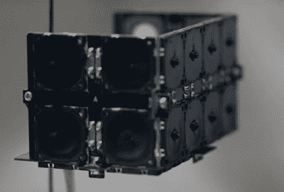

# 室内飞艇使用超声波传感器在空气中航行

> 原文：<https://hackaday.com/2021/11/27/indoor-blimp-sails-through-the-air-using-ultrasonic-transducers/>

四轴飞行器类型的无人机*可以*在室内飞行，但除非你有很大的空间，否则它通常只会以坠毁告终。被螺旋桨叶片击中面部的前景，以每分钟 10 万转的速度旋转，不堪设想，然后就是噪音。因此，作为室内摄影或在公共场所操作的解决方案，它们是不可行的。日本移动运营商 DOCOMO 对旧的想法有了新的看法；飞艇。但是，当然，即使是充满氦气的车辆也需要叶片来操纵房间，我们听到你哭了吗？不是这样的，如果你使用一对[专门的超声波传感器阵列来移动空气，而不是](https://youtu.be/76rDC7VWiQU)！(视频，嵌入下方)

Three banks of thrusters provide a 180 degree steerable net force

细节还不太清楚，但 DOCOMO 已经安装了一个氦气球，它的两侧都有模块，可以产生可操纵的推力，使飞行器能够轻松优雅地实现所有预期的空中机动。底部的模块包含控制电子设备，一个朝上的 RGB LED，用于增加一些光彩，当然还有一个摄像机，用于拍摄所有重要的视频镜头。

我们很想找到这些超声波传感器设备的来源，但只能猜测其物理排列，即只允许空气沿一个方向流动，以实现净推力。我们可以找到一些研究论文暗示使用超声波在空气中推进的能力，[就像这个](https://ieeexplore.ieee.org/document/8580114)(呸！IEEExplore 付费墙！)但是据我们所知，这项技术还没有完全掌握在黑客手中。

在这些精美的页面上，软式飞艇绝不是稀缺的，这里有一个[软式飞艇，一个 Arduino 控制的 3D 打印软式飞艇](https://hackaday.com/2018/11/27/blimpduino-hits-version-2/)，一个由日本艺术家【Kensho Miyoshi】制作的[照明软式飞艇艺术装置](https://hackaday.com/2014/01/02/glowing-balloon-blimps/)，如果使用氦气对你来说太安全了(或者如果你想帮助防止这种据称珍贵的[资源消失在太空中](https://hackaday.com/2016/07/11/the-dubious-claim-of-a-world-helium-shortage/)，你可以用氢气来建造一个[遥控软式飞艇。只是不要点燃火柴。](https://hackaday.com/2013/01/19/an-arduino-hydrogen-blimp-oh-the-humanity/)

 [https://www.youtube.com/embed/76rDC7VWiQU?version=3&rel=1&showsearch=0&showinfo=1&iv_load_policy=1&fs=1&hl=en-US&autohide=2&wmode=transparent](https://www.youtube.com/embed/76rDC7VWiQU?version=3&rel=1&showsearch=0&showinfo=1&iv_load_policy=1&fs=1&hl=en-US&autohide=2&wmode=transparent)

谢谢[意大利]的提示！