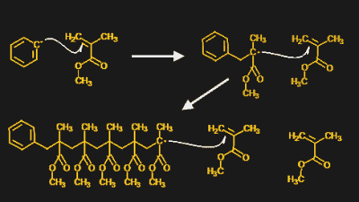
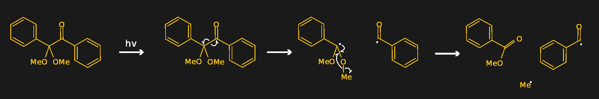
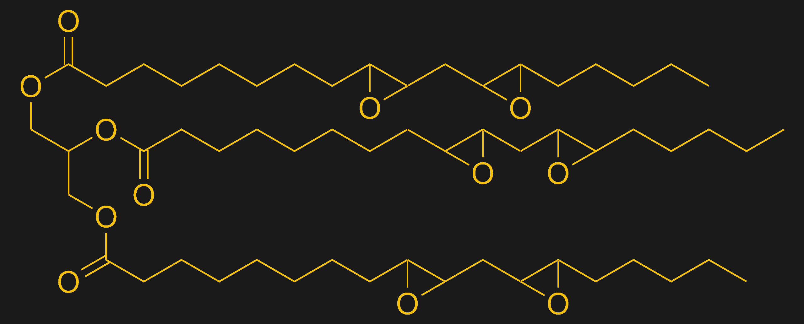

# 塑料:用于 3D 打印及其他领域的光聚合物

> 原文：<https://hackaday.com/2021/12/21/plastics-photopolymers-for-3d-printing-and-beyond/>

如果你做过 3D 打印，很有可能是标准的熔融沉积模型。FDM 是非常简单的东西——将一点塑料细丝加热到足够的温度，从一个精细的喷嘴中挤出熔融的粘性物质，在三维空间中或多或少地精确控制喷嘴的位置，然后连续几个小时重复这个过程，直到打印完成。对外人来说，这看起来像魔术，但对我们来说，这只是另一个星期六下午。

树脂印刷完全是另一回事，对我们大多数人来说更接近魔法。目前的立体平版印刷机只是在紫外光源和透明底部的建造槽之间有一个高分辨率的 LCD 显示器。当一个构建板慢慢地将它从树脂中提起时，通过将 UV 光图案闪入罐中来一层一层地构建印刷品，就像一些从原始粘性物质中出现的生物一样。

当然，这一切都只是科学，但如果 SLA 印刷有任何魔力，肯定是在用于它的树脂中。它们毫无特色的棕色塑料瓶和信息贫乏的标签几乎没有给出它们成分的线索，尽管它们的碳氢化合物气味和粘稠的质地是很好的线索。让我们看看树脂瓶的内部，看看是什么让 SLA 的魔力发生。

## 基础知识

理解立体平版印刷树脂背后的化学过程的良好基础是甲基丙烯酸甲酯(MMA)聚合成聚甲基丙烯酸甲酯，也称为 PMMA 或简称丙烯酸。虽然 SLA 树脂的配方各不相同，但其中许多都是基于丙烯酸酯的，因此这里的化学原理和一般原则一样，可直接应用于许多树脂。

甲基丙烯酸甲酯的聚合是所谓的自由基反应。它之所以有效，是因为 MMA 的两个碳原子之间有一个双键，附近还有一个酯基——这个酯基有两个氧，其中一个在双键中。这两个基团的电子结构使得双键碳易于还原，这是一个电子的增益。

Free-radical polymerization of MMA into PMMA. The ring structure is the initiator, which reduces the carbon-carbon double bond in MMA monomer. That creates another free radical, which reduces another MMA, and so on.

一般情况下，MMA 单体之间不会发生反应，因为周围没有自由电子浮动来还原碳碳双键。为了让 MMA 聚合，需要在混合物中加入引发剂——在这种情况下是过氧化苯甲酰。引发剂是一种提供不成对电子或自由基的化合物。一旦自由基出现，它们通过还原双键与碳结合。这第一个反应的产物将有它自己的未配对电子，然后可以继续还原另一个 MMA 单体中的双键，等等。引发后自由基产物的产生是自由基聚合的关键。

因此，一瓶 SLA 树脂包含 MMA 单体和某种引发剂是理所当然的。但是是什么阻止了单体在瓶子里聚合呢？如果引发剂是类似于上面例子中使用的过氧化苯甲酰，那就是会发生的事情。因此，为了有利于 SLA 工作，树脂混合物必须包含引发剂，该引发剂可以在混合物中保持惰性，直到需要时为止。

## 开始做事

这就是光引发剂发挥作用的地方。当像过氧化苯甲酰这样的引发剂在加热的情况下很容易分解成自由基时，光引发剂就需要更多的诱导。多年来，化学公司已经开发了数百种不同的光引发剂，每种光引发剂都适合于特定的一组待聚合的单体以及工业需求，例如自由基形成的效率、毒性、甚至赋予最终产品的气味。但是它们都有一个共同的特点，那就是在暴露于正确波长的光线之前，它们都是不活跃的。

光引发剂的一个好例子是 2，2-二甲氧基-2-苯基苯乙酮，仁慈地缩写为 DMPA，由 Ciba 以商品名 IRGACURE 651 出售。这种化合物有两个由两个碳链连接的苯环。接头部分的一个碳与氧形成双键，形成酮官能团。当合适波长的光子——DMPA 的吸收峰在 250 纳米和 340 纳米——击中酮基时，它会被激发到一个电子被敲掉的程度。通过一系列中间步骤，多余的电子被转移到不同的原子上，分子的接头部分在一个叫做α-裂解的过程中断裂。这留下了一个稳定的物种——苯甲酸甲酯——加上两个可以引发聚合的自由基。

DMPA (left) decomposes into methylbenzoate and two free radicals (right) through intermediate steps when exposed to UV light. Source: from Squidonius, public domain, via Wikimedia Commons

## 轻踩刹车

光聚合的机制引出了一个问题:SLA 打印机中的紫外光如何不只是一次性聚合整罐树脂？这似乎是一个问题，因为聚合基本上是一个连锁反应，一旦开始。但是由于化学和物理的原因，这种反应有实际的限制。

从化学角度来说，树脂中引发剂的含量通常很低，只占混合物的百分之几。所以开始聚合反应的地方不多。聚合反应也倾向于自发进行链终止，或者通过两个增长的自由基链结合在一起，或者通过污染物如氧还原自由基链。一些树脂甚至添加了特定的抑制剂化合物来限制聚合速度。不管是哪种方式，自发终止可以防止油箱变成一块塑料砖。

光聚合没有在构建槽中失控也有物理原因。来自罐底部的 LCD 显示器的紫外线不是特别强，并且在传播很远之前会被树脂吸收。这就是为什么 SLA 树脂往往没有重着色，以及为什么加入树脂的任何颜料都必须仔细选择，以避免吸收紫外线。这也是为什么 SLA 印刷品在印刷后需要额外的清洁和固化步骤；在罐中发生的聚合是不完全的，未反应的树脂残留在印刷品中。将印刷品浸泡在高强度的紫外光中完成这一过程，并使印刷品变硬。

## 吃大豆充饥

在引发剂、单体、颜料和可能的抑制剂之间，SLA 树脂已经看起来像是一种化学物质的女巫配方。但是我们还没完。树脂很少只使用单体，而是使用单体和低聚物的特殊混合物——预聚合单体的短链。向树脂中加入低聚物会使增长的链领先一步，从而加速聚合。它还会增加树脂的粘度，这样它就不会流动，也不会在制造罐中晃动并产生气泡。

SLA 树脂的另一种常见添加剂是交联剂。交联剂是可以在两个或多个增长的聚合物链之间形成连接的化合物。交联倾向于使聚合物链成为更多的基质结构，从而为最终产品提供强度和刚性。交联还可以改变材料的属性，甚至允许不同类型的单体共聚，如向丙烯酸酯中添加氨基甲酸乙酯以增加韧性和灵活性。

一些 SLA 树脂也包含填充材料。填充物在塑料中很常见——例如，许多 Schedule 40 PVC 管含有粉末状石灰石。在 SLA 树脂中，添加填料是为了通过填充交联聚合物链之间的空间来填充塑料。许多新的“生态友好”SLA 树脂开始声称是由大豆制成的，虽然这是真的——至少对一些树脂来说是这样的——但树脂中仍有许多材料显然不是来自大豆。其中的大豆油实际上只是一种填料——如果没有列出的丙烯酸酯单体和交联剂或光引发剂，这种树脂将毫无用处。

Just like mom used to make? Epoxidized soybean oil (ESBO) is used as a plasticizer in many plastics. It’s made by treating polyunsaturated soybean triglycerides with peroxide to convert C=C double bonds to epoxides. Source: from Ed, public domain via [Wikimedia Commons](https://commons.wikimedia.org/wiki/File:Epoxidized_linolein.svg)

## 不仅仅是为了印刷

虽然我们在这里主要关注 SLA 印刷树脂，但这远不是感光聚合物的唯一应用。如果你在过去三十年左右的任何时候补过牙，很有可能你的牙医使用了含有甲基丙烯酸酯单体的光聚合物，并用发射紫外线的光纤棒固化。印刷电路板制造商广泛使用光敏聚合物，既用于蚀刻电路板的光刻胶涂层，也用于电路板的阻焊层。光敏聚合物也用于制造集成电路的光刻工艺中的掩模。