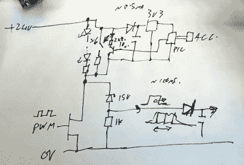

# LED 灯带上的双线传感器

> 原文：<https://hackaday.com/2021/12/04/two-wire-sensors-on-led-strips/>

虽然可寻址 LED 灯条风靡一时，但来自[mikeselectrictuff]的[Mike]一直在研究一种使用更基本的双线灯条的装置，这种灯条可以通过 PWM 调光进行简单控制。他最近想出了一种简洁的方法，不用增加任何额外的电缆就可以将传感器信号发送到这些长条上。

The circuit in question.

该产品使用 24 V LED 胶带，由 6 个串联的 LED 组成，正向电压为 3V。因此，这些灯条直到大约 18V 电压通过时才开始发光。

通过在调光 led 的 MOSFET 两端添加一个 15 V 齐纳二极管和一个电阻，当 MOSFET PWM 调光器处于关闭状态时，可以在 led 两端施加约 9 V 的电压，而不会点亮 led。PIC10F322 微控制器和加速度计可以在此电压下运行，借助与 led 并联的 3.3 V 调节器。调节器还必须能够在 led 开启时处理全部 24 V 电压。

还连接了一个晶体管，开关一个与发光二极管并联的 2.2 K 电阻。当 PIC 开启时，该晶体管会产生大约 10 mA 的电流流经齐纳二极管及其串联电阻。当晶体管导通和关断时，可以测量串联电阻上产生的电压。在这种情况下，用于开启晶体管的脉冲宽度与 LED 灯条末端的加速度计检测到的运动有关。

以 100%占空比打开 LED 会阻止系统工作，因为当 LED 线始终保持高电平时，无法检测到传感器电路产生的脉冲宽度。然而，在实践中，这并不重要——以最大 98%的占空比运行 led 可以消除这个问题。

这是一种通过双线 LED 灯条发送传感器信号的巧妙方法，即使需要一秒钟才能绕过它。它似乎也做了很大的工作，增加运动反应效果的 LED 灯条的问题。[这也不是我们从【迈克】那里看到的第一个 LED 项目](https://hackaday.com/2016/09/28/sim-card-connectors-and-white-pcbs-make-huge-led-snowflakes-happen/)。休息后的视频。

 [https://www.youtube.com/embed/8WH5tCNIIck?version=3&rel=1&showsearch=0&showinfo=1&iv_load_policy=1&fs=1&hl=en-US&autohide=2&wmode=transparent](https://www.youtube.com/embed/8WH5tCNIIck?version=3&rel=1&showsearch=0&showinfo=1&iv_load_policy=1&fs=1&hl=en-US&autohide=2&wmode=transparent)

【感谢 Tim Gremalm 的提示！]