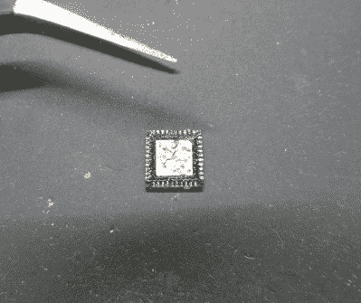
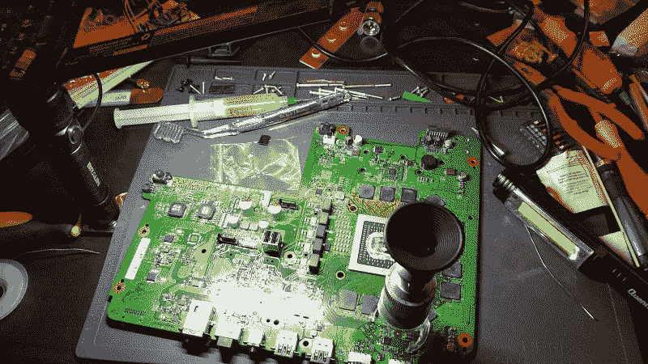
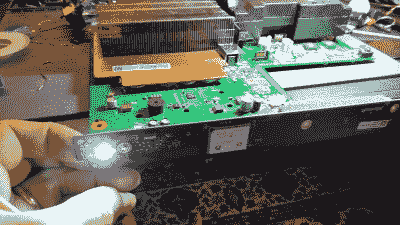

# 本周失败:黑客作家试图修复 XBox

> 原文：<https://hackaday.com/2021/12/08/fail-of-the-week-hackaday-writer-attempts-xbox-repair/>

像许多 Hackaday 的读者一样，我为自己是家里的“修理工”而自豪。当有东西打破时，我会很兴奋，因为这是一个展示我技能的机会。特别有趣的是，当一些重要的东西坏了，比如冰箱或洗衣机——像这样的修理是与时间的赛跑，因为我必须比雇人来修理还要快。我通常赢得比赛；我都不记得上次付钱给人做什么了。就像我说的，这是一个值得骄傲的点。

所以，当我儿子在大学第一学期结束后的感恩节假期回家时，他迫不及待地打开他的 Xbox，从他的生物化学研究中放松一下，结果却看到一个黑屏，没有启动，对我来说是时候了。我相信我能及时唤醒那个死盒子，让他开心一下。事实上，他回到了学校，我的工作台上的机器仍然被拆开，这证明了我的狂妄自大，但公平地说，我确实接近了一个修复，而且可能仍然会完成它。但不管怎样，我一路走来学到的经验真的很有价值，值得分享。

## 诊断

很快，这看起来像是电源问题——插上电源，按下按钮，没有指示灯，没有蜂鸣声，没有风扇。我们检查了一些基本的东西，比如确保电源线末端有线电压，并扭动东西来寻找松动的连接。排除这些因素后，我认为这可能是一个坏的电源，在 Xbox One X 上是一个内部模块。手头有了拆卸说明，我们把电源模块从箱子里拿出来测试——12v，就像标签上写的那样。太糟糕了——这本来是一个简单的解决办法。

谷歌了一下，我找到了一系列似乎与症状相符的维修视频。有一个特别的引起了我的注意；这表明一个坏的 HDMI 重定时器芯片可能是罪魁祸首。这个芯片究竟是如何变坏的是一个谜——这个控制台已经几个月没有使用了——就像一个坏的 HDMI 芯片如何使整台机器瘫痪一样。但这是个线索。

不幸的是，解决这个问题远远超出了我的能力范围。我很会用烙铁，但只是在宏观世界里。是的，我以前尝试过表面贴装器件焊接，甚至参加了 2019 年超级大会的[SMD 挑战赛。我并没有给自己带来荣耀，但我在 Supercon 用手头的次优工具做得足够好，我想我可能会做得很好。但首先，我需要去购物。](https://hackaday.com/2019/11/18/a-newbie-takes-the-smd-challenge-at-supercon/)

The original TDP158 HDMI retimer chip in its QFN-40 package, after desoldering. That center thermal pad really stuck it down good.

我需要更换的芯片是 TDP158 ，它采用 40 引脚四方扁平无引脚(QFN)封装。我对 SMD 了解不多，但这显然是一个仅靠烙铁无法解决的问题。外壳底部的焊盘间距为 0.4 mm，有一个相对较大的传热焊盘焊接到电路板上。我需要一些工具来进行修理。

虽然我愿意花 55 美元在亚马逊上买一个便宜的热风站，但我还没准备好花钱买另一个我显然需要的工具:显微镜。事实证明，我很不明智地认为，我可以用比尔·赫德在我探索[作为一名黑客变老的问题时向我建议的简单的头戴式放大镜来蒙混过关。我需要的另一件东西是替换 TDP158，Mouser 和 Digi-Key 都有它。可惜都没货了，预计 2023 年 3 月— *！*幸运的是，亚马逊上的经销商有库存，所以我在订单中添加了一个，并在等待送货时完成了拆卸。](https://hackaday.com/2016/06/22/a-hackers-guide-to-getting-old/)

## 首次修复尝试

从电路板上取下有缺陷的芯片实际上比我想象的要容易。我看过的视频都把热风站的温度调到了 480 摄氏度——QFN 背面的那个大隔热板确实能很好地散热。当芯片被替换时，它也有帮助，并且你真的不在乎你向它喷射多少热量。这后来一直困扰着我，但对于我的第一次尝试，我所关心的是不要熔化附近的任何电容和电阻，因为我没有多余的。

当芯片被打开时，我开始遇到麻烦。下面有一个很大的焊盘，显然与很多铜相连，因为试图给它上锡是一场噩梦。仅仅用我的 Hakko 熨斗尖摩擦它是不够的，即使把温度调到最高——焊料会立即硬化并形成凸起，使芯片保持在电路板表面以上。当我用脱焊编织带试图吸走多余的时候，编织带最终会被焊接到焊盘上。热空气和烙铁的结合使焊盘成形并为新芯片做好准备。

我在回流工作中看到的一切让我相信困难的部分已经过去了；此时，助焊剂，电路板上的阻焊层，以及表面张力的奇迹，只要稍微加热，就会神奇地将芯片浮到正确的位置。的确是这样，但是即使通过我的放大镜，我也能看到问题。沿着芯片一边的焊盘上显然没有太多的焊料，有几个明显的焊料桥。

How not to SMD. This was my very suboptimal repair setup, although the Harbor Freight work light is highly recommended for car repairs. The stand microscope over the TDP158 chip at lower right was invaluable, but still very awkward to use.

接下来就是几个小时用热空气在电路板上追逐焊料，我的烙铁几乎用了我能找到的所有尖端，几毫升的焊剂，还有一大堆脏话。也有很多工具的变化，尤其是在光学部门。头戴式窥视镜是不够的，所以我找到了一个小显微镜，我可以在芯片上方保持平衡，以查看关节。我的照明也很糟糕——我用了我的便利的 [Harbor Freight 可充电工作灯](https://www.harborfreight.com/390-lumen-magnetic-slim-bar-folding-work-light-56329.html)，这真的很有帮助，但它仍然投下尴尬的阴影，而且大部分时间都在妨碍我的工具。

## 一些成功

我最终厌倦了到处追逐焊料，当我确信我至少已经处理了焊料桥时，我插回了足够的东西来测试控制台。令我完全惊讶的是——尤其是因为我的儿子现在正在观看比赛过程——它马上就启动了！但是，唉，当扣上扣子并在电视上测试时，没有 HDMI 输出——毫无疑问，这些焊接点缺乏焊料。进入第二轮。

It works! Well, not really — it boots, but still doesn’t have any video output.

由于第一轮的经历，第二次变得稍微容易一些。我弹出芯片，清理它和垫，并浮动芯片回到位置。这一次没有桥，所有的关节看起来都很明亮，闪闪发光——会是这样吗？我终于修好了吗？

当然不是——这次它甚至无法启动。我怀疑我只是简单地煮了芯片——在第一次尝试的所有焊料追逐和第二次尝试的重新焊接之间，我向这个可怜的东西倾倒了一吨热量，就这样做了。

## 第三次是一种魅力？

这就是现在的情况，当我等待另一个芯片，这样我就可以给它第三次尝试，我所能做的就是看看我学到的教训。虽然这是一个可怜的工匠谁指责他的工具，但仍然有一些事情要说，一个适当的设置。如果我要认真对待这件事，我真的需要一个显微镜。[奇异零件] [的[斯科特·艾伦]在这个视频](https://www.youtube.com/watch?v=MBFyGzrClsI)中对[的显微镜](https://www.aliexpress.com/item/32880372287.html)大加赞赏，所以我可能会顺着这些思路有所收获。话说回来，有些小额销售专业人士非常信赖 T4 的纯视频销售方式。(视频，自然。)不过，我觉得立体显微镜似乎更适合我。

照明是另一个大问题。我正在看的范围有一个同轴环形灯，用于无阴影照明，但我店里的房间照明需要大修。诚然，它是以写作为目的建造的，主要是任务照明，但如果能在我需要的时候提供大量照明，那将是一个好主意。

最后，我最需要的是练习。我可能会拿一些 SMD 练习工具，也许还有一些旧的电子垃圾来练习拆焊。

我错过什么了吗？请在评论中告诉我们。我特别渴望听到每个人攀登学习曲线的经历，尤其是从老前辈那里。