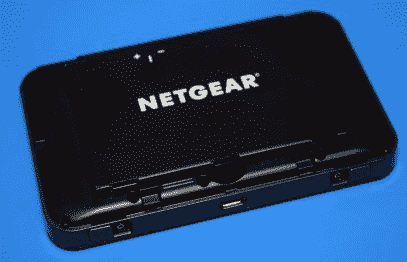
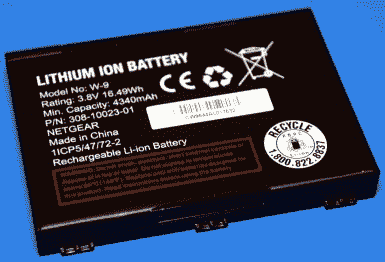
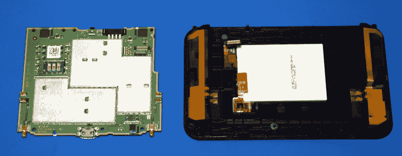
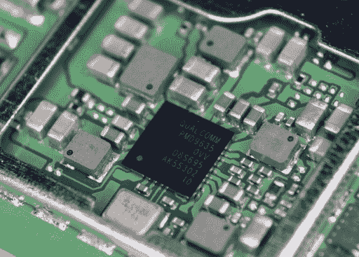
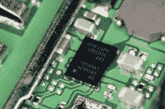
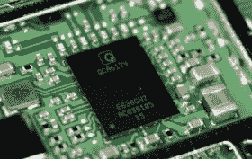
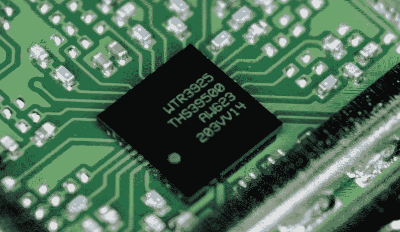

# 拆解:威瑞森 AC791L Jetpack 4G 移动热点

> 原文：<https://hackaday.com/2021/12/14/teardown-verizon-ac791l-jetpack-4g-mobile-hotspot/>

“时不我待”这句话通常被用作一种口头上的踢裤子，提醒人们有时机会必须在它错过之前迅速抓住。但它也可以被解释为对时间永恒行进的警告，以及它如何影响我们周围的世界。在这种情况下，我们最好把蜂窝技术加入到不等人的谚语清单中。需要 5G 吗？不。你想要吗？大概不会。但它在这里，所以做一个好消费者，以技术进步的名义甩掉你所有的 4G 硬件。

这种逻辑可以解释为什么你在这里看到的威瑞森品牌的 Netgear AC 791 l 4G“Jetpack”热点，尽管处于完美的工作状态，却发现自己在垃圾桶里。对于以前的用户来说，5G 的到来一定特别快，因为他们甚至懒得从设备上删除他们的配置信息。以新闻诚信的名义，我不会泄露前主人的身份；但是我要说的是，他们对 WPA2 键的钟爱选择，与我们的出版物非常契合。

对易贝的快速调查显示，这些设备以及类似的设备供应充足。在撰写本文时，有超过 1500 场拍卖与搜索词“威瑞森喷气背包”相匹配，其中大多数拍卖的价格在 20 至 50 美元之间。我们喜欢可以被黑客攻击的便宜且容易获得的小工具，但是在这些热点中有什么我们可以实际使用的吗？让我们找出答案。

## 整洁的包裹

就第一印象而言，威瑞森喷气背包肯定不会让人失望。这款手持设备的重量非常令人满意，前后表面都有轻微的橡胶涂层，让人想起 Thinkpad 的盖子。我特别喜欢装置底部的两个小滑动门，它们盖住了外部天线端口。虽然专用的“后退”按钮会使用户界面的导航更加精简，但前面的电容式触摸按钮工作得很好，屏幕也很漂亮。

    

打开设备，我们可以清楚地知道它为什么这么重:巨大的 4，340 mAh 锂离子电池重 87 克，而 hotspot 本身重 75 克。这看起来似乎是一个过度的能量，即使对于一个 4G 调制解调器和一个简单的无线路由器来说也是如此，但手册解释说 Jetpack 可以兼作 USB 电池组。尽管该设备上没有母 USB Type-A，这意味着你需要携带一个小型 USB On the Go (OTG)适配器来为其他设备充电。

## 在后台

十个 T4 螺丝固定着喷气背包的背板，虽然他们很可爱，在其中一个螺丝上贴了一张贴纸，告诉主人如果他们敢探索自己的硬件，打开这个单元没有问题。随着移动电子产品在过去几年的发展方向，我有点担心整个事情会被粘在一起。

随着后方关闭，我们可以很好地看到围绕设备边缘弯曲的双共形天线。这些通过一些弹性凸片连接到 PCB，这些凸片又直接连接到外部天线端口。与现代超薄智能手机中的蜂窝天线相比，Jetpack 在接待部门提供了一系列令人印象深刻的选择。当然，作为一个 4G 热点，引入稳定 LTE 信号的能力非常关键。

PCB 本身正好从框架中弹出，除了天线的弹簧触点之外，它与设备其余部分的唯一物理连接是连接到前 LCD 和按钮组件的连接器。电路板上的所有元件都被射频屏蔽覆盖，这当然不足为奇，[因为这是我们在其他具有蜂窝连接的设备中看到的情况](https://hackaday.com/2021/09/09/teardown-impassa-scw9057g-433-alarm-system/)，但我很高兴地发现它们至少没有被焊接。只要稍加小心，我们就能清楚地看到内部集成电路的聚宝盆。

## 专为目的而造

通常当我们打开这样的小玩意时，我们能在里面找到一些熟悉的芯片。无论是 Z80 还是 STM32，这些众所周知的组件都为黑客社区和消费硬件世界提供了切实的联系。不仅在思想上，而且在实践中，识别设备核心的 MCU 是[为其开发自己的替代固件](https://hackaday.com/2020/11/17/custom-firmware-for-cheap-bluetooth-thermometers/)的第一步。

我想告诉你，一些常见的硅片隐藏在其中一个 RF 屏蔽下，在硬件上运行自己的代码只是找出正确的 OpenOCD 设置的问题。但遗憾的是，事实并非如此。

    Power Management  LiPo Charger  WiFi/BT Controller  LTE Radio

相反，我们得到了一大堆微型集成电路，其中大部分不出所料来自高通，显然是为手机设计的。WTR3925 是一款蜂窝收发器， [vintage 2013 左右](https://www.qualcomm.com/news/releases/2013/11/20/qualcomm-technologies-announces-fourth-generation-3glte-multimode-modem-and)，MDM9630 是一款 LTE 调制解调器。QCA6174 似乎负责 Jetpack 的 WiFi 和蓝牙接口，RF7459 是一个 CDMA 放大器。SMB1356 是电池的充电控制器，而 PMD9635 是一个电源管理 IC，显然也用于 iPhone 6 的一些变体中。我无法识别标签为 GP1639 的大芯片，但我猜测这是将所有功能整合在一起的 SoC。

虽然我能够找到喷气背包内大多数高通芯片的基本描述，但实际上获得这些组件的完整数据表完全是另一回事。这种情况有点让人想起那次我*试图*去[研究 VeriFone MX 925CTLS 支付终端](https://hackaday.com/2019/07/08/teardown-verifone-mx-925ctls-payment-terminal/)中的一些组件，但除了网上模糊的描述和库存水平之外，什么也没找到。似乎在这些最先进的电信设备上工作的人们是在一个相当紧密的俱乐部里，像我们这样的黑客没有被邀请。

## 将它(重新)使用

虽然我们不喜欢在这些部分使用“不可能”这个词，但让自己的代码在 Jetpack 上运行的可能性看起来并不大。现代手机的硬件有很多秘密，即使这些芯片在 2021 年还远远不是最先进的，关于它们的公开信息也不太公开。这也是一个相当安全的赌注，任何对 SoC 进行逆向工程的努力最终都会遇到一些阴险的安全对策。

那么威瑞森 AC791L 喷气背包是一个死胡同吗？也许不是。虽然内部尺寸不是很大，但我肯定会看到这款设备的主板被替换为带有 ESP8266 或 ESP32 的定制 PCB。接入 Jetpack 的天线和充足的电池，你将拥有一个移动 WiFi 黑客和实验的伟大平台。就此而言，这将是一个非常谨慎的渗透测试设备。仅仅为了使用它的电池和外壳而支付 30 美元可能不值得，但是如果你像我一样碰巧在垃圾桶里找到一个，你可能会有一个不错的冬季项目。