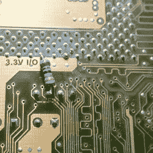

# 聪明的主板黑客将 90 年代末的主板带入 21 世纪初

> 原文：<https://hackaday.com/2021/12/02/clever-motherboard-hack-brings-late-90s-motherboard-into-the-early-2000s/>

一些人将规范视为需求，而另一些人将它们视为挑战。你正在 Hackaday 上阅读这篇文章，所以你知道[Necroware]在哪里。在广告下方的视频中，[你将看到他如何使用一个普通的 90 年代中后期主板，并使其远远超过规格表](https://www.youtube.com/watch?v=J0NLGfocviU)。

【Necroware】做了所有烙铁广告认为人们用烙铁做的事情

【necro ware】已经开始用自己的创造取代实时时钟，【necro ware】寻找其他机会使华硕 P/I-P55TP4XEG 比华硕更有能力。而且，他成功了。意识到主板有能力拥有一个外部电压调节板，[Necroware]做了一个，以便 Socket 7 板可以为 CPU 提供不止一个电压——这正是阻止他从奔腾 133 升级到奔腾 MMX 200 的原因。

虽然升级部分成功，但深入研究 Socket 7 和 Super Socket 7 文档帮助他认识到在战略时钟引脚上需要一个上拉电阻。然后，[Necroware]全面加速，将作者最喜欢的单核 CPU 打入插槽:AMD K6-2 450，这是一款远远超出主板原始功能的 CPU。

这确实表明，当然，[一切都与奔腾](https://hackaday.com/2021/11/04/weird-als-monster-battlestation-is-now-just-a-reasonably-fast-pc/)有关。感谢[BaldPower]做了必要的工作，并把这个伟大的黑客放入了[的举报热线](https://hackaday.com/submit-a-tip/)！

 [https://www.youtube.com/embed/J0NLGfocviU?version=3&rel=1&showsearch=0&showinfo=1&iv_load_policy=1&fs=1&hl=en-US&autohide=2&wmode=transparent](https://www.youtube.com/embed/J0NLGfocviU?version=3&rel=1&showsearch=0&showinfo=1&iv_load_policy=1&fs=1&hl=en-US&autohide=2&wmode=transparent)

