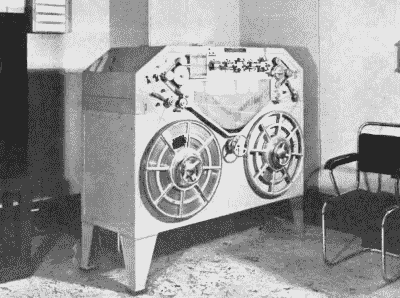
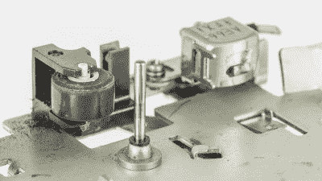
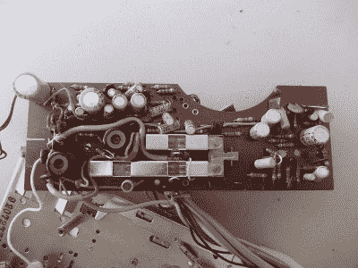
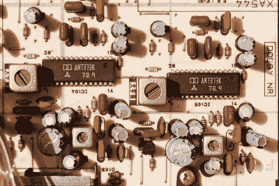
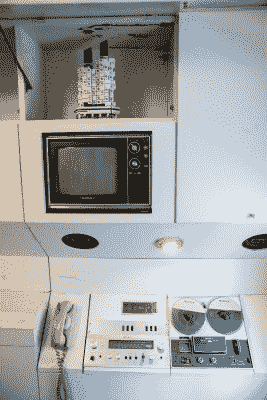
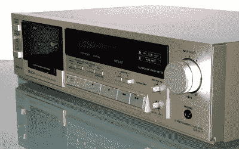

# 了解音频:混音带、磁带循环和剃刀片

> 原文：<https://hackaday.com/2021/12/20/know-audio-mixtapes-tape-loops-and-razor-blades/>

在我们穿越音频技术世界的严肃旅程中，到目前为止我们已经看了数字音频和黑胶唱片。少了什么？磁带，这种曾经无处不在的记录介质，在 20 世纪中期首次革新了广播和录音行业，并在催生整个个人音频领域之前成为家庭音频的支柱。除非你是一个发烧友或收藏家，否则很可能在 2021 年你的音频设置中不会有磁带机，你可能会从 SD 卡而不是磁带加载 8 位游戏，但令人惊讶的是，仍然有大量的磁带作为新奇或短暂的收藏品发布。

## 发出 20 世纪下半叶声音的装置

“Like a travelling razor blade”, a Blattnerphone steel-strip tape recorder at the BBC in 1937\. Douglas Hallam, Jr., [Public domain](https://commons.wikimedia.org/wiki/File:Blattnerphone_recorder_1937.jpg).

第一次磁记录是直接在金属线上进行的，但是金属在弯曲时会疲劳。通过在柔性塑料带上涂上含铁颗粒，随着磁场的变化而产生音频信号的简单技术可以变得更小、更轻、更耐用。但是这种格式取得巨大成功的关键是技术上的进步，这使得这些 20 世纪 50 年代的机器有别于它们的有线录音机祖先。

无论是简陋的卡式录音机，还是高端的录音室多轨，所有的录音机都非常相似。有两个容纳磁带的卷轴:容纳录音的回放卷轴和存储机器中播放的磁带的卷绕卷轴。轻驱动收带盘，使其运行速度快于磁带速度，放带盘有轻微的制动力，使磁带始终处于张紧状态。

The pinch roller and tape head of a Sony cassette mechanism. Raimond Spekking, CC BY-SA 4.0.

如果磁带只是被收带盘上的力拉过磁头，它将以可变的速度运行，该速度由收带盘上的功率和缠绕在其上的磁带的半径决定。保持胶带速度恒定很重要，这可以通过将胶带夹在恒速旋转的金属滚筒和橡胶滚筒之间来实现。该压带轮调节速度，通过卷轴驱动保持其两侧的磁带张力。在磁带通过压带轮之前，它要经过两三个读写磁头。首先接触的是擦除磁头，然后是记录和回放磁头。在一些机器中，录音和放音是由同一个磁头完成的。磁头具有可调节的方位角，其设置使得磁头磁极之间的间隙垂直于磁带边缘。

Many tape recorders such as this Sanyo cassette deck had significant switches to repurpose parts of their circuit between play and record. tony_duell, [CC BY 2.0](https://commons.wikimedia.org/wiki/File:Sanyo_G2605H_Cassette_PCB_(30001007695).jpg).

录音和回放头都连接到音频放大器。在一些廉价的机器中，这两个放大器是相同的物理电路，通过记录/回放开关来反转，但是在高质量的录音机中，它们是分开的。记录时，擦除头由高频交流信号驱动，目的是删除和覆盖任何先前的记录。

磁带不是线性介质，这意味着它的磁化程度与施加的磁场不成线性比例。但它确实有一个近似线性的范围，这促使工程师们寻求将录音保持在线性范围内并大幅降低失真的方法。最初，他们使用固定 DC 电流流过记录头的 DC 偏置，但后来的设计使用交流偏置，其中比音频信号高几十 kHz 的高频交流信号与其一起记录，交流在回放时听不见，但具有提供恒定记录水平的效果，以保持在磁带磁性的线性区域内。交流偏压来自一个振荡器，该振荡器也为磁带擦除头提供驱动，其频率和电平根据所用磁带介质的类型设置为不同的值。磁带介质中使用了不同的磁性材料，包括氧化铁、二氧化铬和细分的铁颗粒，这些材料中的每一种都具有不同的磁性，需要不同的偏置。

The noise reductions chips with the Dolby logo in a Yamaha cassette deck. Retired electrician, [CC0](https://commons.wikimedia.org/wiki/File:Dolby_subcircuit,_Yamaha_K-340_cassette_deck.jpg).

磁带本身就是一种噪音介质，在录音中背景噪音的嗖嗖声清晰可闻。如果你熟悉杜比实验室，它可能是通过电影院和家庭影院系统的环绕声编码，但它是在模拟录音降噪系统中开始的。[最初的杜比系统](https://en.wikipedia.org/wiki/Dolby_noise-reduction_system#Dolby_B)是一组滤波器，将压扩器(具有对数响应的放大器，旨在增加动态范围)应用于不同的频带，当反转时，具有降低合成信号的高频噪声成分的效果。这种产品的消费者版本被称为杜比 B，从 20 世纪 70 年代早期开始，它就是磁带录音设备的标准功能。

## 哪盘磁带适合你？

A reel to reel tape recorder was seen as essential enough to be designed into the capsule apartments of Tokyo’s famous Nakagin tower. Dick Thomas Johnson, ([CC BY 2.0](https://flickr.com/photos/31029865@N06/51473147042/))

对于收藏家来说，几十年来有许多深奥的盒式磁带和盒式磁带，但对于高保真系统来说，可能只有两种格式会感兴趣。卷轴式录音机是最早的录音机，顾名思义，它有一对打开的磁带卷轴。消费类和低端专业卷对卷机使用 1/4 英寸宽的磁带以各种速度运行，从广播质量的每秒 15 英寸到正常工作日记录介质的每秒 7.5 英寸，以及语音记录的每秒 3.25 英寸。它在用特殊的粘性胶带拼接之前用刀片切割胶带的极端简易性使其成为广播界的一场革命，并且我们中的一些人在 20 世纪 90 年代仍在这样做。

也许你会更熟悉盒式磁带，这是飞利浦在 20 世纪 60 年代开发的一种听写媒体格式，但由于其受欢迎程度，它被发展成为一种高保真媒体，然后通过索尼随身听的成功，成为便携式音乐播放器的起源。这种格式采用两个卷轴，将它们小型化，并将其包装在一个塑料盒中，一个 0.15 英寸宽的磁带包含两个立体声对中的四个轨道，以每秒 1 7/8 英寸的速度移动。这种格式可以发展到如此低的磁带速度可以提供最终成为高质量系统的地步，这是对那个时代竞争音频公司的许多工程师的工作的敬意，他们将它推向了极限。

A 30 or 40-year-old cassette deck will still sound good, and cost you far less than you’d think. waterborough, [Public domain](https://commons.wikimedia.org/wiki/File:Denon-dr-m11-2.jpg).

如果你没有把录音机看作是一个年长亲戚拥有的新奇物品，那么我们希望你已经找到了感兴趣的东西。也许你想要一个作为你自己的收藏，令人惊讶的是，在 2020 年仍然有可能买到全新的卡式录音机。但是，虽然盒式磁带放音机机构曾经由高端制造商为他们自己的产品以非常高的标准制造，但现在似乎只有非常少量的不同机构出现在市场上所有新的盒式磁带放音机中。所有全球速卖通随身听的复制品都有一个顶部装载装置，还有一个可以在任何汽车卡带播放器上找到的槽式装载装置。互联网会告诉你，它们是一家名为 Tanashin 的日本公司制造的机制的克隆，该公司在 2009 年之前一直是预算机制的制造商，普遍的共识是它们的质量非常低。我们建议在拍卖网站和友好商店中搜罗一套 1980 年代末或 1990 年代初的高质量高保真音响设备，购买一套替换的皮带套件，并[学习如何设置其磁头方位](https://www.hifivision.com/threads/cassette-head-azimuth-some-facts.66121/)。

2021 年，磁带录音已经过时，甚至可能与音频无关；你究竟为什么会对它感兴趣？它的文化影响。公平地说，磁带定义了 20 世纪 50 年代以来流行音乐作品的声音。音乐从可以现场演奏的固定曲目发展到工作室制作的杰作，这些杰作需要几个月的工作才能产生一种仅靠乐器无法实现的声音，这是因为磁带。在(磁带)随身听出现之前，听录音音乐是坐在客厅里的事情，而现在我们认为便携式音乐是理所当然的。也许一个更容易接近的遗产存在于一个更人性化的层面，你们中有多少人已经组装了一个混音带？给你心爱的人寄一盘手工制作的磁带，里面有你当前选择的音乐，磁带盒有手绘的封套，如果你收到了回赠，就把它演奏到死。“我为你准备了一个 Spotify 播放列表”听起来就不一样了。

在这次逗留到过时的模拟音频之后，我们将回到下一期节目的轨道上，这一次，它将触及音频世界中一些更有问题的说法的核心。我们要看看电缆。