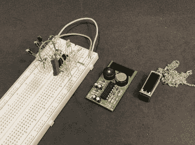

# 光束鸟吊坠真的会鸣叫

> 原文：<https://hackaday.com/2021/12/09/beam-bird-pendant-really-chirps/>

在学期结束和考试开始之间，[NanoRobotGeek]度过了一个愉快的周末。他们买了一桶啤酒狂欢了吗？不，事实上，恰恰相反——他们可能通过在 0603 自由焊接[这个美丽的啁啾鸟吊坠](https://www.instructables.com/Free-Formed-Solar-Chirping-Bird-Pendant-Using-0603/)获得了一些脑细胞。

 该电路是围绕 74HC14 构建的标准波束项目，但【NanoRobotGeek】做了一些改动，以实现理想的啁啾声。正如你在休息后的视频中看到的，它发出大约 30 秒的鸣叫，然后关闭 1-2 分钟，然后再次启动。

比梁项目好的是什么？我们称之为便携式的。虽然唧唧声可能会很快过时，但没有什么可以替代如此小巧的作品，以至于你可以把它挂在脖子上炫耀。

这是一个漫长的过程，因为[NanoRobotGeek]从电路试验板开始，然后在 2019 年制作了一个 PCB 版本，他们试图通过这个项目小型化。我们认为他们在这方面做得非常出色，如果你足够疯狂去尝试这一点，文档也是一流的。你需要足够的耐心和耐心，而预镀锡是你的好朋友。请务必在休息后观看演示。

名字得到了验证，这也不是[NanoRobotGeek]第一次涉足微型电路雕塑了——让我们来看看我们已经介绍过的所有内容。

 [https://www.youtube.com/embed/DPphoa3fAkA?version=3&rel=1&showsearch=0&showinfo=1&iv_load_policy=1&fs=1&hl=en-US&autohide=2&wmode=transparent](https://www.youtube.com/embed/DPphoa3fAkA?version=3&rel=1&showsearch=0&showinfo=1&iv_load_policy=1&fs=1&hl=en-US&autohide=2&wmode=transparent)

