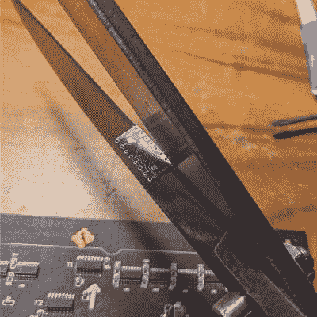

# 剪你的方式来 DIY PCB 城堡

> 原文：<https://hackaday.com/2021/12/11/snip-your-way-to-diy-pcb-castellations/>

城堡状 PCB 边缘有点神奇。电镀的半圆形特征是一种从一个板到另一个板进行牢固、低轮廓连接的方式，焊料流入其中的方式非常令人满意。但是将它们添加到 PCB 设计中并不总是便宜的。不用担心——你可以用这个简单快捷的方法制作自己的城堡。

 [@CoilProtogen]在 Twitter 帖子中没有包括太多关于设计细节的信息，但图片清楚地表明了这里的想法是什么。OEM 城堡实际上只是电路板边缘的电镀区域，可以用来将电路板固定到另一个电路板上，而无需添加任何硬件。这里的黑客意识到，排列一堆大直径过孔并用一把锋利的剪刀将它们劈成两半，将在不增加成本的情况下获得相同的剖面。帖子上的评论从赞美这个想法的辉煌到对电路板潜在损害的畏缩，但[@CoilProtogen]坚持认为 0.6 毫米的基板像黄油一样切割。我们担心过孔上的镀层可能会撕裂，但这里似乎不是这种情况。

在这种情况下，零剖面连接的优势显而易见，在较大的 PCB 上，城堡形 PCB 被用来取代笨重的插头引脚连接器。我们可以看到这种技术通常是有用的；在之前，我们已经看到它们的良好效果，这是我们以后要记住的技巧。