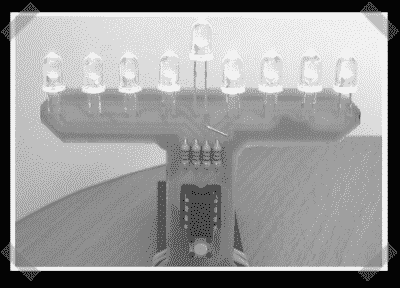
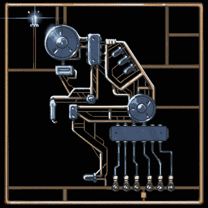
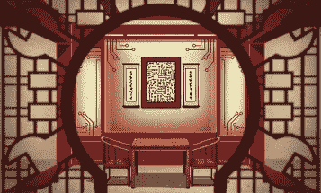
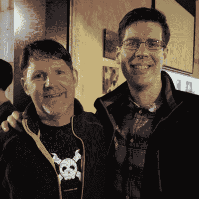

# 今天是我在 Hackaday 的最后一天；感谢所有的黑客！

> 原文：<https://hackaday.com/2021/12/10/today-is-my-last-day-at-hackaday-thanks-for-all-the-hacks/>

我已经决定开始职业生涯，并接受了 Golioth.io 的开发者关系工程师一职。我很高兴地宣布，埃利奥特·威廉姆斯将成为《黑客日报》的下一任主编。

从 2009 年夏天开始，我已经在 Hackaday 工作了 13 年。但是像所有的 Hackaday 写作团队一样，我开始是这个网站的忠实读者。我记得在 2005 年初，当凯文·罗斯在旧 CNET 电视节目*的一集里提到屏保*时，我听说了 Hackaday。Hackaday 已经在制造机器人，并且刚刚开始使用 8 位 AVR 微控制器，它正是我一直在寻找的新的有趣项目的来源。

Remember when all Hackaday photos looked like this? This one is actually [the first time I had a project featured on the site](https://hackaday.com/2008/11/13/improved-led-menorah/)!

从那时起，发生了巨大的变化。当我开始写作时，我们刚刚停止使用黑白照片。几篇文章之后，我们删除了强制所有文章小写的 CSS。当我在 2013 年成为主编时，我们不再称之为 Hack a Day，而是支持 Hackaday，大约一年后，我们彻底检查了网站，从黑色上的绿色改为黑色上的黄色，并将 470 像素的内容宽度扩展到 800 像素。进步。

不变的是我们如何保持新鲜感。Hackaday 一直相信我们的作者会按照他们自己的兴趣来指导我们。为 Hackaday 写作的人有更好的事情要做，但他们将写作作为一种创造性的发泄方式，专注于提升他们的技能，发现可用技术的新用途，并与更大的 Hackaday 社区分享这种能量。他们生活在世界各地，在许多不同的领域工作。这些经历汇集在一起，形成了一部集体著作。我很幸运拥有这个伟大的作家群体，你也是。当他们的时代结束时，人们希望新的一批读者会挺身而出，确保美好的时光永远不会结束。

## Hackaday 的特别之处

Hackaday 是一个真正独立的声音，我们的读者对我们的信任是我们最宝贵的资产。多年来，我看到一个又一个网站陷入广告或“赞助内容”的困境——一些公司付费将他们的信息发布在一个原本可信的网站上。Hackaday 从来不需要这么做。由于我们的母公司 Supplyframe 的强大支持，编辑独立性是一种奢侈，它认为 Hackaday 社区是值得的。当然，你不会有任何其他方式。

Supplyframe 于 2013 年 7 月收购了 Hackaday，并对该组织的未来进行了大量投资。他们创建了 Hackaday.io，为项目托管提供场所，第二年春天，我们推出了 Hackaday Prize。2014 年 11 月，我们在慕尼黑举办了第一次发布会，宣布了大奖得主。这是始于 2015 年的 Hackaday Superconference 的前身，已经发展成为公认的最优秀的硬件会议。

  Art by Joe Kim for the Hackaday Circuit Sculpture contest  Art by Joe Kim on a Maya Posch article about GNU Debugger: [https://hackaday.com/2020/11/06/local-and-remote-debugging-with-gdb/](https://hackaday.com/2020/11/06/local-and-remote-debugging-with-gdb/)  Art by Joe Kim on a Kristina Panos article about the Antikythera Mechanism: [https://hackaday.com/2015/11/23/the-antikythera-mechanism/](https://hackaday.com/2015/11/23/the-antikythera-mechanism/)  Art by Joe Kim on Steven Dufresne article about Robot Operating System: [https://hackaday.com/2018/05/31/modular-robotics-made-easier-with-ros/](https://hackaday.com/2018/05/31/modular-robotics-made-easier-with-ros/)  Art by Joe Kim on a Brian Benchoff article about variable instruction computing: [https://hackaday.com/2016/02/19/variable-instruction-computing-what-is-old-is-new-again/](https://hackaday.com/2016/02/19/variable-instruction-computing-what-is-old-is-new-again/)  Art by Joe Kim on a Brian Benchoff article about Tesla vs. Edison: [https://hackaday.com/2017/01/25/tesla-vs-edison/](https://hackaday.com/2017/01/25/tesla-vs-edison/)

在此期间，Hackaday 开始就一系列主题撰写长篇文章；深入探究历史人物、学习新技能的入门读物、我们周围世界的趣闻，以及我们在建设项目时使用的设备和材料背后的科学解释。乔·金(Joe Kim)成为了 Hackaday 的艺术总监，并围绕这些更长的文章形成了一种独特的视觉存在。作家和编辑超越了较短的项目功能，以迎接这一挑战。

我喜欢黑客日。我很难过要离开。

## 这么好的东西为什么要留下？

所以我为什么要离开我拥有的好东西呢？嗯，我一直在想我能不能专业的写固件。虽然这不是我要去的地方，但这是朝着那个方向迈出的一步。

今年夏天，我的好朋友 Chris Gammell 提到他正在签约一家初创公司，为泽法开源 RTOS 的固件工程师构建云服务。我决定尝试一下，因为这些年来我有许多微控制器物联网平台。我喜欢硬件不可知的想法，我一直是签名二进制和空中更新的支持者。正如您所料，云端有 web 控件和 REST API，但我很高兴看到它也为我们这些喜欢简单脚本的人提供了基于终端的控件。

今年秋天，Chris 告诉我，他正在考虑全职负责开发人员关系，并且正在寻找一位懂得如何编写固件的同行。工作是了解平台的每个部分，编写文档，与 Chris 一起构建硬件演示，并围绕这些内容编写内容，了解使用平台的人，并为他们提供所需的任何帮助。所以，玩玩嵌入式系统，写写它们，和其他人一起研究一下吧！这是一个利用我在 Hackaday 擅长的东西的机会，也是我在简历上做一些固件工作的机会。星星已经排成一行，我觉得我必须做出一个飞跃。

## Hackaday 的美好未来

Elliot Williams and Mike Szczys a few days after the 2016 Hackaday Belgrade conference

能够来到这里真是太棒了，这也是为什么许多写作团队——尤其是工作人员作家和编辑——这么多年来一直是 Hackaday 的一部分。是的，我要离开了，但是作为新的主编，埃利奥特·威廉姆斯正在建立他在 Hackaday 超过七年的经验。

汤姆纳尔迪将接任执行主编，克里斯蒂娜帕诺斯将成为任务编辑。珍妮·李斯特和亚当·法比奥是编辑团队的长期成员。这些编辑都得到了 30 多位其他作家的支持，他们日复一日，年复一年，日复一日地把我们的出版日程排得满满的。

虽然今天我要告别编辑和写作，但我不会告别黑客日。你可以打赌，我会继续阅读和发送这些提示。

感谢所有给我们发来一个项目链接的人，在我们的首页上展示。感谢您为我们发表的文章增加深度的所有建设性和有见地的评论。感谢我遇到的每一个人，不是通过屏幕，而是在现实世界中——那些瞬间的友谊将被永远珍惜。感谢每一个重视知识传承和帮助他人提升的人。

黑客日万岁！