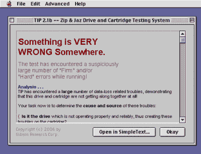

# MAC 提示诊断您的旧 Zip 和 Jaz 驱动器

> 原文：<https://hackaday.com/2021/12/08/mac-tip-diagnoses-your-old-zip-and-jaz-drives/>

Trouble In Paradise (TIP)是一款仅适用于 Windows 的流行工具，用于对 Iomega Jaz 和 Zip 驱动器进行故障排除。这些驱动器已经不再受 PC 的青睐，但这些驱动器仍然受到经典 Mac 收藏家的高度重视，他们使用 SCSI 版本作为老式机器的启动盘。因此，[马尔西奥·路易斯·特谢拉]着手将 TIP 工具移植到平台上。

Macintosh utilities used to have so much personality about them.

这一切都是因为在现代运行原始的齿尖回收工具变得困难。人们必须找到一台旧的 Windows 98 机器和 SCSI 适配器，才能将它与 Macintosh 兼容的 Zip 或 Jaz 驱动器一起使用。这启发了[马尔西奥]去联系开发者[史蒂夫·吉布森]，他为这个工具提供了原始的 x86 汇编代码。

[马尔西奥]然后把这个一行一行移植到 C 语言中，用一个复古的 Macintosh 编译器编译，让 TIP 在经典的 Mac 平台上运行。现在，可以在你的旧 Mac 上检查和测试 Zip 和 Jaz 驱动器和媒体，而不必摆弄老式的 Windows 机器。

这需要大量的努力，以及[Steve Gibson]对代码的慷慨捐赠，所有参与者都应该为他们的工作受到称赞。我们并不是每天都能看到如此令人印象深刻的港口，但它们偶尔也会出现。

同时，如果您一直在自己的项目中使用 Iomega 的经典可移动存储，请不要犹豫，告诉我们！休息后的视频。

 [https://www.youtube.com/embed/vtBlOaG2pNw?version=3&rel=1&showsearch=0&showinfo=1&iv_load_policy=1&fs=1&hl=en-US&autohide=2&wmode=transparent](https://www.youtube.com/embed/vtBlOaG2pNw?version=3&rel=1&showsearch=0&showinfo=1&iv_load_policy=1&fs=1&hl=en-US&autohide=2&wmode=transparent)

