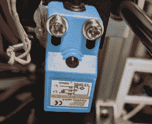
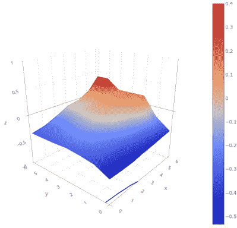

# 3D 打印:一个床的水平来统治他们

> 原文：<https://hackaday.com/2022/01/05/3d-printering-one-bed-level-to-rule-them-all/>

在理想情况下，FDM 3D 打印机的底座应该与打印头的运动平面完全平行。我们通常说，这意味着床是“水平的”，但实际上在传统意义上它是否水平并不重要，只要头部和床在每一点上相距相同的距离。当然，实际上没有什么是完美的。

第二个最好的情况是床非常平，但是相对于打印头倾斜。尽管这并不理想，软件可以以线性方式上下移动打印头来补偿倾斜。如果床本身不是平的，而且到处都有不规则的起伏，情况会更糟。

为了解决这个问题，一些打印机固件支持探测河床以确定其形状，并在打印头穿过地图时上下调整打印头。当然，你不能在每一个可能的点探测床，所以打印机将不得不在测量的参考点之间进行插值。马林的双线整平就是一个例子。

但是，如果你有足够的闪存空间，并且你使用马林，你可能想尝试[统一床水平(UBL)](https://marlinfw.org/docs/features/unified_bed_leveling.html) 。这就像类固醇上的双线性平衡。不幸的是，这种模式的文档并不像您希望的那样简单。一切都在那里，但很难开始，信息分散在几个页面和视频中。让我们解决这个问题。

## 基本思想

[](https://hackaday.com/wp-content/uploads/2021/12/sensor.jpg)

An inductive sensor

这个想法很简单。打印机在许多地方探测床。理想情况下，您可以使用离打印头不太远的传感器来完成这项工作。你可以有最多 225 个点，尽管 100 或 49 是常见的尺寸——即 15 x 15、10 x 10 或 7 x 7，并且床不一定是方形的。固件将探针值存储在 EEPROM 中。事实上，它可以存储多个网格，如果您有多个打印表面，这很有用:例如，您可以在一个插槽中存储一个玻璃床的网格，在另一个插槽中存储一个 PEI 床的网格。

一旦探测数据就位，您就不应该再探测它了，至少在很长一段时间内是这样。然而，有几个可能的问题。首先，你的床可能不会在每个地方都探测准确。更有可能的是，你的探针不能到达喷嘴能到达的床上的每一个点。最后，事情会随着时间而变化。你的床在底座上可能会下沉一点。该系统可以适应一切，但它有点复杂，直到你习惯了它。

## 一切旧的都是新的

当然，整平河床并不是什么新技术。打印机有能力做一些版本的很长一段时间了。如果你的床非常平，倾斜虚拟床就足够了。这在玻璃表面上很常见，只需计算出 X 和 Y 倾斜的斜率并线性应用即可。

[](https://hackaday.com/wp-content/uploads/2021/12/probe.jpg)

The probe hovers a bit higher than the pint nozzle.

UBL 有点不同。它使用许多点，并在每组点之间进行线性插值。想象每个测量点都是一个大网格的一部分。当打印头在网格中移动时，打印机会根据连接最近的网格点与其邻居的假想线的斜率进行调整。

但是让 UBL 与众不同的不仅仅是这许多点。首先，UBL 允许你很容易地微调点数。由于点与点之间的校正只是一种猜测，所以在有些情况下，猜测是错误的，您需要编辑该点，以对特定点进行或多或少的校正。

这种编辑有几个分支，乍一看可能不明显。首先，你可以设置 UBL 没有 Z 探头。当然，这是一种痛苦，但你可以手动测量所有的点，打印机有条款来帮助你进行测量。不过，理想情况下，你会有一个 Z 探头。感应探头很受欢迎，BL-Touch 和它的许多仿制品也是如此。照片显示了一个典型的电感式传感器。



编辑可以为您做的另一件事是设置 Z 探头无法到达的点。大多数探针与打印头有一些偏移，不能到达打印头能到达的每个点。例如，如果探头位于头部右侧 10 mm，而头部只能到达 0 mm，则探头只能测量 10 mm 或更大的 X 坐标。

事实证明，如果你的床很稳定，你可能不需要测量这些额外的分数，但是如果你需要的话，你可以这样做。Marlin 非常擅长猜测丢失的值，即使它是错误的，从猜测开始然后进行调整可能更容易。

一个有趣的副作用是，一旦你有了一个网格，就有多种方法来想象你的床是什么样子。然后你可能想把你的床调整得更平，但是如果你这样做了，你将不得不重建你的网格。下一次我会告诉你几个方法来得到这样的情节。

## 建设 UBL

您应该已经知道如何为您的机器构建 Marlin。如果没有，你必须从那里开始。一旦您可以让 Marlin 正常构建，您将需要处理这些配置参数:

在`configuration.h`(为清晰起见，添加了一些注释):

```

#define AUTO_BED_LEVELING_UBL  // and turn off or remove other AUTO_BED_LEVELING_* defines
#define RESTORE_LEVELING_AFTER_G28 // pick one of these if you want Home to restore level or turn it on
//#define ENABLE_LEVELING_AFTER_G28

//#define PREHEAT_BEFORE_LEVELING // you can enable this section or just preheat manually
#if ENABLED(PREHEAT_BEFORE_LEVELING)
#define LEVELING_NOZZLE_TEMP 120 // (°C) Only applies to E0 at this time
#define LEVELING_BED_TEMP 50
#endif

#define MANUAL_PROBE_START_Z 0.2 // Manual probes will start here so if this value is large, you will waste a lot of time

#define ENABLE_LEVELING_FADE_HEIGHT // When to fade leveling effect to zero (10mm is good)
#if ENABLED(ENABLE_LEVELING_FADE_HEIGHT)
#define DEFAULT_LEVELING_FADE_HEIGHT 10.0 // (mm) Default fade height.
#endif

#define SEGMENT_LEVELED_MOVES // split moves into small pieces instead of entire grid
#define LEVELED_SEGMENT_LENGTH 5.0
// This section sets the parameters for the mesh validation pattern if you want to use it
#define G26_MESH_VALIDATION
#if ENABLED(G26_MESH_VALIDATION)
#define MESH_TEST_NOZZLE_SIZE 0.4 // (mm) Diameter of primary nozzle.
#define MESH_TEST_LAYER_HEIGHT 0.2 // (mm) Default layer height for G26.
#define MESH_TEST_HOTEND_TEMP 205 // (°C) Default nozzle temperature for G26.
#define MESH_TEST_BED_TEMP 60 // (°C) Default bed temperature for G26.
#define G26_XY_FEEDRATE 20 // (mm/s) Feedrate for G26 XY moves.
#define G26_XY_FEEDRATE_TRAVEL 100 // (mm/s) Feedrate for G26 XY travel moves.
#define G26_RETRACT_MULTIPLIER 1.0 // G26 Q (retraction) used by default between mesh test elements.
#endif

#elif ENABLED(AUTO_BED_LEVELING_UBL)  // settings for UBL
//#define MESH_EDIT_GFX_OVERLAY // Display a graphics overlay while editing the mesh
#define MESH_INSET 0 // Set Mesh bounds as an inset region of the bed -- to avoid clips or other margins
// Set the # of rows/columns to use&nbsp;
#define GRID_MAX_POINTS_X 7 // Don't use more than 15 points per axis, implementation limited.
#define GRID_MAX_POINTS_Y GRID_MAX_POINTS_X
//#define UBL_HILBERT_CURVE // Use Hilbert distribution for less travel when probing multiple points
#define UBL_MESH_EDIT_MOVES_Z // If you turn this off, the nozzle could scrape the bed while moving between edit points
#define UBL_SAVE_ACTIVE_ON_M500 // Save the currently active mesh in the current slot on M500
//#define UBL_Z_RAISE_WHEN_OFF_MESH 2.5 // You can force a height when there is no data for a point

#define UBL_MESH_WIZARD // add a wizard for setup to the menu

// more menu setup
#define LCD_BED_LEVELING
#if ENABLED(LCD_BED_LEVELING)
#define MESH_EDIT_Z_STEP 0.025 // (mm) Step size while manually probing Z axis.
#define LCD_PROBE_Z_RANGE 4 // (mm) Z Range centered on Z_MIN_POS for LCD Z adjustment
#define MESH_EDIT_MENU // Add a menu to edit mesh points
#endif

// What do do after a Z probe
#define Z_PROBE_END_SCRIPT "G1 Z10 F12000\nG1 X15 Y200\nG1 Z10"

```

如果你需要覆盖，在`configuration_adv.h`中也有一些设置，例如，三点探针角之类的东西。你通常可以不去管这些。如果你有一个 8 位控制器，你可能没有足够的内存来建立 UBL。有几种方法可以减少内存占用，但不会太多。最好升级到更大的主板。

## 下次

一旦你建立了固件并下载到你的打印机上，你就可以开始了，对吗？不完全是。即使打印机现在知道 UBL，你必须设置它，包括设置 Z 高度和测量你的第一个网格。下次我会告诉你这是如何工作的。