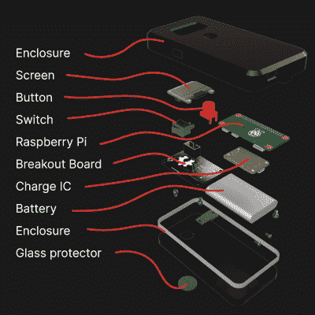

# 用于识别塑料的开源检测器

> 原文：<https://hackaday.com/2021/12/13/an-open-source-detector-for-identifying-plastics/>

回收塑料的挑战之一是确定一件物品实际上是由哪种塑料制成的。为了满足需求，大规模的回收中心依靠各种自动化系统将不同类型的塑料从进料流中分离出来。但在世界上技术不太先进的地方，工人们会发现自己不得不手动识别塑料物品；一个耗时且容易出错的过程。

为了尝试改善这种情况，[杰里·德·沃斯]、[阿明·斯特拉勒]和[朱尔·维德马尔]一直在研究一种手持开放硬件设备，他们简称之为塑料扫描仪。他们希望这种袖珍型装置可以在野外使用，通过测量其对红外光的反射率来明确识别各种类型的塑料。该设备有望非常容易操作，因为用户只需将设备靠近一块塑料，按下按钮，然后等待信息在有机发光二极管显示器上弹出。

 或者至少是这样的想法。虽然该团队最终希望发布一个工具包来构建自己的手持塑料扫描仪，但似乎硬件还没有为生产做好准备。不出所料，最近的工作似乎已经放到了开发板上，让团队改进他们的过程。该开发单元集成了一个波长范围为 850 至 1650 纳米的 IR LEDs 阵列、一个连接到 ADS1256 24 位模数转换器(ADC)的 InGaAs 光电二极管和一个 Arduino Uno。相比之下，最终的硬件使用 Raspberry Pi Zero 和一个较小的“分线板”，其中包含传感器和 IR LEDs。

[浏览项目](https://github.com/Jerzeek/PlasticScanner-Software)的软件库，我们可以看到该设备使用 Python、TensorFlow Lite 和已知塑料的红外反射率值数据库来尝试和确定最接近的匹配。显然，这样一个系统的准确性将高度依赖于已知良好数据的数量，但至少在目前，用户似乎有责任建立自己的收集或 ir 值。

尽管这个项目很有趣，但我们对它用纯光学方法来识别塑料有点怀疑。自动回收中心确实使用红外光谱，但这只是众多工具中的一种。没有额外的数据点，[如被测塑料的密度或静电特性](https://hackaday.com/2019/04/13/this-bot-might-be-the-way-to-save-recycling/)，塑料扫描仪似乎会有相当高的误差。仅仅是考虑到用户在使用设备时可能遇到的各种纹理和颜色就已经是一个相当大的挑战了。

 [https://www.youtube.com/embed/lNZrY9Fcah8?version=3&rel=1&showsearch=0&showinfo=1&iv_load_policy=1&fs=1&hl=en-US&autohide=2&wmode=transparent](https://www.youtube.com/embed/lNZrY9Fcah8?version=3&rel=1&showsearch=0&showinfo=1&iv_load_policy=1&fs=1&hl=en-US&autohide=2&wmode=transparent)

【感谢哈维。CZ 代表小费。]