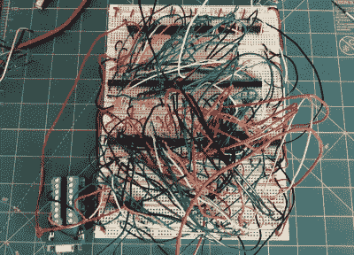

# 满足您所有复古需求的超薄 7400 逻辑 VGA 板

> 原文：<https://hackaday.com/2021/12/14/a-slim-7400-logic-vga-board-for-all-your-retro-needs/>

多年来，我们已经看到许多黑客用 74xx 逻辑芯片生成 VGA，但它们通常不是最实用的构建。这些电路通常作为比赛的一部分或纯粹为了挑战而组合在一起，通常由大量跳线组成，通常占据多个试验板。不是你用完就能扔进抽屉的东西。

但是由多产的黑客[Nick Bild]创造的 Vectron VGA Plus 设法在这方面做了相当大的改进。定制 PCB 的设计比它的前辈更小更简单，包含的芯片比我们过去看到的这种东西要少得多。同时，它在底部提供了一个方便的标题行，允许用户连接他们正在工作的任何东西，从微控制器到复古计算机。

When your breadboard looks like this, it’s time for a PCB.

如果你真的想最大限度地利用桌面空间，PCB 看起来仍然可以缩小很多，但我们认为出于他的目的，[Nick]觉得这已经足够紧凑了。尤其是当你看到同一电路在试验阶段是什么样子的时候。呀。

那么，是什么简化了这个 640 x 480 VGA 接口呢？简单的答案是增加更多的内存。只要有可能，专用硬件就会被可由外部连接设备执行的软件操作所取代。[Nick]为 Arduino 提供了一些样本代码，让微控制器将数据推入电路板的内存并进行控制。

我们可以将这个项目的起源追溯到几年前，那时[【Nick】正在为他的家酿 6502 电脑](https://hackaday.com/2019/04/19/a-nearly-practical-6502-breadboard-computer/)添加一个 LCD。几个月后，他组装了该板的早期版本，Vectron VGA，然后切换齿轮和[将 VGA 生成任务移交给 FPGA](https://hackaday.com/2020/11/16/vectron-adds-basic-and-christmas-tree-control/) 。我们很高兴看到这个项目的下一步进展，鉴于这个特定黑客的记录，我们不应该在它到达我们的收件箱之前等待很久。