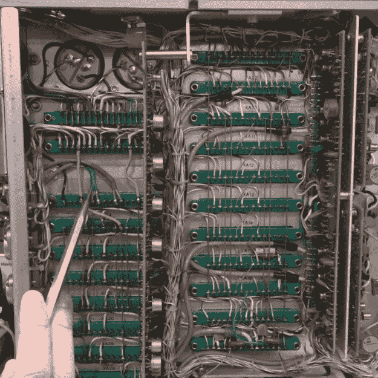

# 一个谢妮钟，来硬的

> 原文：<https://hackaday.com/2021/12/15/a-nixie-clock-the-hard-way/>

注意:在制作[这个过于复杂的谢妮时钟](https://www.youtube.com/watch?v=ri_uOuomBks)的过程中，没有任何老式惠普测试设备受到损害。事实上，如果有什么不同的话，HP 5245L 电子计数器的结果比它进入项目时更好。

Beautiful hand-wired backplane in the HP 5245 counter.

我们提到这种仪器的命运，主要是因为我们之前已经看到过很多看起来很酷的旧东西，里面装满了 Arduinos 项目，虽然它们可能很有趣，但失去我们共同的电子遗产也令人深感不安。这款设备诞生于 20 世纪 60 年代初，拥有一些我们见过的最漂亮的点对点背板布线，毁掉它将是一场悲剧，一场[Shahriar]明智地避免的悲剧。

经过一点概括和一些电源故障排除，下面的视频带我们参观了谢妮的美丽。这是一个很棒的作品，尽管它需要一点校准，但在几十年后仍然非常准确。不过，要把它变成一个时钟，需要增加一点齿轮。在内部，[Shahriar]增加了一个十分频卡，允许计数器使用外部 10 MHz 参考。在外部，使用 erasynch ++可编程信号发生器向计数器发送 0 Hz 至 23，595.9 kHz 的信号，每秒钟上升 100 Hz。

最终的结果是世界上最复杂的 24 小时时钟，老实说，这根本不是建造的重点。这是为了展示柜台内部的辉煌，向我们介绍一些很酷的新射频工具，并一如既往地通过[Shahriar]的视频进行教育和宣传。我们一直很欣赏他的魔法，从他对汽车雷达的观察到 T2 价值百万美元的示波器拆卸，这是另一个伟大的项目。

 [https://www.youtube.com/embed/ri_uOuomBks?version=3&rel=1&showsearch=0&showinfo=1&iv_load_policy=1&fs=1&hl=en-US&autohide=2&wmode=transparent](https://www.youtube.com/embed/ri_uOuomBks?version=3&rel=1&showsearch=0&showinfo=1&iv_load_policy=1&fs=1&hl=en-US&autohide=2&wmode=transparent)

