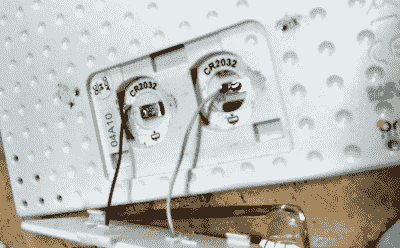

# 气象站转储 CR2032 单元格，增益 18650

> 原文：<https://hackaday.com/2021/12/16/weather-station-dumps-cr2032-cells-gains-18650/>

尽管事实上我们正在快速接近 2022 年，但仍然有令人难以置信的数量的小玩意需要你用一次性电池供电。当然，你可以购买各种形状和大小的传统碱性电池的可充电替代品，但这充其量只是权宜之计。对一些人来说，如果一个新设备没有内置锂离子电池和标准化的 USB 充电功能，它就没有希望。

[丹尼洛·拉里扎]就是这样的人。他的俄勒冈科学气象站需要一对 CR2032 硬币电池，他开始用一种集成的可充电解决方案来代替它们。转换最终比他最初预期的更容易实现，根据他的计算，在需要用标准 USB 充电器充电之前，他的解决方案应该可以让设备保持运行近 40 天。

Wiring in the new battery.

第一步是确定运行气象站实际需要多少电力。虽然两个 CR2032 电池串联在一起，因此提供了标称的 6 V，但他通过实验确定了一个工作台电源，它可以在低至 3.2 的电压下运行。这与单个 18650 电池的电压范围非常吻合，意味着他不需要在组合中添加升压转换器。他指出，气象站现在大部分时间都会发出“电量低”的警告，但这似乎是一个合理的代价。

确信气象站可以用 18650 电池代替原来的 CR2032s 电池愉快地运行，【Danilo】需要做的就是找到一种不时给电池充电的方法。为此，他拿出了一个普通的 TP4056 模块。这个方便的小电路板非常适合 18650 电池，而且非常便宜，没有理由不在你的零件箱里放几个。你永远不知道什么时候你可能需要教一个老玩意儿新把戏。