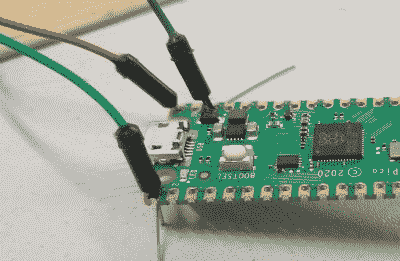

# 使用钓鱼线来固定针头是一个巧妙的技巧

> 原文：<https://hackaday.com/2021/12/16/using-fishing-wire-to-hold-in-pin-headers-is-a-nifty-trick/>

在试验板上工作，人们可以习惯于能够方便地插拔跳线来重新配置项目的好处。人们只能梦想用多氯联苯做到这一点，对吗？不对！最近，Stewart Russell[在 Twitter](https://twitter.com/scruss/status/1463305902866456587) 上分享了一个技巧，告诉我们如何在一根小钓鱼线的帮助下做到这一点。

The wire can be neatly threaded through the board to enable quick hookups.

诀窍很简单:在任何使用 0.1 英寸间距接头的旧开发板上，只需通过 PCB 上的电镀通孔编织一些钓鱼线。然后，可以像在试验板上一样插入常规跳线。钓鱼线有足够的弹性让跳线卡在里面，保持稳定和良好的接触，同时仍然允许它们很容易被移除。

[Hackspace 杂志]对这个技巧赞不绝口，指出使用 0.38 毫米钓鱼线取得了巨大成功[。替代方法包括](https://twitter.com/HackSpaceMag/status/1468536255633842178)[使用牙签](https://twitter.com/ben_everard/status/1463180631945449478)，尽管我们怀疑这种解决方案可能会更混乱、更不可靠。

如果你有自己的使用开发板和分线板快速制作原型的[技巧，一定要在下面的评论中分享。或者，在网上把你最好的东西发给我们](https://hackaday.com/2021/08/12/who-needs-pin-headers/)[！](http://hackaday.com/submit-a-tip)