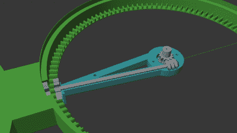

# 隐藏轴和齿轮使这个空心时钟走

> 原文：<https://hackaday.com/2022/01/08/hidden-shaft-and-gears-make-this-hollow-clock-go/>

[shiura]的[空心时钟 3](https://www.thingiverse.com/thing:5142739) 是一个奇妙的 3D 打印时钟机芯，它使用一个隐藏的机制来实现其不寻常的操作。中空的时钟没有表面，只有一个开放的空间，时针和分针按预期移动。只有较长的分针与钟体的其余部分有任何明显的联系，其余部分似乎悬在空中。

Hidden shaft and gearing.

它是这样工作的:较长的分针连接到白色的环上，事实上是这个环旋转，带着附属的分针一起旋转。但是，时针是如何在其他指针转动时保持不动的呢？一个隐藏的轴和齿轮组件可以解决这个问题。分针(实际上是白色圆环)每转一圈，时针只允许相对前进 1/12 圈。这是一个聪明的系统，你可以在照片中看到它的内部。

不像[展示其内部运作的时钟项目](https://hackaday.com/2021/12/23/a-simple-3d-printed-gear-clock-shows-off-how-it-works/)，空心时钟很难隐藏它们。如果你决定自己做，shiura 警告说要做一些调整来微调运动部件之间的摩擦量，以便操作顺利，并为此提供了有用的指导。花几分钟时间观看视频中运行的时钟，嵌入在下面。

 [https://www.youtube.com/embed/XCOC2zNjWCg?version=3&rel=1&showsearch=0&showinfo=1&iv_load_policy=1&fs=1&hl=en-US&autohide=2&wmode=transparent](https://www.youtube.com/embed/XCOC2zNjWCg?version=3&rel=1&showsearch=0&showinfo=1&iv_load_policy=1&fs=1&hl=en-US&autohide=2&wmode=transparent)

