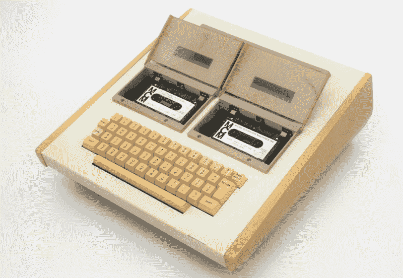
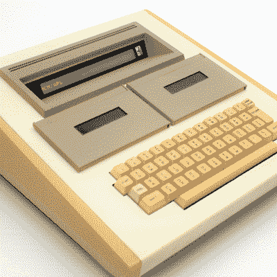

# 感兴趣的输入:加拿大 MCM/70 有点像第一个网络甲板

> 原文：<https://hackaday.com/2022/02/23/inputs-of-interest-canadian-mcm-70-was-kinda-like-the-first-cyberdeck/>

我不想在评论中引起争论，但你认为第一台微型计算机或个人计算机是什么？我们认为答案取决于你的定义。有些人会说，个人电脑诞生于施乐 PARC 公司，它有着奇特的肖像模式显示屏和三键鼠标，而另一些人会说，这一切都始于加州洛斯阿尔托斯或新墨西哥阿尔伯克基的一个车库。

如果你把“计算机”一词理解为能够相当快地处理大量数字的意思，那么加拿大制造的 MCM/70 可以说是第一台个人计算机，因为它是便携式的，有字母数字键盘，显示器，支持盒式存储器，可以用来扩展 8K 的内存。这是一个一体化的计算解决方案，它可以内置一个可选的电话调制解调器。在 1974 年，这是一台具有前瞻性思维的机器。

## 通用个人电脑

我们都习惯于将个人电脑作为标准，无论是移动电脑、笔记本电脑还是台式机。当然，在早期，计算机是大型单一用途的机器，用来处理更多的数据。回到更久远的时代，计算机是人类高速操作复杂的机电计算器，或者简单地使用铅笔或粉笔。

在个人电脑出现之前，人们不得不在大型机上共享时间来进行计算。想象一下，每当你想在网上查找一些东西的时候，你不得不去图书馆。难道你不想在家里自己的机器上做吗？你当然会。

Image via [VintageComputer.ca](https://vintagecomputer.ca/the-micro-computer-machines-mcm-70-the-canadian-holy-grail-of-computing-history/)

20 世纪 60 年代末，安大略省金斯敦皇后大学的 Mers Kutt 教授厌倦了看着大型计算机用户的效率因提交程序的漫长等待时间而受到影响。库特在 1968 年创办了一家公司，并建造了一个带有单行显示的数据输入终端，消除了打卡的需要。

Kutt 想要建造一台不同的机器来支持 APL 的开发，APL 是一种充满数学符号的新编程语言，最好在定制键盘上编程。他创办了一家新公司——微型计算机机器公司(MCM)来制造这些设备，这些设备看起来像 20 磅重的原始电脑甲板。

## 一个便携的、数学头脑的网络平台

MCM/70 被设计成一种价格合理的通用计算机，如果你认为 1974 年的全套设备型号 9800 美元是“价格合理”的话。它基于 800 KHz 的 Intel 8008，是首批使用 CPU 的商用计算机之一。显示器是一个 32 字符的玻璃等离子体数字，支持滚动。

Image via [VintageComputer.ca](https://vintagecomputer.ca/the-micro-computer-machines-mcm-70-the-canadian-holy-grail-of-computing-history/)

这些机器有几种不同的方式:它们要么根本没有卡带，只有一个卡带和一个用于上传程序到其他机器的声音耦合器，要么有两个卡带。ROM 内置了一个 APL 解释器和一个电池，以便在掉电时保存工作空间。它们甚至可以安装成电池供电。

MCM/70 有一个带有 QWERTY 和 APL 图例的专用键盘，ISO Enter 和一个 honkin ' 9u 空格键。像任何老式电脑一样，我们也想尝试一下。请务必查看加拿大网站上[的所有图片。](https://vintagecomputer.ca/the-micro-computer-machines-mcm-70-the-canadian-holy-grail-of-computing-history/)

当然，这种类型的计算能力并不便宜，而且一般不会出现在普通消费者的家中，这可以说是多少人可能会描述个人电脑。这些小型机和它们的继任者大多被出售给需要进行大型计算的公司和政府机构。各种医院和保险公司以及美国宇航局和美国陆军是 MCM 的几个客户，他们在几年内售出了数百台。

## 发生了什么事？

这可能是激情的问题。《发明个人电脑:MCM/70 *的故事*一书声称，默斯·库特既不是黑客，也不是业余爱好者；相反，他是一个企业家和发明家，他只是看到了一个市场，并找到了一个合作伙伴来帮助他实现自己的愿景。尽管如此，他坚持不懈。

据发明个人电脑的人说，库特和 MCM 的一些投资者之间有一场“毁灭性的权力斗争”。到 20 世纪 70 年代末，他们开始看到竞争对手提供相同数量的计算能力，MCM 正在设计一种改进的机器作为回应。据说，他们没有资金来推动快速发展，从而击败市场竞争对手。到 1983 年，MCM 倒闭了。

库特创办了最后一家公司，名为 All Computers，Inc. [，最终起诉英特尔](https://www.crn.com.au/news/computer-pioneer-launches-patent-suit-against-intel-15213)，声称他们在英特尔处理器中使用了他的专利电路。该诉讼于 2005 年被驳回，库特于 2006 年被授予加拿大勋章。