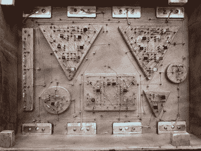

# 向你们新的巨型 555 定时器霸主致敬

> 原文：<https://hackaday.com/2021/12/20/all-hail-your-new-giant-555-timer-overlord/>

你要求的，现在你得到了。积累了十多年的抱怨，但这个巨大的 555 定时器 ic 终于聚集了足够的精神动能，以有形的形式要求 Hackaday 的读者忠诚。

或者不是。不太令人兴奋的解释是，创造者[Rudraksha Vegad]正在寻找一种方法，将他对分立电子元件和木工的兴趣结合起来。结果是一个不可思议的构建，不仅仅是一个对话的开始；这个桌面大小的标志性集成定时器电路功能齐全。假设你手边有鳄鱼夹，你甚至可以把它挂在面包板上。

 揭开这个木制“芯片”的盖子，你会发现一个由分立元件组成的错综复杂的手工连线阵列，它代表了真实事物内部的微观变化。他甚至不厌其烦地重新创建了比较器和触发器的符号，你可以在 555 的示意图中看到，使用木制形状来提升它们各自的组件。它可能不符合经典定义，但肯定这必须算作某种形式的电路雕塑。

[Rudraksha]称赞其他几个项目不仅激发了他创造自己的 mega 555，还帮助他理解了每个人都喜欢的 IC 的内部工作原理。他说，利用从旧硬件中回收的组件，这个项目最终对他很有教育意义。如今，当大多数制造商更有可能接触微控制器而不是逻辑芯片时，[花一些时间在晶体管和无源器件上是很有启发性的](https://hackaday.com/2021/10/26/simple-electronic-hacks-inspire-doing-more-with-less/)。

 [https://www.youtube.com/embed/GDjzL_fKQDE?version=3&rel=1&showsearch=0&showinfo=1&iv_load_policy=1&fs=1&hl=en-US&autohide=2&wmode=transparent](https://www.youtube.com/embed/GDjzL_fKQDE?version=3&rel=1&showsearch=0&showinfo=1&iv_load_policy=1&fs=1&hl=en-US&autohide=2&wmode=transparent)

