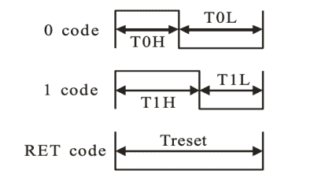

# 6502 上的 WS2812s

> 原文：<https://hackaday.com/2021/12/23/ws2182s-on-a-6502/>

我们仍然记得 WS2812 LED 第一次进入我们意识的时候，那是在时间的迷雾中。数据手册中的时序图的准确性值得怀疑，这让它听起来很棘手，时序容差很小，本质上是一个 500 kHz 的高速两位 PWM 数据协议。那时候用一台 85 年的老爷车是一个挑战，但是像苹果 II 这样又老又破的东西是不可能达到标准的，对吧？

[Anders Nielsen]接受了让古老的 6502 处理器驱动新像素的挑战，并取得了胜利！毕竟，如果芯片[足够好，可以用于 Bender](https://spectrum.ieee.org/the-truth-about-benders-brain) 和[终结者 T-800](https://www.pagetable.com/?p=64) ，它应该可以闪烁一些彩色 led，对吧？秘方是移位寄存器！

 具体来说，【Anders】滥用 74LS165 并行输入、串行输出移位寄存器来干脏活。不是直接对 WS2812 的“长高为 1，短高为 0”信号进行位碰撞，移位寄存器的前几位硬连线到 VCC，后几位硬连线到 GND。

中间的位决定移出的脉冲是长还是短，它们由 6502 通过芯片通过 [6522 设置，就像 Apple II 一样。从移位寄存器中时钟输出数据处理时序关键的东西。非常聪明！](https://en.wikipedia.org/wiki/MOS_Technology_6522)

休息下的视频。

 [https://www.youtube.com/embed/sWaI3kpXslY?version=3&rel=1&showsearch=0&showinfo=1&iv_load_policy=1&fs=1&hl=en-US&autohide=2&wmode=transparent](https://www.youtube.com/embed/sWaI3kpXslY?version=3&rel=1&showsearch=0&showinfo=1&iv_load_policy=1&fs=1&hl=en-US&autohide=2&wmode=transparent)

