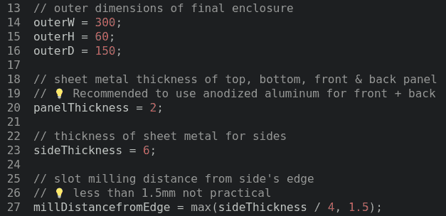

# 使用 OpenSCAD 规划定制铝外壳

> 原文：<https://hackaday.com/2021/12/26/planning-custom-aluminum-enclosures-with-openscad/>

这些年来，我们已经看到许多项目让您使用 OpenSCAD 创建定制的外壳，这是有充分理由的。参数化 CAD 工具是基于用户可调变量生成 3D 模型的理想工具，如果您利用它的集成定制器，制作一个定制的盒子就像移动一些滑块一样简单。生成的文件会被发送到 3D 打印机，这样就万事俱备了。但是，如果你正在寻找一个定制的外壳，不那么…塑料？

在这种情况下， [AlClosure by [0xPIT]可能就是答案](https://github.com/0xPIT/AlClosure)。该代码不是为您的 3D 打印机生成 STL 文件，而是帮助您设计一个由铝板制成的外壳。顶部和底部面板旨在从 1.5 毫米至 2.5 毫米的板材上切割而成，而侧面则由更厚的 5 毫米至 8 毫米的板材制成，以容纳一个容纳前后插片的机加工口袋。

 因为是 OpenSCAD，所以大部分设计都是由你可以调整的变量控制的。显然，外壳的外部尺寸可以在瞬间改变，但修改所用铝板的厚度或螺丝孔的大小也同样容易。[0xPIT]在记录代码本身方面也做得很好，所以你会确切地知道你在修改什么。

显然，你需要切割和加工铝的能力来实际利用这个项目。代码本身实际上只是一种将设计概念化并提前计算出尺寸的方法。但是，正如最近杰里米·菲尔丁在 2021 年大会上的主题演讲提醒我们的那样，这种早期的原型设计通常可以让你省去很多麻烦。