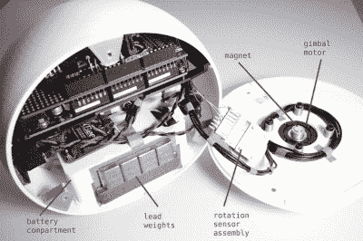

# 当球形机器人变成两个轮子时

> 原文：<https://hackaday.com/2021/12/30/when-a-ball-robot-becomes-two-wheels/>

距离《星球大战:原力觉醒》第一次向我们展示小型球形机器人 BB-8 已经过去了大约六年，但公平地说，在这一过程中，我们并没有失去对滚球机器人的集体迷恋。已经有很多制造全滚动装置的尝试，但也许[Derek Lieber]有更好的选择[，通过增加一对轮胎](https://revenanteagle.org/checksix/ballbot/ballbot.htm)，将球形机器人变成两轮滚轴。受一款从未上市的三星样机的启发，它通过轮子克服机器的低重心来工作，并使用倾斜传感器来控制速度。

 球形底盘是一个 3D 打印的外壳，在经过多次电机实验后，最终版本将一对带有一组磁性位置传感器的万向电机放入其中。里面是一个 Arduino Mega 和一个定制的电机驱动板，带有一个 LM6234，带有一个 XBee 无线电用于远程控制。与此同时，电力来自一组三个脂肪细胞，底部有一些额外的铅镇流器来保持整个事情的平衡。

[过去我们已经见过更多传统的球形机器人](https://hackaday.com/2020/05/21/spherical-quadruped-arduino-robot/)，但我们对这款机器人特别感兴趣，并期待看到它的未来。

 [https://www.youtube.com/embed/M2yQxeAfSCs?version=3&rel=1&showsearch=0&showinfo=1&iv_load_policy=1&fs=1&hl=en-US&autohide=2&wmode=transparent](https://www.youtube.com/embed/M2yQxeAfSCs?version=3&rel=1&showsearch=0&showinfo=1&iv_load_policy=1&fs=1&hl=en-US&autohide=2&wmode=transparent)

