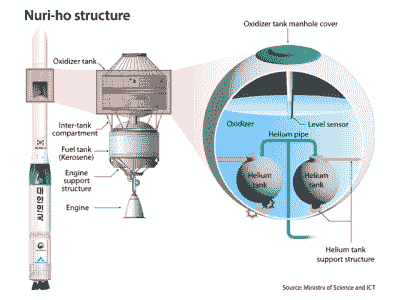

# 可重复使用的助推火箭，亚洲综述

> 原文：<https://hackaday.com/2022/01/11/reusable-booster-rockets-asian-roundup/>

航天飞机的固体火箭助推器可以重复使用，尽管最终整个系统并没有证明比一次性发射更便宜。但鉴于猎鹰 9 号计划的成功——助推器 B1051 上个月完成了第 11 次任务——火箭级返回发射场并被重复使用的想法不再是一个疯狂的提议。世界各地的其他航天局都在追求这项技术，这并不奇怪。

去年，印度空间研究组织(ISRO)宣布了基于他们的 T2 GSLV 马克三型火箭(T3)的可重复使用发射计划(T1)。日本宇宙航空研究开发机构(JAXA) [去年秋天宣布，它正在与日本各行业和大学合作，开始一项可重复使用的火箭项目](https://asia.nikkei.com/Business/Aerospace-Defense/Japan-launches-reusable-rocket-project-chasing-Musk-s-SpaceX)。11 月，当立法者[宣布一项可重复使用的火箭计划时，韩国航天局，韩国航空航天研究所(KARI)感到惊讶，该计划没有列入他们的 2022 年预算](https://spacenews.com/south-korea-to-develop-reusable-rocket-with-100-ton-thrust-engines/)。不在亚洲，但在 12 月法国的 ArianeGroup [宣布了一项名为 MAA](https://arstechnica.com/science/2021/12/france-seeks-to-build-reusable-rocket-make-up-for-bad-choices-in-the-past/)的可重复使用的火箭计划。

说到韩国的火箭计划，我们在 10 月份报道了因第三级出现问题而未能进入轨道的 Nuri 火箭。Kari 最近完成了对所有数据的审查，并得出结论，问题出在位于氧化剂箱内的氦箱的锚上。

显然，在安装支架的设计中，水下储罐随高度变化的浮力没有完全考虑进去。当它们最终发生故障时，由此导致的管道破裂导致液氧泄漏，随后 46 秒的发动机过早停机。2022 年 5 月的下一次发射很可能会推迟。