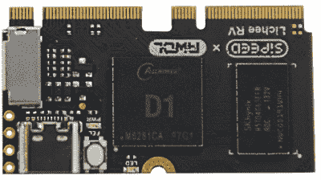

# 新的部分日:RISC-V 荔枝-RV 模块和船坞

> 原文：<https://hackaday.com/2022/01/06/new-part-day-the-risc-v-lichee-rv-module-and-dock/>

Sipeed 一直忙于利用 RISC-V 领域的发展，开发了一个有趣的低成本模块，他们称之为 [Lichee RV](https://wiki.sipeed.com/hardware/zh/lichee/RV/RV.html) 。它基于[阿里赢家 D1 SoC](https://dl.linux-sunxi.org/D1/D1_Datasheet_V0.1_Draft_Version.pdf) (它包含一个[平头铁铉 C906](https://occ.t-head.cn/vendor/cpu/index?id=3817197695983423488) ，用于那些跟随中国 RISC-V 处理器开发的人)，支持可选的 NAND 文件系统。这个小电路板使用一对边缘连接器，类似于 Raspberry Pi CM3 外形，只是它基于一对 M.2 连接器。该模块具有 USB-C、SPI LCD 接口以及板载 TF 卡插座，其余接口位于 big edge 连接器上。

The minimalist Allwinner D1-based Lichee RV

这就把我们带到了下一个 Sipeed 板，Lichee RV Dock，这是一个用于模块的小型开发板。这打破了 HDMI，增加了 USB，WiFi/蓝牙模块，音频驱动器，麦克风阵列接口，甚至 40 路 GPIO 连接器。构建您自己的嵌入式云连接设备所需的一切。

早期采用者请注意，尽管 Linux 支持仍处于开发的早期阶段，显然 Debian 是目前最有用的。我们自己还没有测试过，但是对于那些预算不多，不需要像 Raspberry Pi 或类似产品那样耗电的多核性能的项目来说，它看起来确实非常有用。

我们已经看到几年前在 Pi Hat 上托管的 [Sipeed MAix M1 AI 模块，以及在 Sipeed K210](https://hackaday.com/2019/05/24/new-part-day-a-64-bit-risc-v-cpu-in-raspberry-pi-hat-form/) 上运行的 [NES 仿真器。如果你问我们，RISC-V 的未来看起来相当不错！](https://hackaday.com/2019/03/14/nes-on-risc-v/)

感谢[Maarten]的提示！