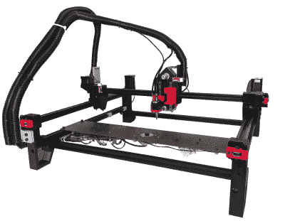

# 天使投资者给开源 PnP 一个巨大的推动

> 原文：<https://hackaday.com/2022/01/04/angel-investor-gives-open-source-pnp-a-massive-boost/>

当一个开源硬件项目成长起来并变成一个可持续发展的业务时，我们很高兴，除了努力工作和伟大的想法之外，我们一无所有。但是，用你自己的钱来做这件事，将任何销售的利润投入到开发中，并且在这样做的同时不拿一分钱的工资，这真的是一个艰难的前景。人们显然需要收入来维持生活，而花在创业上的时间是你不能用来谋生的。因此，我们很高兴能为您带来来自[Stephen Hawes]和他的拾放机计划的最新[消息。自从我们最后一次检查这个项目以来的一年中，开发一直在以稳定的速度继续，与此同时，这些家伙很快就超出了车库的工作空间，他们准备出售 PnP 机器套件。](https://www.youtube.com/watch?v=e_WSFvBg8EU)

大新闻是，Stack Exchange 的联合创始人、看板管理工具 Trello 的创建者和天使投资人[Joel Spolsky]对该公司进行了相当大的投资(10 万美元)，使他们能够获得 3000 多平方英尺的收入。ft 办公空间，并给他们资金购买股票和所有那些无聊的业务开销的东西。[Stephen]花时间解释说[Joel]不会对公司有任何控制权，所有的硬件和软件都将保持完全开源。对那些感兴趣的人来说，【乔尔】将他的投资作为[安全票据](https://www.ycombinator.com/documents/)(未来股权的简单协议)，因此，如果他们在未来获得巨大成功，【乔尔】只会以小份额分配的形式获得回报。没有比这更公平的说法了！

【Stephen】最近收到了[关于他在项目中使用“索引”名称的“停止和终止”通知](https://www.youtube.com/watch?v=H8X38fbqWUM&t=152s)，因为这已经是一个被其他人保护的商标术语，该项目将需要很快更改名称。这是一个小挫折，但有点令人恼火的是，这笔投资的一大部分现在必须交给律师，以确保他们最终选择的名字没有被占用，并且可以安全使用。

就机器本身而言，它现在正在全面运行，有多个自动带式送料器，具有上下面向的机器视觉，以及所有这些优点。它甚至被演示为自己的定制主板 PCB 放置零件，reprap 风格。不错！

我们希望[Stephen]和合作伙伴[Lucian]获得他们应得的所有成功，并希望他们能够获得这些套件，因为这些地区的人们需要一台负担得起的、可出租的桌面 PnP 机，包括这位抄写员！

这里是关于机器的[早期故事，但它不是我们见过的唯一开源 PnP 机器——这里是几年前的](https://hackaday.com/2020/05/11/open-source-pick-and-place-has-a-450-bom-cost/)[另一个](https://hackaday.com/2015/02/06/a-diy-pick-and-place-you-can-build-right-now/)。

 [https://www.youtube.com/embed/e_WSFvBg8EU?version=3&rel=1&showsearch=0&showinfo=1&iv_load_policy=1&fs=1&hl=en-US&autohide=2&wmode=transparent](https://www.youtube.com/embed/e_WSFvBg8EU?version=3&rel=1&showsearch=0&showinfo=1&iv_load_policy=1&fs=1&hl=en-US&autohide=2&wmode=transparent)

