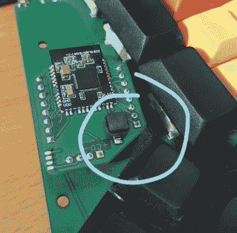
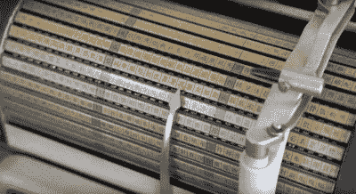
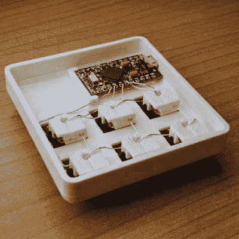

# 和克里斯蒂娜一起“基宾”:有三种语言打字机的那个

> 原文：<https://hackaday.com/2022/01/18/keebin-with-kristina-the-one-with-the-tri-lingual-typewriter/>

当一个项目最终做到了你一开始就想让它做的事情，这难道不是很棒吗？当涉及到 aero DOX 时，[西蒙·梅里特]不愿意妥协。他对键盘的最初设想是一种无线的、符合人体工程学的分离，可以很容易地在几台电脑之间切换。虽然有些人更喜欢一个接一个地进行布局，但[Simon]一直在推进同样的设计，这是一种 ErgoDox 和 Redox 之间的混搭，而 Redox 本身就是 ErgoDox 的无线版本。

aero DOX 有三个 nRF51822 模块——一个用于两半通信，一个用于控制一半发送按键，第三个在接收器端。[Simon]使用两个 AA 电池为每个电池供电，并且在连接到 PC 时遇到了问题。

NRFs 想要 3.3 V，但据称在困难时期会满足于 2 V。[西蒙]增加了一个升压转换器，为每个人提供稳定的 3.3 伏电压，Aerodox 变得足够可靠，可以成为[西蒙]的日常司机。但是让我们回到尚未实现的潜在部分。

重点是在多台电脑上轻松使用这个 keeb。[Simon]最近发现了某人用于有丝分裂键盘的蓝牙代码，并将其改编为 Aerodox 上的工作代码。他在两半部分之间使用了一个 Gazell 链接，并通过蓝牙将控制部分连接到电脑。不幸的是，[Simon]不得不修改模拟氧化还原时的定时器中断和去抖动方案，但它现在可以工作了，只需按一下按钮就可以在电脑之间切换。既然[Simon]对 nRF 芯片很满意，我们接下来可能会看到运行 ZMK 的 nRF52 版本。时间会证明一切。

## 历史克拉克斯:三语东芝打字机

Image via [This is Colossal](https://www.thisiscolossal.com/2021/04/typewriter-three-languages/)

不，那不是一张华丽的可折叠书桌——那是一台由东芝在 1940-1954 年间生产的三语打字机，有 1000 多个字符。这个坏男孩可以通过旋转圆柱体，使用指针选择字符，并向下操作下面的控制杆来输入日语、中文和英语。

[这是东芝生产的第二台索引打字机](https://www.typewritermuseum.org/collection/brands/index.php3?machine=toshiba&cat=il#)。第一本叫做《日本》,于 1915 年出版。日本人通过从托盘中选择一个人物来工作。20 世纪 50 年代中期，东芝改用西式键盘。

在 BW-2112 上，汉字沿着桶的长边按语音排列，阿拉伯字母和数字按字母和数字顺序排列。正如你可能猜到的，这是一个相当缓慢的过程，即使你知道你在做什么。但你不必猜它看起来像什么——只要看看下面的视频就知道了。可惜我们看不到里面。

感谢[ukezi]在这一点上的提示！

 [https://www.youtube.com/embed/JZcui85b4EE?version=3&rel=1&showsearch=0&showinfo=1&iv_load_policy=1&fs=1&hl=en-US&autohide=2&wmode=transparent](https://www.youtube.com/embed/JZcui85b4EE?version=3&rel=1&showsearch=0&showinfo=1&iv_load_policy=1&fs=1&hl=en-US&autohide=2&wmode=transparent)

## 看，马，没有焊料

 所有这些疯狂的投入是否让你想跳进 keeb 游戏？这完全可以理解。那么为什么不从小处着手呢？

随着 3D 打印机的出现，制作一个定制的 macropad 真的再容易不过了，尤其是当你站在像[Jan Lunge]这样的黑客的肩膀上时。而且以[Jan]的身材，你甚至不需要任何焊料。

这里连接的关键在于小的塑料夹子[Jan],它是在你运行了列导线之后卡入的。这个塑料片不仅可以固定两根电线，还可以将它们分开——如果你打算像[Jan]那样使用裸线，这一点尤其有用。

像这样的设计，很容易用颜色来装扮它，或者使它简约而单调。不管怎样，它放在你的桌子上一定会很好看。

* * *

有关于键盘的热门提示吗？通过发送一两个链接来帮助我。不想让所有的黑客抄写员看到它？欢迎[直接给我发邮件](mailto:kristinapanos@hackaday.com?Subject=[Keebin' Fodder])。