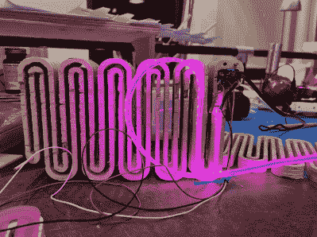

# 滑动器:发光的可视计步器

> 原文：<https://hackaday.com/2022/01/07/slither-a-visual-pedometer-that-sheds-light/>

你已经打破新年决心去做更多锻炼了吗？是啊，我们也是。也许问题仅仅在于我们没有将目标游戏化。一个简单的视觉辅助工具显示你的进步，可以帮助你一天一天地实现目标，更容易坚持下去。这就是[skhackett]的视觉计步器 Slither 背后的想法。

 虽然 Slither 使用了 Fit Bit 应用，但并不需要实际的 Fit Bit——这对我们这些不喜欢佩戴配饰的人来说是个好消息。但是如果你想让你的脚步算数的话，你将不得不随身携带你的手机。通过跟踪每天的步数，Slither 的分段总和意味着每周 50，000 步的总目标。

背面是一个羽毛 Huzzah，它从手机接收步数数据，并驱动一串侧光 LED 灯条。尾部有一个霍尔效应传感器，Slither 由一个小的、独立的木头和丙烯酸树脂组成的内置磁铁来控制开关。这不是换蛇的好方法吗？

我们真的很喜欢这里胶合板的外观，尽管[skhackett]推荐使用中密度纤维板，因为他们经历了相当数量的碎片。如果你只是想看蛇发光，那么[骗计步器](https://hackaday.com/2021/11/20/cheating-a-pedometer-the-easy-way/)应该不会太难。