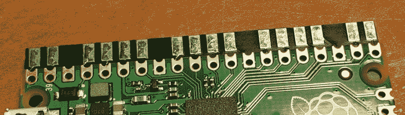

# 树莓派 Pico 的背部有一个小键盘

> 原文：<https://hackaday.com/2022/01/10/raspberry-pi-pico-gets-a-tiny-keyboard-on-its-back/>

随着黑客和制造商构建不一定遵循传统设计范式的定制计算设备，对越来越小的键盘的需求越来越大。我们在过去几年中看到的许多 cyberdecks 都使用了所谓的 60%甚至 40%键盘，并且有一种趋势是将黑莓键盘重新用于可穿戴设备和其他口袋大小的设备。但是如果你需要更小的东西呢？

进入这个由[TEC]制造的令人难以置信的小键盘。【IST】。59 个键被塞进一个比三个美国便士还小的地方，这可能是有史以来最小的键盘了。PCB 被设计为直接安装在 Raspberry Pi Pico 的背面，该 Pico 运行一些 CircuitPython 代码来读取开关矩阵，并充当标准 USB 人机接口设备。Pico 的电路板设计文件和源代码已经发布在该项目的 Hackaday.io 页面上，为您提供了启动自己的微型输入设备所需的一切。

The Pi Pico’s castellated pads make attaching the PCB a snap.

当然，当你在这个东西上敲打文本时，你可能不会打破任何速度记录。我们从过去的黑客徽章中了解到，一系列微型开关是一种功能性的文本输入方式，尽管有些令人不快。

 [https://www.youtube.com/embed/iWWTJKWFNok?version=3&rel=1&showsearch=0&showinfo=1&iv_load_policy=1&fs=1&hl=en-US&autohide=2&wmode=transparent](https://www.youtube.com/embed/iWWTJKWFNok?version=3&rel=1&showsearch=0&showinfo=1&iv_load_policy=1&fs=1&hl=en-US&autohide=2&wmode=transparent)

 [https://www.youtube.com/embed/V2ivH2PEoiA?version=3&rel=1&showsearch=0&showinfo=1&iv_load_policy=1&fs=1&hl=en-US&autohide=2&wmode=transparent](https://www.youtube.com/embed/V2ivH2PEoiA?version=3&rel=1&showsearch=0&showinfo=1&iv_load_policy=1&fs=1&hl=en-US&autohide=2&wmode=transparent)

