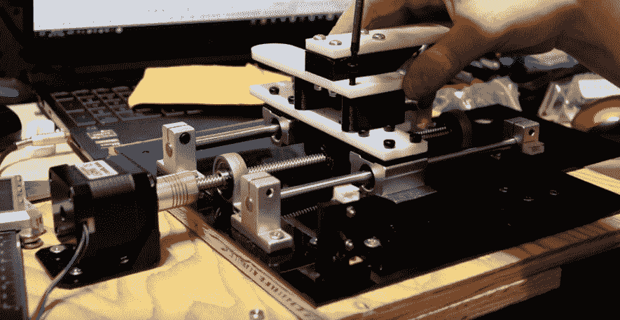

# 窥视这只机器老鼠的幕后

> 原文：<https://hackaday.com/2022/01/09/peek-behind-the-curtain-of-this-robotic-mouse/>

乍一看，这个小电子鼠标似乎是一件相当简单的事情。一扇门打开了，我们的啮齿动物朋友探出头，环顾四周，然后又进去了。但是就像《绿野仙踪》中的一样，一个精心布置的幕布隐藏着[令人印象深刻的一系列小装置，使得这个魔术成为可能](https://www.willdonaldson.io/blog/animatronic-mouse-house)。

创作者[威尔·唐纳森]已经整理了一份关于创造这个小家伙的精彩文章，我们认为你会惊讶于其中所涉及的机制有多严肃。以提供水平运动的钻机为例，NEMA 17 步进电机与 200 毫米丝杠和双 8 毫米导轨组件配合，就像在家里作为 3D 打印机的一部分一样。

这场秀的明星骑在一个由印刷组件和丙烯酸制成的结实的滑动托架组件上，该组件通过 GT2 同步带和滑轮与门相连，在适当的时候自动打开和关闭。为了给这个木偶注入一些生命，[威尔]在它身上装了一对 SG90 伺服系统，以一种平移和倾斜的方式排列:后面的伺服系统左右转动鼠标的身体，而前面的伺服系统上下移动头部。

Arduino Uno 通过 TB6600 控制器控制伺服系统和步进电机，光学限位开关用于确保没有东西移动出界。[Will]暂时将 CAD 文件和源代码留给自己，尽管我们想象一个足够敬业的 mouseketeer 可以基于可用的信息重建安装。

这看起来是第一只为 Hackaday 增光添彩的电子动画鼠标，但我们肯定对看到[人给无生命的物体赋予栩栩如生的动作并不陌生。](https://hackaday.com/2018/07/27/animatronic-puppet-takes-cues-from-animation-software/)

 [https://www.youtube.com/embed/6pF4vZ_XxC4?version=3&rel=1&showsearch=0&showinfo=1&iv_load_policy=1&fs=1&hl=en-US&autohide=2&wmode=transparent](https://www.youtube.com/embed/6pF4vZ_XxC4?version=3&rel=1&showsearch=0&showinfo=1&iv_load_policy=1&fs=1&hl=en-US&autohide=2&wmode=transparent)

