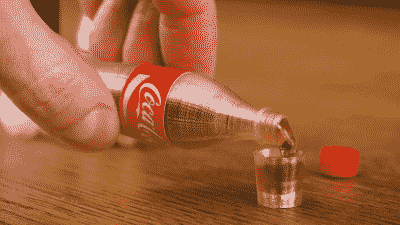

# 回收汽水瓶成细丝打印更小的汽水瓶

> 原文：<https://hackaday.com/2022/01/15/recycling-soda-bottles-into-filament-to-print-smaller-soda-bottles/>

热塑性塑料很棒，因为你可以把它们熔化，然后改造成你喜欢的任何形状。[The Q]通过将旧汽水瓶回收成可用的 3D 打印机细丝巧妙地证明了这一点。

Cute, huh? Why aren’t Coca-Cola making these? Tiny fake grocery items already proved [hugely popular in Australia.](https://www.news.com.au/finance/business/retail/coles-little-shop-collectables-end-with-no-sustainability-campaign/news-story/0082d76358ff7869d32fbad8e4f800fb)

汽水瓶通常由 PET 塑料或聚对苯二甲酸乙二醇酯制成，这是现代社会中最受欢迎的热塑性塑料之一。一个汽水瓶可以用一个简单的手动机器切割成一个连续的细长条，这个机器用刀片将瓶子切开。然后，这种塑料条可以通过加热的喷嘴进行输送，以生产用于 3D 打印的细丝。[Q]演示了这一过程的两个部分，包括使用电动卷轴在瓶子材料通过挤出机时卷绕细丝。

然后通过打印小版本的汽水瓶来展示这种灯丝。[The Q]将这些装满苏打水，并给它们合适的盖子和标签，以便完成。这是一种展示灯丝实际上适用于 3D 打印的巧妙方式。值得注意的是，这种打印几乎肯定不是食品安全，但它确实是一个概念的证明，而不是试图制造一个可用的饮料容器。

[就像我们过去看到的类似产品一样](https://hackaday.com/2021/06/29/petbot-turn-pet-bottles-into-filament/)，由于单个瓶子中的塑料量，灯丝的长度有限。我们希望看到一种将多瓶塑料送入挤压机的方法，以制造更长的线轴，因为细丝本身的连接长度可能会[充满问题。](https://hackaday.com/2020/12/17/fancy-filament-joiner-has-promise-but-ultimately-fails/)休息后的视频。

 [https://www.youtube.com/embed/XEvjR8nSFbc?version=3&rel=1&showsearch=0&showinfo=1&iv_load_policy=1&fs=1&hl=en-US&autohide=2&wmode=transparent](https://www.youtube.com/embed/XEvjR8nSFbc?version=3&rel=1&showsearch=0&showinfo=1&iv_load_policy=1&fs=1&hl=en-US&autohide=2&wmode=transparent)

