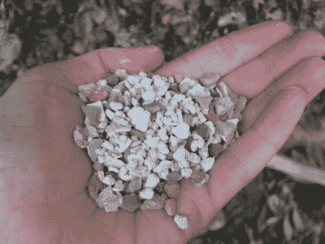
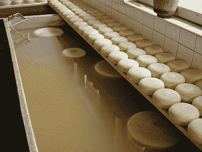

# 这条路上布满了岩盐替代品

> 原文：<https://hackaday.com/2022/01/25/the-road-is-peppered-with-rock-salt-alternatives/>

每年冬天，数百万吨岩盐被撒在美国的道路上，主要是在中西部和东北部地区。这是防止事故的一种廉价而有效的方法。岩盐在化学成分上与胡椒旁边的物质相同，只是它没有研磨得那么细，也没有添加钠或钾碘来预防甲状腺肿。食盐和岩盐都是通过降低水的冰点来融化冰的。糖也是。

我们每年冬天撒在地上的盐大部分来自地下盐晶网络，这些盐晶网络是在各种古代海洋干涸时形成的。尽管很自然，但岩盐对环境有害。首先，氯化物是永恒的，当它被冲走时，不容易从它污染的土壤和水中分离出来。岩盐还会腐蚀混凝土，进入地下水，对宠物有害。最糟糕的是，它的功效会随着温度下降。在 15 华氏度(-9 摄氏度)时，岩盐[失去了超过 86%的融化能力](https://meltsnow.com/salt-vs-temperature/)。

## 一次性底特律

所有这些盐对汽车也不好——对油漆不好，还会腐蚀车架。在美国最咸的地方，也就是盐带，汽车在成为摩登原始人的汽车之前只能使用几年。嗯，不完全是，但是盐对刹车线和大部分底盘来说是很糟糕的。抛开消费者的痛苦不谈，制造所有这些一次性汽车来满足需求确实会对环境造成影响。

但问题是我们需要用盐，或者类似的东西。尽管数百万人更多地呆在家里，但卡车运输业仍然依赖于加盐的高速公路和地方道路。因此，如果你喜欢库存的杂货店和及时从贝佐斯仓库运来的东西，你就会发现问题所在。那么有哪些选择呢？有吗？

## 添加磨料

A handful of chicken grit. Image via [Omelet](https://www.omlet.com.au/guide/chickens/chicken_care/feeding/)

冰点抑制剂不是唯一的解决方案，但它们通常是很大一部分。多年来，许多管辖区用沙子补充盐，直到它开始堵塞下水道管道。一个现代的替代方法是根据道路温度读数来计量使用量。另一个窍门是分发一种液体盐溶液，这种溶液见效更快，而且不会反弹到水槽里。

就环保替代品而言，一些人在人行道和车道上使用研磨剂，如猫砂、咖啡渣或 T2 鸡砂，这是贝壳和小鹅卵石的混合物，有助于消化。但是，当然，所有这些都只是牵引剂——它们不会融化冰。虽然当涉及到你的财产时，除非雪下有一层冰，否则在铲雪或吹雪后某种牵引剂可能就足够了。

当然，如果大规模使用的话，这些可能会引起和沙子一样的问题，尤其是咖啡渣。因此，尽管这些可能对环境更好，但它们也有自己的一系列问题。

## 盐水是好的，算是吧

Cheeses take in the light after their brine bath. Image via [Recycle Reminders](https://www.recyclereminders.com/blog/cheese-brine-on-your-road/)

几年前，我们听说威斯康星州在他们的道路上使用奶酪盐水，这不仅是真的，而且它的工作温度比盐低得多。但是普通人是如何获取奶酪盐水供家庭使用的呢？我们不确定。幸运的是，其他食物副产品也有效，比如甜菜汁和泡菜汁。

但是其中一些也有他们的问题。甜菜汁仍然需要盐来起作用——关键是要制造一种不容易流到排水沟里的粘性物质。问题是有机物质会耗尽河流、湖泊和溪流中的氧气。

最糟糕的盐水可能来自水力压裂法，这是一种已经引起争议的做法。这种放射性径流已经在宾夕法尼亚州等地使用。道路盐开始变得好看了，不是吗？

## 有更好的除冰器吗？

但是有一种东西比盐更好:醋酸钾。它不含氯化物，可生物降解，但它有降低氧气的问题，并已被证明对水生昆虫有害。醋酸钾作为一种预防措施更有效，因为它可以防止冰附着在表面上。它的价格大约是岩盐的三倍，但一点点就够了，所以价格几乎持平。另一种被称为醋酸钙镁盐的预防疗法对环境友好，但只有在气温骤降时，它才像岩盐一样有效。

那么，答案是什么？我们认为改变是从家里开始的，所以当你去买冰的时候考虑一下里面的东西，或者试着自己做。无论你做什么，都要谨慎从事。

【主图和缩略图通过[肖恩·迪尔恩](https://unsplash.com/@shawndearn?utm_source=unsplash&utm_medium=referral&utm_content=creditCopyText)在 [Unsplash 上】](https://unsplash.com/s/photos/winter?utm_source=unsplash&utm_medium=referral&utm_content=creditCopyText)