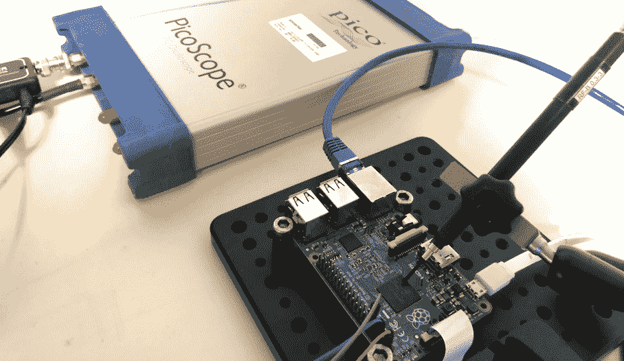
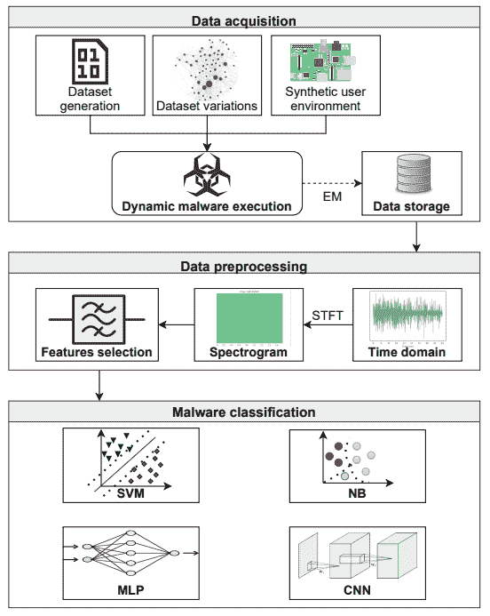

# 通过嗅探恶意软件的 EM 签名来识别恶意软件

> 原文：<https://hackaday.com/2022/01/19/identifying-malware-by-sniffing-its-em-signature/>

“非同寻常的主张需要非同寻常的证据”这句话最常被认为是卡尔·萨根说的，特别是来自他的电视连续剧*宇宙*。萨根可能不是第一个提出这种假设的人，这个节目当然也没有声称他是。但这就是电视对你的力量；这个术语后来被称为“萨根标准”，是一个方便的格言，很好地概括了在处理未经证实的理论时怀疑和批判性思维的重要性。

当我们听到 2021 年年度计算机安全应用会议(ACSAC)期间提交的一篇论文 [*混淆揭示:利用电磁信号进行混淆的恶意软件分类*](https://dl.acm.org/doi/10.1145/3485832.3485894) 时，这也恰好是我们想到的第一个短语。正如主流媒体所描述的那样，该论文详细介绍了一种方法，通过这种方法，研究人员能够通过收听从物联网设备发出的电磁波来检测物联网设备上运行的病毒和恶意软件。人们只需要将探针放在一个有问题的小装置上，这项技术就能以接近 100%的准确率识别出故障所在。

对我们来说，这些听起来确实是非同寻常的主张。但是证据呢？好吧，事实证明，深入挖掘这个故事发现了很多。感谢 ACSAC 的赞助商，不仅[论文可以免费获得，而且论文背后的团队](https://www.acsac.org/2021/program/papers/)[已经发布了在 GitHub](https://github.com/ahma-hub/analysis) 上重现他们的发现所必需的所有代码和文档。

不幸的是，我们似乎暂时放错了他们的软件支持的 10，000 美元的 1 GHz Picoscope 6407 USB 示波器，所以我们无法完整地重现实验。如果你碰巧遇到它，请给我们写信。但与此同时，我们仍然可以走过这个过程，并试图以经典的萨根风格将事实与虚构分开。

## 烘焙恶意软件 Pi

了解这项技术能够做什么，以及进一步了解它*不能*做什么的最好方法是检查团队的测试平台。除了前面提到的 Picoscope 6407 之外，硬件配置还包括一个 Langer PA-303 放大器和一个 Langer RF-R H-Field 探头，该探头位于 Raspberry Pi 2B 的 BCM2837 处理器上。正如您所料，探头和放大器连接到示波器的第一个通道，但有趣的是，第二个通道连接到 Pi 上的 GPIO 17，用作触发信号。

[正如该项目的 Wiki](https://github.com/ahma-hub/analysis/wiki) 中所解释的，下一步是故意在树莓 Pi 上安装各种 rootkits、恶意软件和病毒。然后使用一个包装程序，该程序首先通过 GPIO 引脚触发微微示波器，然后在给定的持续时间内运行被检查的特定软件。这个过程一直重复，直到团队收集了数万个各种恶意软件的捕获数据，包括`bashlite`、`mirai`、`gonnacry`、`keysniffer`和`maK_it`。这为他们提供了当其 Linux 操作系统被感染时，Pi 的 SoC 的电磁(em)输出是什么样子的数据。

但关键的是，他们还在他们所谓的“良性”数据集上执行了相同的数据采集。这些捕获是在 Raspberry Pi 正常运行并运行物联网应用常见工具时进行的。为众所周知的程序和命令收集 EM 签名，例如`mpg123`、`wget`、`tar`、`more`、`grep`和`dmesg`。这些数据为正常操作建立了一个基线，并为团队提供了一个对照的控制。

## 计算数字

如论文第 5.3 节*数据分析和预处理*所述，在提取任何有用数据之前，需要清理原始电磁捕获。你可以想象，探测器在如此近的距离上接收到了不和谐的电子噪音。预处理阶段的目标是过滤掉尽可能多的背景噪声，并识别与处理器上运行的各个程序相对应的指示性频率波动和峰值。

 然后将得到的净化光谱图通过神经网络，该神经网络被设计用于对 EM 信号进行分类。在很大程度上，计算机视觉系统能够根据其训练集对图像中的对象进行分类，该团队的软件展示了一种不可思议的能力，当呈现一个捕获的 em 签名时，可以分辨出 Pi 上运行的是什么类型的软件。

当被要求将签名分类为勒索软件、rootkit、DDoS 或良性时，神经网络的准确率超过 98%。当系统的任务是向下钻取并确定正在运行的恶意软件的具体类型时，也实现了类似的准确性。这意味着该系统不仅能够检测 Pi 是否受损，甚至能够区分`gonnacry`感染和`bashlite`感染。

当试图识别正在执行的特定二进制文件时，准确性受到了相当大的影响，但是系统仍然管理着相当高的 82.28%。也许最令人印象深刻的是，该团队声称在试图识别各种类型的恶意软件时，即使试图主动模糊它们的执行，如在虚拟化环境中运行它们，准确率也达到了 82.70%。

## 现实的期望

虽然实验结果肯定是令人信服的，但重要的是要强调这一切都是在受控的理想条件下发生的。在这篇论文中，没有任何一点声称这项技术，至少在目前的形式下，可以在野外实际使用，以确定计算机或物联网设备是否感染了恶意软件。

最起码，在你说这个想法在实验室之外是否有任何实际应用之前，需要在更广泛的计算设备上收集数据。对他们来说，作者说他们选择 Pi 2B 作为一种“样板”设备；相信它的 32 位 ARM 处理器和香草 Linux 操作系统为通用物联网设备提供了一个合理的替代品。这是一个足够合乎逻辑的假设，但仍然有太多的变量在起作用，以至于说 Pi 测试台上收集的任何 EM 签名都适用于随机的无线路由器。

然而，很难不留下深刻印象。虽然研究人员可能没有创造出类似于*Star Trek*medical tricorder 的 IT 设备，一种你可以简单地在病人身上挥动就可以立即看到他们一周内患了什么疾病的设备，但他们似乎已经非常接近了。