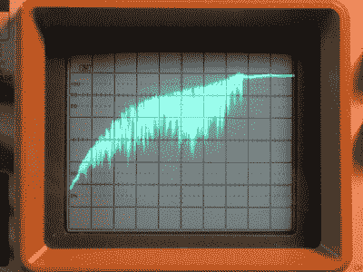

# 在电位计清洗摊牌中赋予老式合成器新的生命

> 原文：<https://hackaday.com/2022/01/19/giving-vintage-synths-new-life-in-a-potentiometer-cleaning-showdown/>

任何拥有一台装有电位计的旧设备的人都可以证明，这些机械部件确实需要定期清洁。无论是接收器上的音量旋钮还是混音器上的推子，随着时间的推移，它们会变得噼啪作响，并且通常不精确，因为氧化和粘性往往会聚集在它们内部。

This is your potentiometer caked with gunk.

在这个来自过去的爆炸中， [[Keith Murray]展示了几种可以清洁推子式电位计的方法](https://www.keithrobertmurray.com/articles/potentiometer-cleaning-showdown.html)，以及通过用示波器测试过渡随时间的平滑度，每种清洁方法的效果如何。看到一个脏兮兮的推子的表现有多糟糕，以及一股压缩空气的帮助有多小，这很有启发性。接触式清洁器效果更好，但无论如何都要把推子里所有松散的粘糊糊的东西弄出来。

最后，浸泡在异丙醇(IPA)中，以及完全拆卸后进行手动清洁，是唯一能够将衰减器性能恢复到新性能的方法。然而，使用接触式清洁器，然后用压缩空气吹掉推子，似乎是一种可以接受的避免拆卸的折衷方法。

为了让老式(音频)设备保持在最佳状态，你最喜欢用什么方法清洁电位计？请在下面的评论中告诉我们。

感谢[格兰特·弗里斯]的提示！