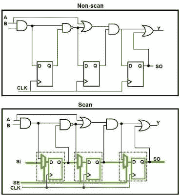
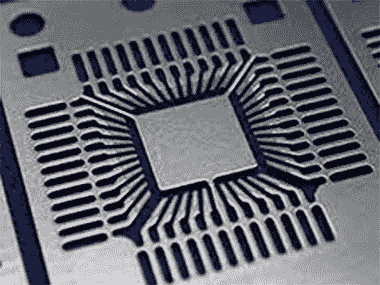
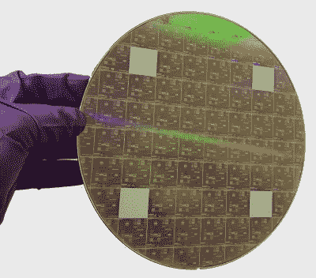
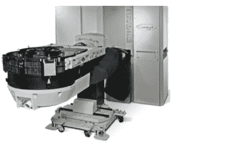
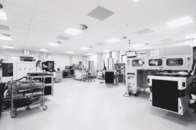
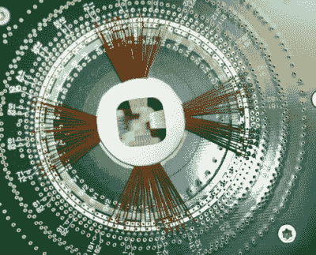
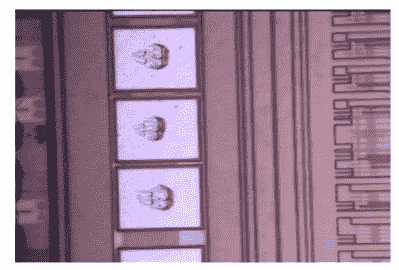

# 今天的头发明天就没了:四个人去修理晶片探测器

> 原文：<https://hackaday.com/2022/02/08/hair-today-gone-tomorrow-four-men-go-to-fix-a-wafer-prober/>

我在半导体行业职业生涯的早期经历相当不同:一系列事件让我稍微跳过了一些学科，在一次这样的事件之后，我进入了飞利浦半导体的测试工程部门。我被分配了各种奇怪的项目，支持工程工作，修理坏了的 ATE 设备，并接受了大量的培训:好时光！这里有一个直接来自古怪堆的故事。

我们需要组建一个由专家组成的精英团队，奔赴威尔士最黑暗的地方，解决一个紧迫的生产问题。简而言之，晶圆探针产量是灾难性的，相关晶圆没有给出正确的结果。进入正题需要一些 IC 制造背景，但是如果你喜欢关于硅或者红胡子测试工程师的故事，这是值得的。

## 集成电路设计和可测试性

The DFT process turning ordinary sequential logic into scan testable logic. Note the additional SI (Shift In) and SE (Scan Enable) lines and the scan chain hookup

天真的 IC 设计是为了追求芯片面积、开发时间和一些错误的简单概念而放弃可测试性。我不知道过去遇到过多少次这样的故事，一家新的创业公司自豪地制造芯片，但几乎没有可测试性，当他们试图扩大产量时，他们真的受到了打击。

芯片可能是“设计正确”的，因为它正确地针对制造过程，并且在工作台上，产品*验证*过程可能显示它在规格范围内并且适合客户的最终应用。然而，一旦完成，我们需要一个*验证*过程，以确保芯片在正常的过程差异下符合规格，并且没有缺陷。参见[美国国家航空航天局](https://www.nasa.gov/seh/2-4-distinctions-between-product-verification-and-product-validation)关于这一重要区别的有趣指南。

测试工程师的第一个切入点是零缺陷测试的概念，它依赖于被称为测试设计(DFT)的设计支持。)[这本基本指南](https://semiengineering.com/knowledge_centers/test/scan-test-2/)将为感兴趣的人介绍这些概念。

这些测试方法需要 DFT 工程师对设计的数字部分进行功能更改。作为数字合成流程的一部分，它们几乎总是由专用工具自动完成，激活“扫描测试模式”所需的测试模式由特殊的 [ATPG](https://en.wikipedia.org/wiki/Automatic_test_pattern_generation) (自动测试模式生成器)工具生成。这将分析 IC 的[门级网表](https://physicaldesign-asic.blogspot.com/2020/07/gate-level-netlist-gln.html)，并指出如何执行所需的结构测试。我过去用过的一个例子是 [Synopsys Tetramax](https://www.synopsys.com/implementation-and-signoff/test-automation.html) 。这种测试方案有很多很多变化，比如 [Logic-BIST](https://www.electronicdesign.com/technologies/test-measurement/article/21800852/whats-the-difference-between-atpg-and-logic-bist) (内置自测)，但那是另一天的主题。无论如何，这里的目标是获得测试开发过程中需要的测试模式，进一步深入。

## 集成电路生产和测试过程

Metal lead-frame prior to die attach and moulding

A typical 200mm wafer. So pretty!

一旦集成电路设计完成，这东西需要制造。这是在世界上少数几个地方的极其复杂、极其昂贵的设施中完成的，以下简称为“fab”。像 [TSMC](https://www.tsmc.com/english) 、 [SSMC](https://www.ssmc.com/) 或[塔](https://towersemi.com/)这样的公司将在合同基础上制造你的设计，将晶片运送到他们需要去的任何地方进行测试和封装。

晶片被装在一艘塑料“船”上，通常一次 25 片，运送到世界各地的测试和组装工厂，在那里它们可以被测试，然后被切割和封装。每一个晶片都有成百上千个相同的器件拷贝，踩在表面的矩形网格上。

根据组装过程的不同，接下来发生的事情将以不同的方式进行。旧的或更简单的设计可能只有一个围绕芯片核心的简单焊盘环，每个连接都有金属化的接触区域(称为“焊盘”)。封装时，在使用引线键合机将金(或铜，最近)键合线连接到引线框架和芯片焊盘之间之前，新锯出的(或“单个化的”)芯片将被粘合到[引线框架](https://en.wikipedia.org/wiki/Lead_frame)(金属支架)上。然后，在封装被分割以准备“最终测试”之前，整个东西被填充在模具中，塑料被注射成型在它周围。到目前为止，很多事情都可能出错，所以在打包发行之前测试包是非常重要的。

从测试的角度来看，晶圆在被制造厂处理时将会经历测试。将有许多特殊的测试芯片散布在晶片周围，与应用芯片混在一起。这些被称为过程控制监视器(PCM)，由 fab 内部用来测量晶片质量，并确保制造过程在规定的参数范围内(因此称为“过程控制”)。选定的 PCM 数据通过自动化流程交付给最终客户，产品工程师(负责产品制造的工程师)在需要时可以访问这些数据。一旦完成的晶片被运送到测试室，它们*可能*接受晶片探针测试。如果封装成本低，那么在封装前不测试的产量影响可能足够低，以至于在封装前进行测试在经济上是不可行的。我们称之为“盲组装”封装，只要“最终测试”是高质量的，我们就可以确保客户将获得完全正常工作、符合规格的器件。然而，如果封装复杂且昂贵，晶圆探测就变得必要，当然，如果产品是[芯片级封装](https://en.wikipedia.org/wiki/Chip-scale_package)(例如倒装芯片)，就不会有封装(或引线框架)这样的东西，只是一堆粘在 RDL ( [再分布层](https://en.wikipedia.org/wiki/Redistribution_layer))上的焊球，但这是一个不同的问题。

Dice being singulated with a diamond saw

总体计划是在最终质量检查之前，通过剔除不良晶圆(PCM 数据)和不良芯片(晶圆探针)，然后封装好的芯片，在多个点进行测试，以提高整体质量。在后两个阶段中的任何一个阶段，产品也可以针对不同的最终规格进行速度/性能分级(或分级)。这完全取决于产品。在哪个阶段进行什么样的测试还取决于许多因素，例如可用 ATE 平台的测试可行性，以及预期的故障率与测试成本。测试成本经济学和随后的计划是一个棘手的问题。

## ATE 系统

Big Iron: Teradyne Catalyst ATE platform – do not drop on foot

让我们来谈谈交易的工具。自动测试设备(ATE)是一个有点宽泛的术语，但我们在这里处理的是专用 IC 测试平台，所以范围缩小了一点。目标平台是旧的 Teradyne Catalyst 系统。这台机器是一个绝对的野兽，身体巨大而沉重，吸收三相电源就像它过时了。

所谓的主机盒，包含大电源、支持电路和波形源(如果安装了 RF ),大小是美式冰箱的两倍，但重量却有几吨。这是通过脐带连接到测试头。最后一位是业务端，包含测试电子设备、本地电源，是测试仪与应用程序接口的地方。

A typical test floor with a device handler shown docked to a test head

这些平台的想法是，不要为每个产品设计一个定制的测试平台，配备一整套与设备要求相关的设备，您可以将芯片设计为在通用平台的能力范围内可测试，然后您只需要在测试模式下配置一个具有足够资源的平台来与您的设备接口。

典型的 ATE 测试头是一个大盒子，大约有洗衣机大小(但很可能重得多)，里面装有一些非常昂贵的电子设备。它们通常排列有几列平行的插槽，每个插槽都有一个弹簧针块，有时每个块有数百个弹簧针。一些插槽可能是空的，一些插槽可能具有用于 RF 和高电流的特殊连接。在 pogo 模块下方，电缆束向下连接到内部插件箱。

这些卡使用本地时序发生器(连接到低噪声时钟)将模式格式化为波形，并驱动到被测 IC 中。对于一个测试头来说，包含 2000 个以上以 800 Mbps 或更高速度并行工作的数字通道并不罕见。这些卡还包含[引脚参数测量单元](https://www.analog.com/en/applications/markets/instrumentation-and-measurement-pavilion-home/electronic-test-and-measurement/parametric-measurement.html)(ppmu)，能够向引脚提供或吸收电流并进行测量。这允许测试诸如断开或短路的引脚以及引脚漏电流之类的缺陷。记住最后一点，以后再说！典型的 ATE 测试头能够同时并行测试多个 ic，如果资源允许的话，正如我前面说过的，这些是通用平台，具体取决于产品的需求。

## 机器人搬运器和晶片探测器

这是通用 ATE 位停止和定制每设计位开始的地方。为了测试 ATE 上的芯片，你需要一个接口。如果产品需要晶圆级测试，那么就需要更多的硬件。除了手动测试台，我还将设计一个[探针卡](https://en.wikipedia.org/wiki/Probe_card)，它将通过一个称为 pogo tower 的通用适配器连接到 ATE 头。

与晶圆的接口是通过定制设计的圆形探针卡 PCB 实现的，它具有匹配的 pogo 焊盘环(只是表面焊盘)和中间的一个大孔。中间的空间用来放置探针“蜘蛛”,这是一个由细而硬的金属丝组成的圆形阵列，每根金属丝的末端都有一个弯曲，终止于一个尖点。这种点阵列的最终形状，即探针“针”，被设计成与芯片上的焊盘对齐，并且在线阵列上散布一些合适的环氧树脂加强件，探针尖端将完美地对齐并且共面。这是一项非常专业的工作，它们是精密的组件。

A cantilever probe card for a single site. Note central epoxy stabilisation ring

晶片探测器很酷。想法是你把晶片探针卡固定在机器的顶部，针朝下，然后把整个东西推到 ATE。ATE 头将已经对接了 pogo-tower。接下来，你操纵测试头向上，越过你的头，这样你就可以把它颠倒过来，并把它对接在晶片探测器机器的顶部，通过机械装置的扭转锁定在探针卡上。

探测器机器将非常小心地将晶片向上推入固定的探针阵列，进行所有的电接触。然后，它指示测试仪测试一个或多个芯片，并在进入下一个芯片之前收集宁滨结果。对整个晶片和盒子中的每个晶片重复这一过程。芯片的 X-Y 坐标和测试结果被保存到 datalog 流中，因此可以获得[晶圆图](https://en.wikipedia.org/wiki/Substrate_mapping)和成品率。晶圆图是测试结果与芯片位置的查找表，这是输入到装配线以挑选出要封装的好芯片的内容。这曾经是由机器墨斑坏模具！

## t'mill 的麻烦

这就是自动化 IC 测试和开发过程的原因和方法；回到我们的故事！我们的破解调试团队由一名晶圆探针专家、一名机械设计师、来自飞利浦半导体(菲律宾)的来访测试车间经理和我(当时是一名培训中的测试工程师)组成。

该产品是一个成熟的长期运行的产品，建立在 200 毫米晶圆上，是一个较老的工艺节点(最有可能是 TSMC 350 纳米)，非常简单。直到有一天不是了。晶片探测是由一台旧的 [Electroglas EG4080](http://www.electroglas.com/PDF/EG4090u+.pdf) (最新 4090 链接的 pdf)与一台 Teradyne 催化剂对接提供的。当时相当普遍的配置。产量已经下降到零，所以他们做的第一件事是运行一些保存在现场的相关晶片，在一个特殊的惰性气氛柜中。这些是在开发过程中使用的相同晶片，所有测试结果都保存在文件中，并在建立新的测试台时用于良好的关联目的。他们一颗骰子都没通过，所以我们被叫来解决这个问题。

## 调试

Some probe needle marks

我们分头行动，检查了所有东西。探测员 guy 检查了 EG4080 的设置、校准、机械观察，并使用内置的高变焦检查相机检查了“[探针标记](https://www.edn.com/probe-mark-inspection/)”。这些见证标记具有典型的“短沟”形状，表明针接触，然后在垫子上轻微滑动，在其中挖一个小沟。这是因为，当针接触时，晶片被驱动进入针中更远一点，导致其滑动或横向摩擦。这促进了氧化物的擦洗，提供了良好的电接触，并保持尖端锋利。

没有证据表明过度驱动，或针偏转“错误”的方式，也没有明显的尖端磨损。机械人大量参与了这一过程，并跟踪测试和检查，整理所有数据。我检查了 ATE 校准，检查了系统的所有部分，检查了测试程序是否是正确的版本，并在手动控制下启动了一些测试。我可以看到哪个测试失败了:引脚泄漏。其他一切都很好。

这种特定的测试寻找焊盘环中、管芯周围或者封装内的缺陷。其工作原理是将任何双向引脚设置为输入模式，然后利用该 PPMU 将一个小测试电流吸入所有支持输入的引脚。结果有点奇怪，两个引脚给出了相当随机的结果，但这是唯一明显的错误。我们又把它拆了一遍，目视检查每个组件，清洁触点，清除灰尘和污染物，寻找任何可以解释我们所看到的奇怪电流路径。

## 流氓胡子

由于我们找不到设备的任何问题，我们开始检查它是如何被使用的。测试地板是典型的–气候控制，带有金属防静电安全地板。所有设备都正确接地，所有员工都穿着工作服、发套和高跟鞋。我们只是站在一起随意发表想法，谈论污染和可能的环境因素，这时我脱口而出“如果有根头发卡在探针里怎么办？”

> 如果有根头发卡在探针里怎么办？

几乎每个人都站在那里说那是不可能的，所有的操作员都把头发绑在一个很紧的遮盖物下，甚至连胡子都被遮盖住了。"我们肯定会在摄像机上看到一根头发吧？"什么也没看见。"但是，我问，有人真的把探针卡拿出来放在显微镜下观察过吗？"“不”，答案是，因为它是微妙的，他们不想处理它没有必要。

探测器操作员只是打开插销，把它举到灯下，用放大镜仔细观察。地板上的工作人员讨论了一会儿后，一些镊子出现了，小伙子非常小心地从针间拔出了一根短而卷曲的姜黄色头发。当他开始重新组装测试堆栈，对接 ATE 头，并在探测器上启动手动测试时，地板上变得非常安静。“Bin 1！”是感叹！切换到自动模式，对晶片进行探测，屏幕上产生的晶片图看起来与参考数据完全一样。成功！那个接线员留着姜黄色的大胡子。我们笑着，收拾好装备，朝家走去。价值数百万英镑的电子设备，差点被一个无赖的络腮胡子给毁了。你编不出来。