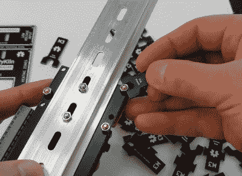

# 超便宜的 PCB 扳手是完美的工具包配件

> 原文：<https://hackaday.com/2022/01/18/ultra-cheap-pcb-wrenches-make-perfect-kit-accessory/>

让我们把一件事说清楚。在任何情况下，我们都不建议您用 PCB 制成的扳手来替换现有的扳手系列。然而，[正如创造者【本·倪克斯】解释的那样](https://github.com/CurlyTaleGamesLLC/PCBWrench)，它们确实是一种非常便宜和轻便的临时工具，非常适合用 DIY 工具包分发。

 这个聪明的开放式硬件项目是由【本】的愿望产生的，他希望将一个 M3 扳手与他正在开发的基于 ESP32 的窑控制器[的工具包打包在一起。他能从通常的进口网站上找到非常便宜的螺丝刀，但似乎没有人能买到同样便宜的扳手。他尝试 3D 打印它们，但最终发现塑料无法胜任这项任务。然后他想知道从印刷电路板上切下的一个小扳手会怎么样。](https://github.com/CurlyTaleGamesLLC/PyKiln)

有点令人惊讶的是，答案是相当好。我们不建议你试着用一个螺母把你的螺母拧下来，但是如果你用几个螺母压住控制板，它们会很好用。[Ben]在 KiCad 中提出了一个面板化设计，允许将 18 个小扳手装入一个 100 x 100 mm 的 PCB 中，适合流行的在线板房生产。从标准的 1.6 毫米 FR4 制造，他们出来大约 10 美分一个。

由于[Ben]已经很友好地在麻省理工学院的许可下发布了他的设计，你可以自由地旋转这些扳手，要么作为你自己的工具包，要么只是为了紧急情况而扔进工具袋。我们很乐意看到有人为额外尺寸的螺母调整设计，或者想出一些方法来嵌套它们，以便在每块板上偷偷取出几个额外的扳手。

过去，我们见过很多人为自己制作廉价工具，但是能够大批量生产廉价工具的项目对于像我们这样的社区来说是非常令人兴奋的。

 [https://www.youtube.com/embed/X2ZebSj626w?version=3&rel=1&showsearch=0&showinfo=1&iv_load_policy=1&fs=1&hl=en-US&autohide=2&wmode=transparent](https://www.youtube.com/embed/X2ZebSj626w?version=3&rel=1&showsearch=0&showinfo=1&iv_load_policy=1&fs=1&hl=en-US&autohide=2&wmode=transparent)

