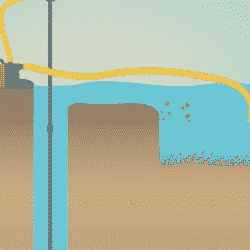

# 钻机在双重任务中表现良好，如钻井钻机

> 原文：<https://hackaday.com/2022/01/19/drill-does-well-in-double-duty-as-well-drilling-drill/>

商业上有许多方法用于在地下钻孔以提取饮用水，这些方法都需要很大很吵的设备。但是如果你只是想要一口小井呢？你真的需要召集大人物吗？[开发技术工作组]是荷兰特温特大学的一个学生协会，他们在休息时间下方的[视频中展示了一些简单的自制夹具和一个强大的手钻足以完成这项工作！](https://www.youtube.com/watch?v=xQRhsoSCXvg)

There’s more to drilling a well than just drilling well

这些夹具中最主要的是一个旋转机构，用于支撑钻头及其重量，控制钻头，并将水注入连接钻头的管道。旋转计划可在[WOT]的网站上获得。看起来像是 DIY 钻头的东西使用商业上可买到的金刚石钻头来提高硬度。

该视频的显著之处在于，它讨论了钻孔、套管内衬以及使其适合抽水的每个阶段。该视频还讨论了成功钻井所涉及的化学品和方法，并概述了同样适用于商业钻井的过程。

很自然，你会想确保你的钻孔机是有绳的，这样你就可以长时间钻孔，但也不会长翅膀飞走！

 [https://www.youtube.com/embed/xQRhsoSCXvg?version=3&rel=1&showsearch=0&showinfo=1&iv_load_policy=1&fs=1&hl=en-US&autohide=2&wmode=transparent](https://www.youtube.com/embed/xQRhsoSCXvg?version=3&rel=1&showsearch=0&showinfo=1&iv_load_policy=1&fs=1&hl=en-US&autohide=2&wmode=transparent)

