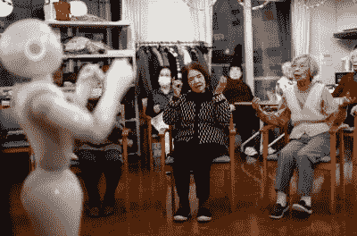

# 机器人能给人很好的拥抱吗？

> 原文：<https://hackaday.com/2022/01/24/can-robots-give-good-hugs/>

我们都可以偶尔拥抱一下。大多数人可能会说，分享温暖是美好的，另一个活生生的、会呼吸的肉包的挤压感非常令人欣慰。拥抱甚至对健康有益。

但也许你刚到这个城市，还不认识任何人，或者你已经比你所有的朋友和家人都长寿。或者也许你看起来不像那种喜欢拥抱的人，因此你得不到足够的拥抱。几乎每个人都需要和想要拥抱，不管是很棒的，好的，还是一般的。

那么，怎样才算是一个好的拥抱呢？有点像握手。它应该是温暖和干燥的，硬度与环境相适应。理想情况下，你们两个同时完成，事情不会变得尴尬。机器人有可能检查所有这些盒子吗？这就是德国斯图加特马普智能系统研究所的凯瑟琳·j·库琴贝克和团队随意发明的人形机器人 [HuggieBot 背后的想法](https://www-mpg-de.translate.goog/18134173/roboter-mit-sanfter-hand?c=2191&_x_tr_sl=auto&_x_tr_tl=en&_x_tr_hl=en)[翻译](https://www-mpg-de.translate.goog/18134173/roboter-mit-sanfter-hand?c=2191&_x_tr_sl=auto&_x_tr_tl=en&_x_tr_hl=en)。用户反馈帮助团队解决了问题。

## 一种不同的软机器人

在医疗和老年人护理机器人的背景下，它们当然必须既温柔又有反应。所以 Kuchenbecker 博士和他的团队从拥抱和触觉互动开始。与给某人洗澡或在床上给他们翻身这样复杂的动作相比，拥抱在某种程度上更容易复制。

HuggieBot 的手臂上有传感器，以确保它给出友好的拥抱，而不是威胁生命的挤压，尽管我们想知道如果传感器出现故障，是否有任何故障安全措施。HuggieBot 背上的另一个传感器检测到人类对拥抱的回应。当他们举起手臂或靠在机器人的手臂上时，它会打破拥抱。希望如此。

Kuchenbecker 博士和他的团队知道 HuggieBot 应该是柔软、温暖的，和人类差不多大小。最重要的是，它应该知道什么时候从拥抱中解脱。HuggieBot 还可以做一些我们没有想到的事情——它可以像人类一样适应一个人的身高和姿势。

从生理上来说，HuggieBot 看起来像机器人一样可爱。它穿着舒适的灰色帽衫和紫色长裙，平板的脸上带着愉快的表情。HuggieBot 的上半身既充气又加热，让它拥抱起来更舒服。他们甚至用泡沫包裹手臂，给双手穿上袜子。我们假设 HuggieBot 穿了一半衣服是为了展示下面是什么。

在一天结束的时候，你仍然会被机械手臂拥抱，这有点可怕。但他们似乎做得很好，你可以在下面的视频中看到早期版本的 HuggieBot。它不只是把你拉进来，它会等你靠近，然后用它那巨大的工业钳子般的胳膊夹住你。

 [https://www.youtube.com/embed/-xIPeUA3axg?version=3&rel=1&showsearch=0&showinfo=1&iv_load_policy=1&fs=1&hl=en-US&autohide=2&wmode=transparent](https://www.youtube.com/embed/-xIPeUA3axg?version=3&rel=1&showsearch=0&showinfo=1&iv_load_policy=1&fs=1&hl=en-US&autohide=2&wmode=transparent)

## 挤压游戏

拥抱是身体和情感上的温暖，尽管与机器人甚至无生命的物体建立情感纽带更加困难，但这绝对不是闻所未闻的。想想那些带着毛绒动物玩具和安全毯的孩子。或者汤姆·汉克斯和他的宠物排球威尔逊。

我们在这里唱反调吧。并不是每个人都会因为是人类而给予完美的拥抱。我们都知道有人拥抱得太用力、太久或太频繁。如果你能训练一个机器人完全按照你想要的方式拥抱你，那会怎么样？如果我们真的认为拥抱机器人会成为一种东西，那么还有很多事情需要考虑，这些事情会让拥抱变得更加愉快和人性化。就像如果你哭了，机器人可能会轻拍你几下，并张开手揉揉你的背，以获得额外的安慰。并不是说这个问题很难解决。难的是让人们接受这个想法，把他们的内脏暴露在机器面前。

A robot leads seniors in an exercise routine. Image via [Reuters](https://www.reuters.com/article/us-japan-ageing-robots-widerimage/aging-japan-robots-may-have-role-in-future-of-elder-care-idUSKBN1H33AB)

在日本，机器人已经在老年人护理中发挥作用。东京的一家养老院有多达 20 个不同的机器人在四处游荡。他们中的许多人被设计来玩游戏和与居民进行交谈，以及引导他们进行日常锻炼。

你会拥抱一个机器人吗？你会让机器人给你梳头吗？我会抓住机会拥抱 HuggieBot，只要 Kuchenbecker 医生在旁边帮忙，如果事情变糟了。事实上，我认为机器人拥抱比完全没有拥抱要好，尤其是对于孤独的老年人来说，他们可能真的会从常规的友好拥抱中受益。

但这是一种天真的想法。我们真的想走机器人亲密的道路吗？和许多事情一样，这取决于人们用它做什么。