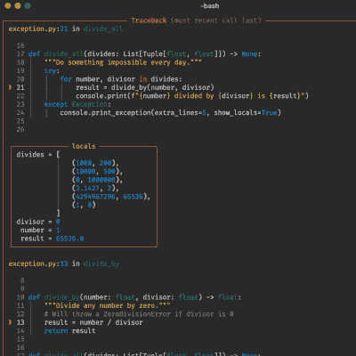

# 让您的 Python CLI 工具流行起来

> 原文：<https://hackaday.com/2022/01/19/make-your-python-cli-tools-pop-with-rich/>

似乎越来越多曾经是 bash 或小型 c 程序的简单命令行工具和小脚本正在慢慢变成 python 程序。当然，我们只能等着看这最终是否是个好主意。但与此同时，下一次你在修改或编写一个新工具时，为什么不加入 Rich 呢？

Rich 是由[Will McGugan]编写的 python 库，它通过 ANSI 代码的力量提供了文本格式、颜色、图形、进度条、降价、语法高亮、图表等等。最棒的是，它可以与 macOS、Windows 和 Linux 兼容。此外，它还提供开箱即用的日志解决方案。Rich 最好的特性之一是 inspect 功能。您可以传入一个对象，它将使用反射打印一个漂亮的图表，详细说明该对象到底是什么，这对调试很有帮助。另一个特性是回溯，它显示异常期间堆栈上相关代码的格式化和带注释的快照。

源代码本身是编写良好的 python，带有注释和输入信息。通过阅读它，你很有可能会学到一两个技巧。Rich 用来[构建 Textual](https://github.com/Textualize/textual) (也是由【Will】)，它的目标是成为一个在终端中运行的 GUI API。这是一个很好的例子，证明了里奇的能力。令人难以置信的是，这些协议已经存在了这么长时间。[威尔]甚至[也靠一台电传打字机型号 33](https://twitter.com/willmcgugan/status/1476940291819069441)发了财。如果你在一个更加受限的环境中工作，为什么不[给你的 Arduino 串行终端带来一些色彩呢？](https://hackaday.com/2021/10/23/this-arduino-terminal-does-all-the-characters/)