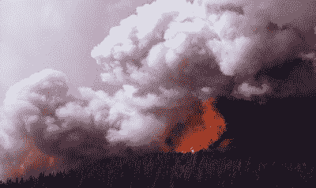
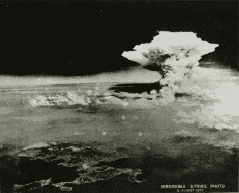
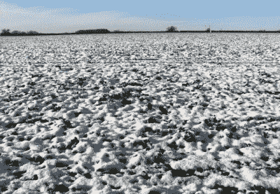

# 核冬天会抵消全球变暖吗？

> 原文：<https://hackaday.com/2022/01/25/would-nuclear-winter-cancel-out-global-warming/>

在冷战时期令人担忧的政治气候中，核战争是一个非常突出的问题。自那以后，核武力威胁变得不那么频繁了，尽管从未完全消失。

然而，在核战争造成的直接毁灭之外，还有核冬天的威胁。基本概念很简单:在一场大规模核战争之后，由此产生的大气效应可能会导致全球气温急剧下降。

有些人说这永远不会发生，而其他人——包括《未来 T2》中的《T3》——则以不同程度的幽默暗示这可能有助于抵消全球变暖的影响。但事实是什么呢？

硬数据并不真正可用，因为到目前为止还没有大规模的核战争可供科学家测量。然而，一些研究已经探索了核冬天的概念，并探索了它的潜在影响。

## 它到底是怎么工作的？

Hundreds of large firestorms triggered by nuclear weapons could loft soot into the upper atmosphere, serving as the causative mechanism of the “nuclear winter” theory. The nuclear aspect is only as an ignition source; any other cause of widespread firestorms could do the same. Image Credit: [Public Domain](https://commons.wikimedia.org/wiki/File:Firestorm_Mirror_Plateu.jpg), Jim Peaco

核冬天的基本概念很简单。在大规模核冲突中，核武器被用于对城市和工业区的战略打击，大规模的火灾会失控。这些火焰会将大量的黑碳烟尘抛入大气的上游。一旦到达那里，当它们从太阳吸收热量时，烟雾颗粒可能会进一步上升到平流层，直到颗粒太高而不能通过降水迅速从空气中“降下”。这些颗粒会遮蔽表面，产生冷却效果。

最近在 2007 年发表的论文表明，超级大国之间的全面核战争可能会导致全球平均气温下降多达 8 摄氏度。如果这听起来不夸张，那么客观地说，在 18，000 年前的最后一次冰河时期，平均气温要低 5 摄氏度。

该课题研究人员的模型显示，对农业的主要连锁效应将会对全球人类造成严重损害。例如，在乌克兰和爱荷华州的关键种植区，气温可能会连续几年出现日最低气温低于零度的情况，这使得种植粮食作物几乎不可能。结果将是全球饥荒。

This photo is often mistaken for being a shot of the mushroom cloud created by the nuclear bomb dropped on Hiroshima in 1945\. However, it is in fact an image of the pyrocumulus cloud created in the firestorm that happened in the aftermath of the attack. Image credit: [Public domain](https://commons.wikimedia.org/wiki/File:Pyrocumulonimbus_cloud_over_Hiroshima,_near_local_noon._Aug_6_1945.jpg), US Military

即使在最近的研究中，用更新的气候模型进行模拟也不断出现类似的结果。这些研究使用了类似的基数，表明一场耗尽主要超级大国大部分库存的全面核战争将向大气层释放大约 150 太克的烟尘。然而，这一价值仍然是一种假设，已经引起了一些部门的批评。

核冬天理论的基本假设是，核爆炸将导致大城市规模的大风暴，能够将大量烟雾抛入高层大气。一方面，在海湾战争之后，科威特石油钻塔的大火并没有产生显著的降温效果。另一方面，研究已经证实了像 T2 森林火灾这样的事情会将烟雾传播到高空。

不管是哪种情况，真实世界的核打击是否会导致可以将大量烟雾释放到平流层的大风暴仍然是一个很难回答的问题。数据短缺；虽然广岛的悲剧性核打击引发了一场大风暴，但随后长崎的核打击却没有。

另一个主要争论点围绕着高层大气中烟雾颗粒的寿命。如果粒子在几周内全部消失，任何冷却效应，无论多么剧烈，都将是相对短暂的，而不是一些论文中所称的多年灾难。

在这方面，研究现有的高海拔气溶胶将是关键。火山爆发是大量烟雾、灰烬和雾化物质进入天空的另一种方式，正如最近汤加的悲惨爆发一样，这是地球 30 年来最猛烈的爆发。一团火山灰被高高地抛离地球表面 39 公里，进入平流层。然而，在这种情况下，冷却是有限的，因为只有大约 40 万公吨的二氧化硫被排放到空气中。这种物质在大气中逗留的时间可以作为科学家的有用指南，这些科学家试图模拟广泛的核引发的火灾的预期结果。无论如何，过去的火山气溶胶在大气中最多只持续了几年。

通常，当我们能够进行真正的实验并测量结果，而不是简单地依赖模型时，科学就处于最佳状态。用格蕾丝·赫柏的话说，“一个精确的测量值抵得上一千个专家的意见。”不幸的是，除非用核武器制造巨大的风暴，否则这样的实验是不可能的。

## 但是这能阻止全球变暖吗？

If the worst modelling is true, agriculture would become impossible in much of the world as daily temperatures regularly hit below freezing, potentially for years on end. Image credit: [Evelyn Simak](https://commons.wikimedia.org/wiki/File:Frozen_field_-_geograph.org.uk_-_1630559.jpg), CC BY-SA 2.0

如果核冬天确实是可能的，正如一些研究论文中显示的模型，那么在某种程度上，核冬天确实可以抵消全球变暖。超级大国之间全面冲突的最令人震惊的结果是，2007 年运行的[模型](https://journals.sagepub.com/doi/full/10.1177/0096340212459127#)显示全球平均气温可能下降多达 8 摄氏度，大约十年后持平于 4 摄氏度。另一方面，全球变暖预计将在未来十年左右达到比工业化前平均水平高 1.5 摄氏度的水平[。](https://theconversation.com/ipcc-says-earth-will-reach-temperature-rise-of-about-1-5-in-around-a-decade-but-limiting-any-global-warming-is-what-matters-most-165397)

因此，理论上来说，小规模实施城市规模的核爆有助于完全逆转全球变暖。然而，这将带来不可逾越的代价。核武器不能简单地在像海洋这样没有人烟的地方引爆；核冬天的全部影响是由爆炸后产生的风暴造成的。试图使用森林或其他土地区域来重现这种效果会对环境产生负面影响，而且这些区域可能没有足够密度的易燃材料来制造真正的火灾。

这种影响也不会永远持续下去。根据这些模型，在 10 到 20 年内，烟灰的任何冷却作用都可能会消失，而人类将因其麻烦而留下大片烧毁的区域，并可能对多次火灾造成的二氧化碳水平产生不可忽视的影响。在这一过程中，如果影响过度，过度降温仍然会给农业带来麻烦，从而导致大范围的饥荒。哪个灾难会胜出的问题的答案是:短期内，核冬天；长期来看，全球变暖。

为了达到这些目的，人们正在探索产生高空气溶胶的其他方法，所有这些方法都将被证明比核冬天的想法破坏性小得多，也更容易维持。

人类当前的问题需要比简单地炸毁一切更复杂的解决方案。从来都是这样！无论如何，重要的是理解科学，以便知道我们如何最好地保护我们今天的生活方式，以及未来的生活方式。