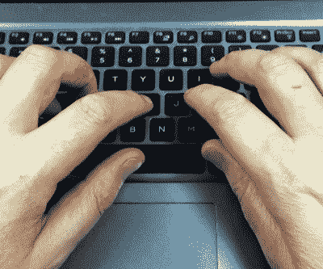
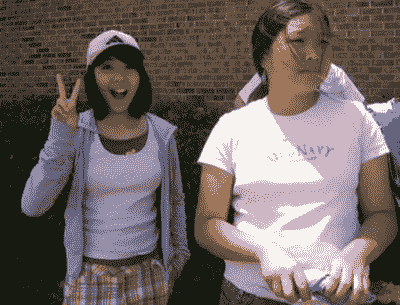

# 版权，你需要知道的

> 原文：<https://hackaday.com/2022/02/04/copyright-what-you-need-to-know/>

上周，一群密码爱好者[以高于现行价格的价格购买了一本罕见的科幻小说](https://twitter.com/TheSpiceDAO/status/1482404318347153413)，然后提议在制作和销售 NFT 之前，在区块链中对其所有页面进行编码扫描。为了保证它们的稀有性，这本书被烧掉了。除了围绕烧书的可疑图像之外，故事中令人发笑的一个来源是他们的错误想法，即在购买一本稀有书籍时，他们也获得了其版权，而不是简单地为一本书支付过多的费用。

这是一个开怀大笑的借口，但也是一个谈论版权的机会，因为它影响着我们的社区。我不是律师，也不是来提供法律建议的。相反，这是基于在内容出版行业工作几十年所积累的工作知识。

## 你的朋友…

版权是一个在我们的社区中不断流传的话题，因为我们谈论开源许可证、DRM、科学论文的自由可用性或过度诉讼的内容所有者。虽然经常被开源界视为与我们的利益相违背，但版权本身是一个强大的工具，为开源概念的建立提供了基石。

Try to spot the point at which the words stop being mine and become Hackaday’s.

当某人创造了某样东西，它就是他们的物质财产。在纸上写点东西，印在书上，就可以把书卖出去了。知识产权将所有权的概念延伸到了物质之外——除了拥有你写在上面的那张纸，你还拥有它的文本的特定艺术表现形式。

你可以随心所欲地印刷多份，并根据自己的条款出售，最重要的是，你可以对任何试图印刷自己副本的人发起法律挑战。这可能是引起最大恐慌的领域或版权，因为根据你的观点，这是版权最有价值的方面，也是最被滥用的方面。

作为内容创作者，您自动拥有作品的版权。这是拥有的强大力量，但同样强大的是转移所有权的能力。例如，从我的键盘流出的文字是我的，但我将它们的所有权转让给 Hackaday，以换取万能的美元，所以这个故事的版权归他们所有。但正是在这种权利中，我们找到了开源的基础，因为除了简单地将所有权分配给别人，你还可以选择性地将权利分配给第三方。各种各样的开源许可证都是简单的文档，提供了一个方便的预先编写的表单来完成这项工作。

The photo of Alison Chang that put Virgin Mobile Australia in hot water. Chewywong ([CC BY 2.0](https://flickr.com/photos/chewywong/467623403/))

我们猜测，许多开发者选择开源许可是出于熟悉，如果一个最喜欢的项目使用特定的许可，那么他们会选择它作为自己的许可。值得仔细考虑并花时间去理解许可证的小字体有什么，因为有时不明智的选择会产生意想不到的后果。

例如，在 2007 年，一名德州少女吃惊地发现自己的照片出现在维珍移动澳大利亚公司的广告中，该广告被电信公司使用，因为摄影师在没有完全理解其含义的情况下，根据知识共享许可将其放在了 Flickr 上。在选择许可证时，重要的是要考虑你想要的结果，问问你自己是否希望允许商业使用，或者你是否要求所有的衍生作品使用相同的许可证。

对于前者，你可能希望选择诸如 Apache 或 MIT 的许可协议，而对于后者，你可能会考虑 GNU GPL。几十年前，当 GPL 受到攻击时，它被它的对手嘲笑为“病毒式的”,因为一旦某个东西在它的控制下发布，那么在没有所有贡献者同意的情况下，它就不容易被转移到不同的许可证上。当发现开源许可证[可以被用来破坏知识产权持有者的一个重要工具](https://hackaday.com/2020/03/05/brute-forced-copyrighting-liberating-all-the-melodies/)时，任何开源倡导者的脸上都会露出笑容。

## …也是你的敌人

确立了你对自己创造的东西的权利之后，让我们看看关于版权的大部分争议来自哪里:其他人或更常见的公司对他们拥有的东西主张他们的权利——无论是真实的、脆弱的还是想象的。这是从哪里来的，哪里是可疑的，你如何避免任何困难的情况？

首先，当存在明显的侵犯版权行为时，知识产权所有者通过某种形式的质疑来主张其所有权并非不合理。挑战可以简单到一个撤下通知，也可以是一个数百万美元的诉讼，但这意味着同样的事情:“你在未经许可的情况下使用我们的东西，停止。”这甚至不是大公司的专利，举个例子，摄影师的作品被报纸窃取，并以提交惩罚性账单作为回应，这种情况并不少见。

长期使用 Linux 的用户会记得 SCO 和一些商业 Linux 供应商之间的斗争，例如，一系列法律挑战最终被认为是毫无根据的，但却给整个 21 世纪初的 Linux 生态系统蒙上了一层阴影。

## 在迷宫中航行而不下沉

如果版权被如此束缚，我们如何才能在世界上导航，而不会不断被任何人起诉，因为他们认为自己应该从我们的馅饼中分得一杯羹，因为他们想象的东西听起来有点像他们 1974 年的模糊 B 面？答案就在一个叫做“合理使用”的想法中，这是任何创建内容的人都需要意识到的。本质上，合理使用可以总结为一句话“这是你无可争议的拥有的东西，但我是在我们双方都理解可以接受或者法律先例已经确立可以接受的情况下使用它的”。这是一个灰色地带，包含一些安全的港湾，但任何冒险进入的人都应该注意不要走得太远的警告。

一个特别的安全港被称为评论中的安全港，在这里，人们同意对书籍的评论需要能够从其中提取引文，对电影的评论可以包括剧照或短片，Hackaday 可以使用我们在撰写项目时拍摄的图像。

戏仿是另一个避风港。我不打算写一个以一家叫 Bendy's 的餐馆为特色的情景喜剧，但是如果我写的话，我应该是相当安全的。想想几乎所有的流行文化模仿，从《古怪的艾尔》到《厌倦了指环王》，你会在或多或少的程度上发现这一点。

版权可能是一种必要的邪恶，无论你希望你的作品作为你的财产受到保护还是被公开，它都可能对你有利，但它也是一个雷区，强大的内容所有者有时会不公平地展示他们的肌肉。如果你正在编写软件或创建内容，花一点时间更好地熟悉环境可能是值得的。

表头:来源于 TreasuryTag ( [CC BY-SA 3.0](https://commons.wikimedia.org/wiki/File:Hampton_court_maze.svg) )的工作。