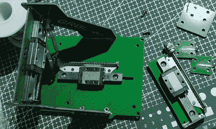
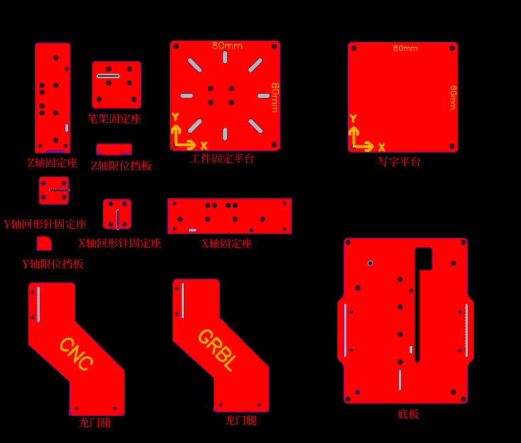

# 来自 PCB 面板的笔式绘图仪

> 原文：<https://hackaday.com/2022/01/21/pen-plotter-from-pcb-panels/>

Hacker [12344321A]建造了一个[聪明的开源笔式绘图仪，它有一个由奇怪形状的 PCB 面板制成的框架](https://oshwhub.com/12344321A/pcb-mi-nicnc-xie-zi-ji)(中文)。它拿着一只普通的绘图笔，在一个 8 x 8 厘米见方的小书写平台上画画。这个空间几乎不够画一张名片，这取决于你来自哪个国家。运动似乎是由 DVD 步进电机头定位组件提供的，控制器是基于 ESP32 的 GRBL 3 轴板。用户通过 WiFi 进行控制，并且可以从用户的智能手机上看到绘图仪正在运行(参见上面项目页面上的视频)。

Linear Motion Assemblies from a DVD player?

这看起来像是一个廉价的建筑，尽管是用焊料和回形针固定在一起，但看起来足够坚固。但事先警告一下，该项目记录在 EasyEDA 赞助的一个开源硬件共享网站上，名为[OSHWHub](https://oshwhub.com/)——中文相当于类似的英文 [OSHWLab](https://oshwlab.com) 。因此，所有的笔记都是中文的，虽然谷歌翻译可以在这里提供帮助。[12344321A]提供 GPL 3.0 许可下的所有工程设计文件。

感谢[J. Peterson]找到这个项目，并通过举报热线引起我们的注意。

