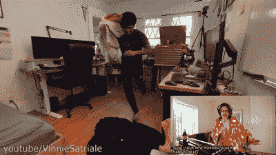

# 机器人 Nerf 警报器用泡沫把你炸醒

> 原文：<https://hackaday.com/2022/01/21/robot-nerf-alarm-blasts-you-awake-with-foam/>

【马克·雷比勒】当【姚一奇】随着你新的早晨的闹钟声跑过卧室时，哨兵用泡沫气浪瞄准了他。

醒来是艰难的；有时候，你需要的不仅仅是一个小小的闹钟来让你起床。当[姚一奇·萨特瑞勒]开始无意识地关掉闹钟时，他全力以赴，决定制造一个 Nerf 哨兵爆破枪来唤醒他。

Nerf 的竞争对手复仇女神 MX 7-10K 飞轮爆能枪是建造的核心，拥有 100 发软泡沫球的容量。步进电机用于控制平移和倾斜系统来瞄准爆炸机。它在树莓 Pi 的指令下移动，树莓 Pi 使用运行在 Coral USB 加速器上的机器视觉算法来跟踪卧室中的目标。一个继电器板被用来激活爆破手的射击动作，爆破任何目标直到他们醒来。

[姚一奇]在建造过程中玩得很开心，还在办公室里向同事展示哨兵枪。这是一个很难躲开的哨兵，机器视觉算法使用全身跟踪模型，所以仅仅遮住一个人的脸不足以逃脱。

这些年来，我们见过各种各样的哨兵枪，从那些发射橡皮筋的[到其他的](https://hackaday.com/2015/08/13/arduino-powered-rubber-band-sentry-turret-is-not-a-lie/)[喷水的](https://hackaday.com/2018/01/26/auto-tracking-sentry-gun-gives-deer-a-super-soaking/)。休息后的视频。

 [https://www.youtube.com/embed/dkEc3wjEfYc?version=3&rel=1&showsearch=0&showinfo=1&iv_load_policy=1&fs=1&hl=en-US&autohide=2&wmode=transparent](https://www.youtube.com/embed/dkEc3wjEfYc?version=3&rel=1&showsearch=0&showinfo=1&iv_load_policy=1&fs=1&hl=en-US&autohide=2&wmode=transparent)

