# 回顾:DevTerm Linux 手持设备有复古未来的感觉

> 原文：<https://hackaday.com/2022/03/02/review-devterm-linux-handheld-has-retro-future-vibe/>

并不是每天都有开源的便携式 Linux 掌上电脑发布，所以当[第一次了解到时尚的小终端](https://hackaday.com/2020/12/08/devterm-beats-cyberdeck-builders-to-the-punch/)时，我忍不住通过 ClockworkPi 订购了 [DevTerm，它包括一个 1280 x 480 屏幕(双宽 VGA)和一个模块化的小热敏打印机。](https://www.clockworkpi.com/devterm)

当然，全球半导体短缺加上运输放缓导致了延迟，但事情最终为这个项目走到了一起。我一直对小画幅机器情有独钟，尤其是那些设计精良的套件，这意味着我可以告诉你把它组装起来并打开它的感觉。有很多要看的，那我们开始吧。

## 设计精良的工具包

DevTerm 的组装是一个很好的周末或下午项目。互锁件和连接器的巧妙设计意味着不需要焊接，组装主要包括根据手册将硬件模块和塑料件点击在一起。任何有组装塑料模型套件经验的人都会对从浇口上切下塑料部件，然后将它们组装在一起产生怀旧之情。

手册中的插图很好，真正聪明的机械设计使得组装过程非常友好。自定心部件的使用，以及本身成为自动调整凸台的挂钩，非常巧妙。不需要任何工具，除了用于固定处理器模块的两个小螺钉之外，实际上根本没有任何硬件紧固件。

当然，有些零件是精密的，不是完全万无一失的，但是任何有电子装配经验的人把它们组装在一起应该没有任何问题。

 [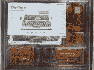](https://i0.wp.com/hackaday.com/wp-content/uploads/2022/02/DevTerm-Kit-tray-and-assembly-document.png?ssl=1) Plastic parts on sprues make up most of the parts. [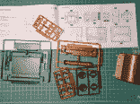](https://i0.wp.com/hackaday.com/wp-content/uploads/2022/02/DevTerm-Assembly-Parts.png?ssl=1) Nostalgia for those who have assembled plastic kits. [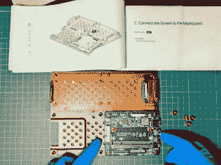](https://i0.wp.com/hackaday.com/wp-content/uploads/2022/02/Installing-modules.jpg?ssl=1) Assembly document is clear and detailed. [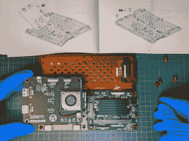](https://i0.wp.com/hackaday.com/wp-content/uploads/2022/02/DevTerm-Assembly-Internals.png?ssl=1) The design uses (nearly) no hardware fasteners, and parts self-locate.

唯一不包括的元件是两个 18650 电池和 58 毫米宽的热敏纸卷。将计算模块固定在其插槽中的两个小螺钉需要一个小十字螺丝刀。

## 模块化组件

除了屏幕和打印机，在 DevTerm 中有四个主要组件；每一个都不需要焊接就可以相互连接。带有迷你轨迹球的键盘是完全独立的，通过弹簧针连接。主板支撑着中央处理器。EXT 板有一个风扇，还提供 I/O 端口:USB、USB-C、微型 HDMI 和音频。剩下的电路板负责电源管理，并容纳两个 18650 电池——顺便说一下，USB-C 端口专门用于充电。甚至还留有一些空间用于定制或添加其他附件。

[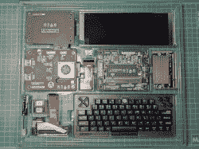](https://hackaday.com/wp-content/uploads/2022/02/PXL_20220125_143829274.jpg)

The modules are all self-contained assemblies.

[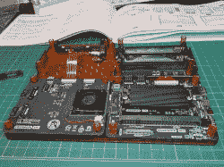](https://hackaday.com/wp-content/uploads/2022/02/PXL_20220125_151833489.jpg)

The modules use connectors, no soldering required.

[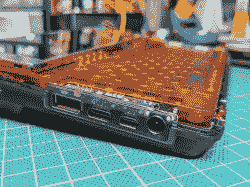](https://hackaday.com/wp-content/uploads/2022/02/DevTerm-Side-Ports-no-Keyboard.png)

I/O ports are all on the side. Power is at the front.

这种模块化带来了回报。例如，它有助于 DevTerm 为处理器和内存大小提供一些不同的选项，包括一个基于 [Raspberry Pi CM3+ Lite](https://www.raspberrypi.com/products/compute-module-3-plus/?variant=compute-module-3plus-lite) 的选项，这是 Raspberry Pi 3 Model B+的核心，旨在集成到其他硬件中。

DevTerm 的 [GitHub 存储库有原理图、代码和参考信息，如电路板轮廓；没有 CAD 格式意义上的设计文件，但将来可能会有。产品页面提到，用于定制或 3D 打印自己零件的 CAD 文件可以从 GitHub 库中获得，但在撰写本文时，它们还不存在。](https://github.com/clockworkpi/DevTerm)

## 使用开发团队

[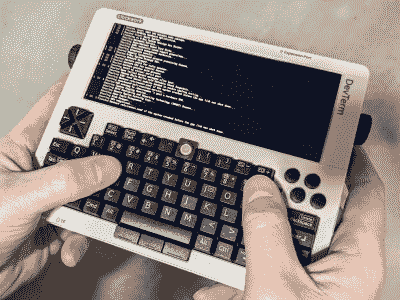](https://hackaday.com/wp-content/uploads/2022/02/DevTerm-in-use-bootup.jpg)

The OS image included on the memory card works great for checking that everything boots, but be sure to upgrade to the latest OS image before doing too much troubleshooting.

当启动时，DevTerm 直接引导到桌面环境，我想做的第一件事是配置 WiFi 连接并启用 SSH 服务器。欢迎屏幕确切地告诉了我如何做到这一点——但我的 DevTerm 附带的早期版本的操作系统有一个小的打字错误，这意味着按照指示操作会导致错误，这有助于提供真正的 Linux DIY 体验。其他一些事情似乎也不太对，但一个软件更新做了很多事情来解决这个问题。

迷你轨迹球的默认行为尤其令人沮丧，因为手指每滑动一下，指针就移动一点点。此外，轨迹球似乎对对角线移动的反应不太好。谢天谢地，[用户【guu】已经重写了键盘](https://forum.clockworkpi.com/t/ive-rewritten-devterm-keyboard-trackball-firmware/7671/23)的固件，我强烈推荐更新的版本，它大大改善了轨迹球的响应。键盘模块可以用 DevTerm 本身的 shell 中的新固件进行编程，但是从`ssh`会话中进行编程是一个更好的主意，因为物理键盘在这个过程中可能会变得没有响应。

[将我的 DevTerm A04 更新到最新的操作系统版本](https://forum.clockworkpi.com/t/devterm-os-a04-image-files/7761)修复了我注意到的大多数开箱即用的问题——例如扬声器没有声音，这让我怀疑我是否正确安装了它们——所以我建议在深入诊断任何特定问题之前确保操作系统已更新。

## 键盘和迷你轨迹球

键盘模块包括一个迷你轨迹球和三个独立的鼠标按钮，默认情况下，单击轨迹球会执行左键单击。这种布局看起来很不错，轨迹球位于键盘顶部的中央，三个鼠标按钮位于空格键下方的中央。

ClockworkPi 的“65%键盘”具有经典的按键布局，我发现当我用双手握住它并用拇指打字时，DevTerm 是最容易输入的，就好像它是一个超大的黑莓手机。将 DevTerm 放在桌面上也是一种选择；这使得键盘处于一个更传统的手指打字角度，但我发现按键有点小，这样做很舒服。

没有触摸屏，所以浏览 GUI 意味着使用轨迹球或键盘快捷键。拨弄位于设备中心的迷你轨迹球——底部边缘有鼠标按钮——是我觉得有点尴尬的事情。在功能上，DevTerm 的键盘和轨迹球组合提供了一个空间高效和平衡布局中可能需要的所有正确的工具；就可用性而言，它并不是最符合人体工程学的。

## 远程访问是更舒适的访问

人们并不总是将 DevTerm 用作便携式机器。当进行配置或其他设置时，使用`ssh`会话登录比使用内置键盘更好。

另一个替代方法是设置远程桌面访问，这样 DevTerm 就可以在舒适的桌面上使用其所有 1280 x 480 双 VGA 宽屏荣耀。

为了尽快做到这一点，我在 DevTerm 上安装了`vino`包，并在我的桌面上使用 TightVNC viewer 来建立一个远程会话。

[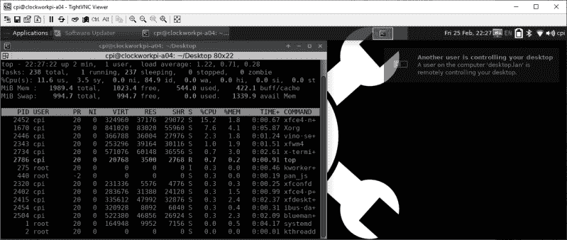](https://hackaday.com/wp-content/uploads/2022/02/DevTerm-Remote-Access-Screenshot-vino.png)

Vino 是 GNOME 桌面环境的 VNC 服务器，而 [TightVNC viewer](https://www.tightvnc.com/download.php) 可用于多种系统。`sudo apt install vino`将安装 VNC 服务器(监听默认的 TCP 端口 5900)，虽然我并不建议每个人都这样做，但使用`gsettings set org.gnome.Vino require-encryption false`将在连接上强制执行完全的零身份验证或安全性，允许用户只使用机器的 IP 地址访问 DevTerm 桌面。

这不是出于安全考虑的最佳决定，但它确实让我立刻避开了轨迹球和键盘，这在紧要关头有其自身的价值。

## 微型热敏打印

热敏打印机是一个意想不到的功能，纸卷轴是在一个单独的，可拆卸的组件。事实上，打印机功能完全是模块化的。DevTerm 内部的打印硬件直接位于扩展端口功能的后面，打印时纸张容器插入该端口。如果需要的话，该组件可以被完全移除并且空间可以被重新利用。

从功能上来说，这台小型打印机工作得非常好，我可以毫无困难地进行打印测试——只要我的电池电量充足。用低电量打印会导致不愉快的断电，所以要避免这种情况。对于任何修改，这一点也值得记住。

[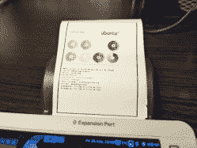](https://hackaday.com/wp-content/uploads/2022/02/DevTerm-Print-Test-Page.jpg)

Printer test page in its diminutive, low-res glory. Click to enlarge.

[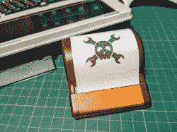](https://hackaday.com/wp-content/uploads/2022/02/DevTerm-paper-spool.jpg)

Removable paper spool, shown here with protective cap.

[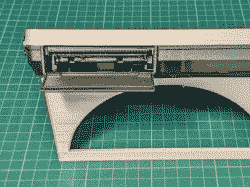](https://hackaday.com/wp-content/uploads/2022/02/DevTerm-Expansion-Port.jpg)

Expansion port, for paper holder. (DevTerm is on a 3D printed stand.)

打印质量和分辨率与任何收据打印机非常相似，因此如果您有任何期望，请降低期望。小打印机是噱头吗？也许吧，但这肯定是一个不错的选择，可以作为一种参考设计，如果有人希望用其他定制硬件来代替 DevTerm 的话。

## 可破解的手持 Linux 体验

很明显，Clockworkpi 努力让 DevTerm 具有可攻击性；模块之间的连接器很容易接近，板上有多余的空间，机箱内也有一些额外的空间。特别是，热敏打印机模块后面有大量的额外空间。如果你想拿出一个烙铁，这里肯定有足够的空间放一些电线和定制的硬件。主要组件的模块化本质似乎也旨在邀请容易修改，这有助于使它成为一个有吸引力的 cyberdeck 构建的起点。

虽然该项目的 GitHub 上目前还没有物理比特的 3D 模型，但一个有进取心的灵魂仍然创造了一个 3D 可打印的 DevTerm 支架,它可以支撑设备，并将其放在一个有用且节省空间的角度。当零件的 3D 模型进入 GitHub 库时，事情就简单多了。

你对这款 Linux 掌机的设计选择有什么看法？对热门硬件有什么想法吗？如前所述，打印模块(以及附带的扩展槽)可以很容易地重新调整用途；就我个人而言，我有点偏爱汤姆·纳尔迪关于盒式 USB 设备的想法。有其他想法吗？请在评论中告诉我们！