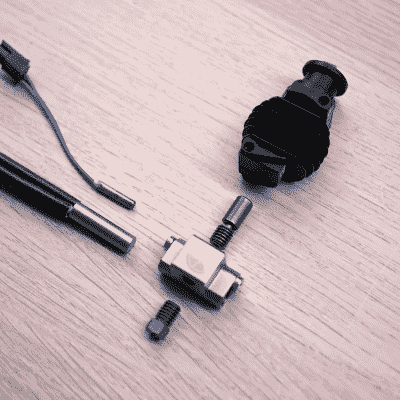

# 3D 打印:水冷酒店

> 原文：<https://hackaday.com/2022/01/31/3d-printering-water-cooled-hotends/>

有一个关于热水瓶的老笑话，热水瓶可以保温和保冷，所以有人在里面装了汤和冰淇淋。当谈到 FDM 3D 打印机时，这个笑话有点切中要害。

你当然要融化塑料，不然东西就打印不出来了，所以你需要热量。但是如果塑料细丝过早变热，它会变软、膨胀和堵塞。热量像这样爬上热端被称为热蠕变，热端有多种方式来应对同时变冷变热的需求。今天大多数旅馆都是用小风扇进行风冷的。但是水冷旅馆已经存在了一段时间，并且越来越多的出现。是噱头吗？您的热端是否正在使用、计划使用或已经使用(和放弃)水冷？

## 心碎

最常见的方法是在加热块和灯丝路径的其余部分之间使用热障。断热器被设计成传递尽可能少的热量，它通常被固定在一个大型散热器上，散热器上有一个风扇。穿过裂缝的热量应该会随着风扇冷却而被吹走。

From [Thomas Sanladerer’s review](https://www.youtube.com/watch?v=1YU6Ehwiu4A) of the Copperhead hotend. Heat break in the middle.

高科技解决方案包括用钛甚至两种不同的金属制造热断路器，目的都是为了减少热端较冷部分的热量传递。更现代的热端使用支撑结构，因此热中断不需要机械刚度，并且它们可以制造非常薄壁的热中断，不会传递太多热量。当然，这是结案了，对吗？也许不是。

虽然标准热障和风扇确实可以完成常见的 3D 打印任务，但可能会有问题。首先，如果你想快速打印——毕竟时间就是金钱——你需要更大的功率来每秒熔化更多的灯丝。如果热中断转移 10%的热量，这将增加对上游冷却的需求。一些工程材料希望在更高的温度下打印，所以你也可能遇到同样的问题。如果你想加热整个印刷室，这有助于某些印刷材料，这也可能导致问题，因为周围的空气现在更热。吹热空气不会有效地冷却。更不用说，能在高温下运转的风扇是出了名的贵。

粉丝还有其他不好的一面。从长远来看，一个边缘系统可能最终会让足够的热量蔓延。然后就是运转时风扇吹风的噪音。诚然，你可能有其他风扇和嘈杂的部分，但它仍然是一个噪声源。通过水冷，您可以将散热器移出加热的外壳，使用更大、更慢、更安静的风扇，同时在您需要的地方获得更多冷却。

## 水到处都是水:没什么新鲜的？

高性能计算机长期依赖液体冷却。热交换块具有用于液体的入口和出口，该液体比空气更好地吸收热量。一个泵使液体循环，另一个热交换器使液体在被泵送回回路的热部分之前冷却。为什么不把它应用到 3D 打印酒店呢？

为什么不呢？这个领域有几个条目，可以追溯到几年前。这些都没有成为普遍使用的超级流行。我们最近也看到了新的兴趣和产品。如果你想自己动手，我们看到了一种非常简单的方法来水冷 E3D 式的热端。

令人有些惊讶的是，这些现象是在多久以前开始出现的。来自 E3D 的泰坦 Aqua 几乎不是该领域的第一个参赛作品，其介绍视频来自 2017 年 12 月。

 [https://www.youtube.com/embed/Yn5wdQac7Xg?version=3&rel=1&showsearch=0&showinfo=1&iv_load_policy=1&fs=1&hl=en-US&autohide=2&wmode=transparent](https://www.youtube.com/embed/Yn5wdQac7Xg?version=3&rel=1&showsearch=0&showinfo=1&iv_load_policy=1&fs=1&hl=en-US&autohide=2&wmode=transparent)

[DIY3DTECH]查看了一个便宜的易贝来源的水冷酒店，大约一年后，尽管我们没有找到后续视频，所以我们想知道它是否在货架上，或者它只是出现了许多漏洞。Dyze Design 早在 2015 年就有水冷。所以它不是新的，只是没有那么广泛。至少，不是今天。

 [https://www.youtube.com/embed/VPpVwXUWBs8?version=3&rel=1&showsearch=0&showinfo=1&iv_load_policy=1&fs=1&hl=en-US&autohide=2&wmode=transparent](https://www.youtube.com/embed/VPpVwXUWBs8?version=3&rel=1&showsearch=0&showinfo=1&iv_load_policy=1&fs=1&hl=en-US&autohide=2&wmode=transparent)

## 现代

即使是新的酒店也可以参与。切片工程公司有一种液体版本的蚊子 hotend。Trianglelab 有阿瑞图萨，仍然有像下面视频中这样的自定义项目。

当然，添加热交换块和一定量的水会增加热交换器的重量，这是不可取的。然而，在实践中，管道和配件并不重，并且在任何给定时间加热块内都不应该有那么多水。然而，如果你正在做你自己的设计，你应该注意增加太多的重量。

你可能担心的另一个问题是渗漏。如今，挤出机风扇故障可能会导致堵塞。但是把水喷到你的打印机上可能会更糟。您希望使用不太可能出现故障的连接器。此外，你可能会想到你使用的液体。液体中的任何添加剂或化学物质可能会在接触喷嘴后存活下来，而不会产生灾难性的影响。

 [https://www.youtube.com/embed/IJAZko27vB8?version=3&rel=1&showsearch=0&showinfo=1&iv_load_policy=1&fs=1&hl=en-US&autohide=2&wmode=transparent](https://www.youtube.com/embed/IJAZko27vB8?version=3&rel=1&showsearch=0&showinfo=1&iv_load_policy=1&fs=1&hl=en-US&autohide=2&wmode=transparent)

正如我们之前所见，自制液冷式 hot and[不一定是一项大工程](https://hackaday.com/2018/02/06/water-cooling-a-3d-printer/)。大多数酒店已经有一些散热器，所以你只需要让水流过它。下面的视频显示了一个自我描述的“janky”方法，但它证明了这一点:这可以是对许多打印机相当简单的修改。另一方面，[黑盒](https://hackaday.io/project/166860-multitool-3d-printer-blackbox/log/167236-passive-water-cooling)打印机可以直接使用它——不需要修改。

 [https://www.youtube.com/embed/IkkLoqctfV0?version=3&rel=1&showsearch=0&showinfo=1&iv_load_policy=1&fs=1&hl=en-US&autohide=2&wmode=transparent](https://www.youtube.com/embed/IkkLoqctfV0?version=3&rel=1&showsearch=0&showinfo=1&iv_load_policy=1&fs=1&hl=en-US&autohide=2&wmode=transparent)

## 轮到你了

你对水冷 3D 打印机有兴趣吗？还是已经做到了？它对你有什么作用？请在评论中告诉我们。

如果水对你来说太简单，并且用油冷却还不够麻烦，我们也看到人们选择用 T2 帕尔贴设备来冷却他们的热端。不过，这也有一些问题。首先，它们确实需要很大的能量。此外，当一面变冷时，另一面至少会变热，而且热量必须转移到某个地方。所以现在你可能会回到风扇或者——是的——水冷。