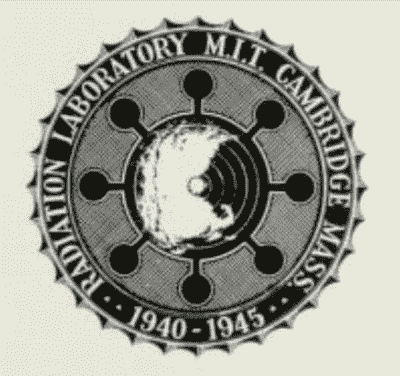
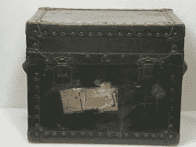
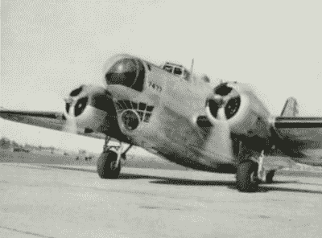
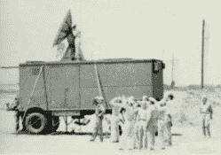
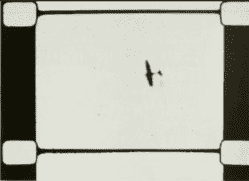
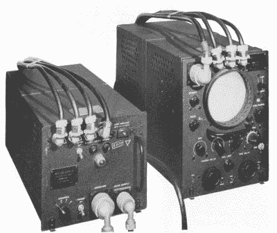
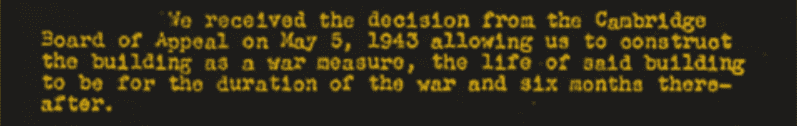
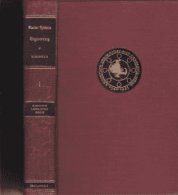

# 记住麻省理工学院辐射实验室

> 原文：<https://hackaday.com/2022/02/07/remembering-the-mit-radiation-laboratory/>

早在 80 年代末，我们公司设法为公司图书馆获得了 1947 年出版的完整的 28 卷麻省理工学院辐射实验室(Rad Lab)丛书。对我来说，这些书很有趣，因为我喜欢历史和旧技术，但我不明白为什么每个人都对收购如此兴奋。只要粗略地看一下这些书，就会发现这些书中描述的“电路”使用的是真空管，而它们的“计算机”是由机械连杆构成的。那是在 20 世纪 80 年代，我们使用半导体、集成电路和数字计算机研究现代雷达和通信系统。这些发霉的旧书怎么可能有任何实际用途呢？令我惊讶的是，事实证明他们确实可以，最终我开始欣赏这种兴奋。这些年来，我甚至自己也用过几个。

## 辐射实验室？核雷达？

在第二次世界大战前的几年里，Vannevar Bush 博士倡导建立一个独立于军方和政府机构的民间科学家组织。在第一次世界大战期间，军方和科学家没有很好地合作，看起来科学和技术将在未来发挥更大的作用。

看来美国最终肯定会卷入这场冲突，布什博士和其他人认为需要一个新的组织框架。为此，国防研究委员会(NDRC)，也就是后来的科学研究与发展办公室(OSRD)，被提交给罗斯福总统，并于 1940 年 6 月获得他的批准。

几乎就在同时，一份礼物落到了这个新组织的头上 Tizard Mission，它于 1940 年 9 月从英国来到美国。他们从英国带来了一个技术创新的真正宝库，英国人希望美国工业的合作能帮助他们在看似确定和迫在眉睫的入侵中生存下来。其中一件珍品是空腔磁控管，我们的丹·马洛尼[几年前写的。](https://hackaday.com/2018/06/11/hacking-when-it-counts-the-magnetron-goes-to-war/)

在几周内，在年轻的威尔士人“太妃糖”鲍恩的指导下，他们审查了设计，并收集了必要的设备来启动它。10 千伏的阳极电源和 1500 高斯的电磁体被采购，科学家们于 1940 年 10 月 6 日星期天聚集在新泽西州惠普尼的贝尔无线电实验室。他们启动了空腔磁控管，结果让他们大吃一惊——一块肥皂大小的东西在 3 GHz (10 厘米)下产生了超过 10 千瓦的射频。

一系列活动接踵而至，辐射实验室于 10 月 25 日正式成立，位于麻省理工学院，在 NDRC 的庇护下运作。名字本来是微波实验室，但后来改成了辐射实验室，以此来误导任何窥探他们研究重点的人。当时，辐射研究实验室，像诺贝尔奖获得者欧内斯特·劳伦斯的伯克利辐射实验室，在范围上是纯科学的，没有战时的重要性。

## 对更短波长的推动

| [美国海军 CXAM 舰载雷达](https://en.wikipedia.org/wiki/CXAM_radar) | 甚高频 | 200 兆赫 | 1.5 米 | One thousand nine hundred and forty |
| --- | --- | --- | --- | --- |
| 美国陆军 SCR-270 | 甚高频 | 100 兆赫 | 3 米 | One thousand nine hundred and forty |
| [英国链家](https://en.wikipedia.org/wiki/Chain_Home) | 高频/甚高频 | 20-50 兆赫 | 15 至 6 米 | One thousand nine hundred and thirty-eight |
| [英国连锁家居低点](https://en.wikipedia.org/wiki/Chain_Home_Low) | 甚高频 | 200 兆赫 | 1.5 米 | One thousand nine hundred and thirty-nine |
| [苏联 RUS-1](https://ru.wikipedia.org/wiki/РУС-1) | 甚高频 | 75 兆赫 | 4 米 | One thousand nine hundred and thirty-eight |

为什么这么大惊小怪？尽管当时雷达系统的使用有限，但它们都在 VHF 波段工作。当时的工程师熟悉 VHF 频段，因此拥有设计工具和必要的组件来构建工作单元。20 世纪 30 年代末，英国建造了一条名为 Chain Home 的大型海岸防御雷达站线，其操作横跨高频和甚高频。自从 1939 年 9 月战争开始以来，这个系统的一些弱点就暴露出来了。200 兆赫的 Chain Home Low 系统解决了其中一些问题，但厘米级雷达(在 SHF 地区)的较短波长有望带来一些真正的优势。例如，天线可以更小，可以更精确地探测和定位更小的物体。但是在引入空腔磁控管之前，没有办法产生必要的发射器功率。

除了空腔磁控管本身，英国人还向美国同行提交了一份优先清单。他们马上需要三种类型的雷达:(1)空中拦截，(2)引导防空炮火，以及(3)远程轰炸机导航。Rad 实验室同意了，并立即启动了三个相应的应急程序。

### 项目 1:机载拦截雷达

B-18 Used as a Flying Radar Laboratory

在三个月的时间里，该团队已经使他们的原型 10 厘米机载雷达工作。它以真正的黑客风格建造，填满了整个屋顶，是用他们能得到的任何东西拼凑起来的。到 1 月初，他们已经有了一个带有两个天线的工作系统，到 2 月，他们已经解决了发射-接收开关问题，并展示了只用“一只眼睛”就能成功跟踪飞机。到了三月份，他们已经将这个庞大的原型缩小成可以安装在飞机上的东西。在第一次试飞中，机组人员演示了空对空探测，并且心血来潮，尝试并成功探测了船只和潜艇。

### 项目 2:高射炮雷达

SCR-584 at Proving Grounds

First Automatically Tracked Airplane

这项工程于 1941 年初全面展开。英国人提出的最初想法，实际上现有的基于甚高频的系统是如何工作的，完全是手动的。雷达会发现飞机，但人们操纵天线并开火——基本上是一种真正改进的探照灯。但是 Rad 实验室的科学家认为他们可以通过自动化整个过程做得更好。他们证明了反对者是错误的，到 1941 年 5 月，雷达开始工作，可以自动跟踪飞机，并将电影摄像机对准飞机。贝尔实验室开发了模拟火控计算机，1942 年 4 月完成了工作系统( [SCR-584 雷达](https://en.wikipedia.org/wiki/SCR-584_radar))。

### 项目 3:远程导航

Loran AN/APN-4 Receiver Set

远程导航项目的开发，或称之为罗兰 T1，马上就开始了。第一对车站在春天的时候正在建设中。罗兰是唯一一个不使用微波的 Rad 实验室项目。相反，它工作在 2 MHz 左右，用于引导飞机和船只。罗兰及其后继产品在美国一直使用到 2010 年，在欧洲一直使用到 2015 年。

这只是前三个项目。到战争结束时，Rad 实验室已经开发了许多其他新的雷达应用，包括 3 厘米和 1 厘米的新系统。

## 作业环境

Rad 实验室急需人手，并开始从全国各地的大学招募物理学家和工程师。据说，这是一个工作的好地方。思想自由交流，推动工程和物理新领域的兴奋。在调制解调器和 BBS 系统、互联网或我们自己的每周一次的黑客聊天出现之前的几十年，Rad 实验室的工作人员每周都与他们在世界各地的同事举行电传会议。

> 实验室从不拘泥于僵化的组织图，基于所谓的逻辑或先入为主的功能；更确切地说，这个组织是围绕着可用的人建立的。(政策是)让科学家摆脱非科学的控制。在过去的一两年里，实验室确实开始更多地被非科学因素所控制。但是这一切来得太晚了，以至于无法阻止该计划的任何重要方面。 Rad 实验室创始主任李·阿尔文·杜布里奇

始终存在的战争紧迫性总是会影响决策。任何提出新想法的人都会受到副主任 I. I. Rabi 的挑战，他会问:“它会杀死多少德国人？”。【编者注:时代不同！]

## 遗产

除了成功进行首三个项目外，雷达实验室继续致力于发展雷达的应用。这些项目包括微波着陆系统、潜艇搜索雷达、电子对抗和反对抗措施、敌我识别(IFF)、预警雷达和炮弹引信雷达等。在巅峰时期，Rad 实验室雇用了 3000 多名员工，其中包括几位未来的诺贝尔奖获得者，包括 I . I . Rabi(1944 年物理学奖)和 Ed Purcell(1952 年物理学奖)，他们的发现与核磁共振有关。

From Building 20’s Approval Letter

1943 年为容纳这个庞大的实验室而建造的临时建筑之一被简称为[20 号楼](https://en.wikipedia.org/wiki/Building_20)并在接下来的几十年里成为了一个传奇。由于是临时建筑，人们不用担心在墙上钻孔来传递电缆。据说美国有 20%的物理学家曾在 20 号楼工作过，并因此获得了“魔法孵化器”的称号。它最终在 1998 年被拆除，为一个现代学术综合体让路。

## 知识百科全书

战争结束后，Rad 实验室于 1945 年 12 月 31 日关闭。最后一项任务是记录五年运作期间所做的工作。助理主任 Louis Ridenour 领导这项任务，让科学家们在恢复正常生活之前记录他们的工作。结果是一个 28 卷集，包括索引。

Volume 1 of the Rad Lab Series

在我从事雷达系统工作的这些年里，我们经常会用到其中的一些书。听到大厅里有人大喊“昨晚谁偷了我桌子上的银子？”是很平常的事 —塞缪尔·西尔弗是《天线》一书第 12 卷的作者。我用了很多 Marcuvitz 的波导手册，第 10 卷。当被分配到一个使用飞行时间计算的项目时，我从罗兰的书中学到了很多。

在 21 世纪 20 年代，这些书还重要吗？我会说理论上的仍然有效，但可能有很多其他的，更现代的，更容易获得的文本。对于喜欢复古电路的人来说，这些书有很多很好的真空管设计范例可以借鉴。如果你对机械计算机感兴趣，那本关于计算机制和连接的书可能会让你感兴趣。这个系列早就绝版了，但是他们可以从互联网档案中获得([链接到第一卷](https://archive.org/details/MITRadiationLaboratorySeries01RadarSystemEngineering))。

横幅图片由麻省理工学院博物馆提供。