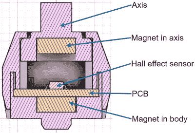
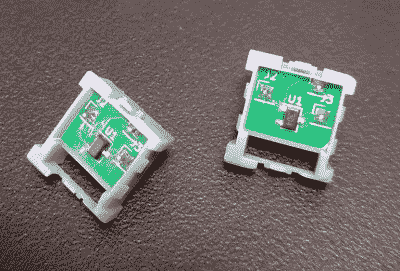

# 3D 打印磁悬浮开关现在很火

> 原文：<https://hackaday.com/2022/02/08/3d-printed-maglev-switches-are-so-hot-right-now/>

这并不总是发生，但是多年来我们已经注意到，一旦我们突出了一个项目，许多非常相似的构建经常会在不久之后出现在我们的提示行中。当然，这些不是模仿者；还没有足够的时间让一些有竞争力的制造商推出他们自己的版本。不，大多数时候是其他人独自在做一个非常相似的项目，他们现在第一次意识到他们并不孤单。

由于这一现象，我们很高兴地报告，又一个 [3D 可打印磁悬浮开关已经问世](https://github.com/famichu/MagLev_Switch_MX)。由[famichu]开发，这个概念与我们之前看到的明显不同，这在某种程度上使整个事情更加令人印象深刻。多个黑客相互独立地开发类似的项目是一回事，因为最终目标往往决定了设计本身的性质。但在这里，我们看到的是一个采用了相同核心概念并朝着不同方向发展的项目。

 那么磁悬浮开关 MX 和[【risk able】最近发布的 void_switch](https://hackaday.com/2022/01/17/3d-printed-magnetic-switches-promise-truly-custom-keyboards/) 有什么不同呢？一句话，惯例。似乎[famichu]想要创造一种磁性开关，其操作方式或多或少与传统的 Cherry MX 开关相同，而 void_switch 则代表了对键盘开关应该如何完全工作的重新想象。例如，不是将所有霍尔效应传感器放在主 PCB 上，这样就不需要对每个开关进行电气连接，而是将每个磁悬浮开关 MX 固定，必须用导线连接在一起形成矩阵。

在内部，[famichu]提出了一种独特的安排，其中 Allegro A1304 线性霍尔效应传感器实际上被放置在两个相对的磁体之间，这两个磁体代表传统的弹簧。当按键被按下时，传感器将拾取周围变化的磁通量环境，但有趣的是，键盘 PCB 的原理图似乎表明传感器没有被微控制器直接读取。相反，它们的输出被用来触发矩阵每行上的 MOSFETs。

In this design, each switch carries its own Hall sensor.

就打印而言，MagLev Switch MX 比 void_switch 的零件更少，[famichu]建议在 MSLA 机器上打印。与 FDM 印刷的 void_switch 相比，这大大加快了打印时间，因为每次运行填充打印机的整个构建体积没有[时间损失。至于定制，除了标准的 STL/3MF 模型之外，还包括了 Fusion 360 设计文件。但是对于我们的资金来说，没有什么比使用 OpenSCAD 的定制功能更好的了。](https://hackaday.com/2021/10/06/making-the-most-of-your-resin-printer-investment/)

这里的一大要点是，显然有不止一种方法可以制造开源、3D 可打印、磁性 MX 风格的开关。我们非常兴奋地看到这两个项目的进一步发展，特别是因为一只小鸟告诉我们，[riskable]已经仔细研究了这个设计，并根据他开发 void_switch 的经验向[famichu]提供了一些笔记。有了这两位磁性专家的合作，定制输入设备的未来看起来确实非常光明。

感谢[斯蒂芬妮]的提示。