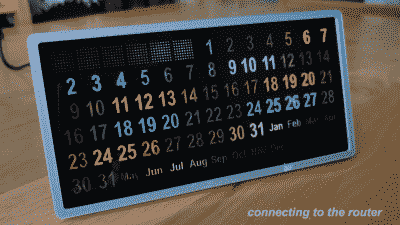

# 使用这个自定义版本跟踪您的 Google 日历

> 原文：<https://hackaday.com/2022/02/02/keep-track-of-your-google-calendar-with-this-custom-build/>

如果你拿着电话或坐在电脑前，在谷歌日历上跟踪你的约会是很容易的，但有时你只想看一眼就知道发生了什么。[这款由[andrei.erdei]制作的桌面日历正是利用了大量有用的 led 灯。](https://www.instructables.com/Perpetual-Calendar-With-Google-Calendar-Connection/)

The attract mode is very cool, even if it doesn’t display any actual information.

设计很简单，使用 WS2812 LEDs 背光显示数字，以指示它们是工作日、周末、周年纪念日、假日还是任何其他重要日期。数字布局是一个漂亮的永久设计，允许显示轻松适应任何月份的结构，甚至是那些从周一开始的整洁的月份。

该设计依赖于一个 ESP-01 来与谷歌日历通信并显示相关数据。这一切都包裹在一个 3D 打印的盒子里，打印的纸张模板从一些烟熏丙烯酸树脂的背后背光，给人一种令人惊讶的专业外观。

如果你厌倦了拿起手机做每一件事情，这种设计可能正是你追踪约会的目的。或者，[你可以一直走硬拷贝路线](https://hackaday.com/2020/11/29/calendar-printer-makes-you-a-hard-copy-on-the-daily/)。休息后的视频。

 [https://www.youtube.com/embed/i26o_reVza8?version=3&rel=1&showsearch=0&showinfo=1&iv_load_policy=1&fs=1&hl=en-US&autohide=2&wmode=transparent](https://www.youtube.com/embed/i26o_reVza8?version=3&rel=1&showsearch=0&showinfo=1&iv_load_policy=1&fs=1&hl=en-US&autohide=2&wmode=transparent)

