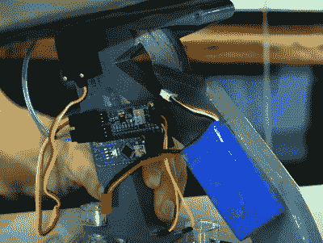

# Arduino 激活的汽车空气动力学装置是…(剧透警报！)

> 原文：<https://hackaday.com/2022/02/03/arduino-activated-automotive-aerodynamic-apparatus-is-spoiler-alert/>

有时候，一个伟大的黑客之所以伟大，仅仅是因为它很有趣，迈克尔·雷希丁(Michael Rechtin)的 T2 DIY 主动空气动力扰流板和空气制动肯定也是一个有趣的黑客。这是一个为生活在一个外观决定一切，贴纸增加马力，良好的音响系统比良好的车轮定位更重要的世界而设计的 mod。这是为什么呢？因为就像只存在于激活关闭它的机制的开关一样，下面看到的 DIY 主动空气扰流板和空气制动器几乎完全没有用。所以要理解它的诱惑力，我们必须理解它的灵感。

几十年来，豪华跑车制造商一直在他们的汽车上增加主动空气动力学部件。例如，一些保时捷车型配备了可根据驾驶条件进行调整的自适应扰流板。布加迪威龙(Bugatti Veyron)等超级汽车的扰流板在制动时会以高角度翻转，以增加阻力并减少制动距离。可悲的是，所有这些特征在普通的两个或四个门的家用车中消失了。*直到现在！*

 【迈克尔】为每一个去商场买消声器的人创造了一个新的主动扰流板。该建筑从数控切割泡沫机翼开始，机翼上覆盖着玻璃纤维、邦多(汽车*必需品*)和一些人造碳纤维，以获得快速的感觉。一个 Arduino，IMU，两个伺服系统和一个电池组可以像大男孩一样检测减速并自动增加扰流板角度，但不需要集成到车辆系统中。或者螺栓之类的。

尽管制动力不足以让汽车减速，但它不足以弹出将汽车固定在行李箱盖上的吸盘。但是它有没有设计出来的“哇”的因素呢？剧透警告:确实如此！

事实证明，这并不是 Hackaday 上的第一个可调扰流板，这款为实际比赛制造的[可调扰流板非常有趣。](https://hackaday.com/2017/08/28/spoiler-alert-repairing-a-race-car-can-get-complicated-fast/)

 [https://www.youtube.com/embed/d2P4gK-bszA?version=3&rel=1&showsearch=0&showinfo=1&iv_load_policy=1&fs=1&hl=en-US&autohide=2&wmode=transparent](https://www.youtube.com/embed/d2P4gK-bszA?version=3&rel=1&showsearch=0&showinfo=1&iv_load_policy=1&fs=1&hl=en-US&autohide=2&wmode=transparent)

感谢[赞]对这个项目的提示！