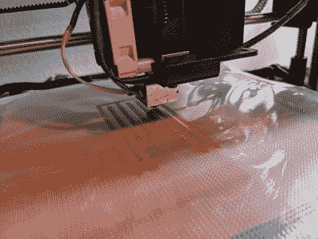
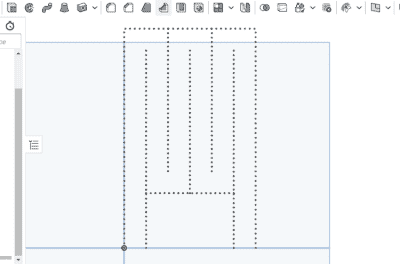

# 万豪复印机数控热封机

> 原文：<https://hackaday.com/2022/02/02/the-wanhao-duplicator-cnc-heat-sealer/>

One custom, compliant heat exchanger, coming right up!

[塔那·亨特]需要找到一种方法，在聚烯烃薄膜制成的流体热交换器上制作各种不同的热封图案，并且不想要由钢板加工而成的传统密封压机的所有交付时间和费用。模式原型意味着通常的方法不允许足够的迭代速度，于是决定采用 CNC 方法。现在，谁能想到一个普通的工具，能够在 X-Y 平面定位，具有可驱动的 Z 轴和受控的热源？当然，现在的答案是普通的 FDM 3D 打印机。幸运的是，[【塔那】有一台更老的机器来试验](https://hackaday.io/project/183836-easy-cnc-heat-sealer)，所以用一点喷嘴砂光，和床上的一片橡胶，就可以了！

Custom seal path made in Onshape

现在，热封通常是在热压机中完成的，使用一个成型工具，将材料固定在适当的位置，形成一个平坦、均匀的封口。显然，这种 CNC 方法不会达到完美的结果，但对于概念验证来说，它还不错。找到一个牺牲喷嘴(但正如[塔那]所承认的，必要时一个 M6 的长度也可以)并用砂纸打磨平，并与床平行，得到一个直径为 3 毫米的接触片。硅橡胶片放在床上，聚烯烃薄膜放在上面。硅树脂有助于将底板固定到位，并提供一些 Z 轴顺应性，以防止电机驱动器过载。理想情况下，打印机将被进一步修改，以将这种适应性移动到 Z 轴或效应器末端，但这需要更多的工作。通过一些巧妙的 3D 建模，Cura 被操纵以生成所需的 g 代码(一系列 Z 轴沿路径插入),一个定制的加热压头诞生了！

这不是我们第一次看到 3D 打印机的这种用途，这是一个更早的失败，像所有事情一样，有不止一种方法可以做到这一点——这里有一种[用散焦 CO [2] 激光器](https://hackaday.com/2019/04/02/custom-inflatables-are-only-a-laser-beam-away/)制作充气气囊的方法。

(警告！两分钟的 3D 打印机头撞到床上！)

 [https://www.youtube.com/embed/iLqsrLpYOyo?version=3&rel=1&showsearch=0&showinfo=1&iv_load_policy=1&fs=1&hl=en-US&autohide=2&start=1&wmode=transparent](https://www.youtube.com/embed/iLqsrLpYOyo?version=3&rel=1&showsearch=0&showinfo=1&iv_load_policy=1&fs=1&hl=en-US&autohide=2&start=1&wmode=transparent)

